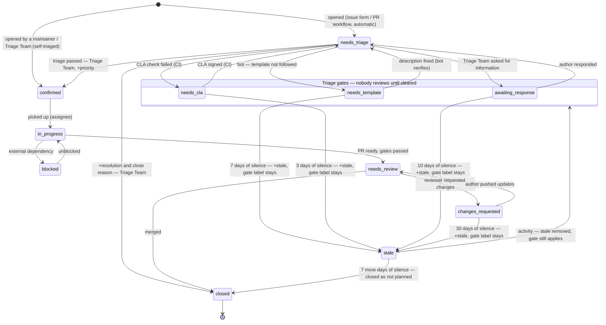

# Triage Policy

This document defines how issues and pull requests move through the AG2 repository: the labels we use, the stages every item passes through, the conditions for moving between them, and who is allowed to do what.

It is the working guide for three actors:

- **Maintainers** — core team members with merge rights. They own priorities, reviews, and merges.
- **Triage Team** — contributors with triage permissions. They own the intake queue: classification, reproduction, routing, and closing invalid items.
- **AI Triage Bot** — automation. It handles everything that does not require human judgment and *proposes* everything that does.

The guiding rule: **automation gates and classifies; humans decide.** The bot never assigns priority, never confirms an issue, and never merges.

---

## 1. Label taxonomy

Every label belongs to a class. The class prefix tells you what question the label answers and who is allowed to change it.

| Class | Question it answers | Cardinality | Set by |
|---|---|---|---|
| `type:*` | What kind of change is this? | exactly one | Bot proposes, Triage Team confirms |
| `status:*` | Where is it in the lifecycle? | exactly one (see stale exception) | Automation + Triage Team + maintainers |
| `priority:*` | When should we work on it? | at most one | **Humans only** (Triage Team, maintainers) |
| `area:*` | Which part of the repository does it touch, and who should look? | any number | `actions/labeler` by file paths; bot for issues |
| `resolution:*` | Why was it closed? | at most one | **Humans close**; the bot may apply `resolution:duplicate` to an open item as a proposal |

Standalone labels outside the classes: `good first issue` and `help wanted` (kept with their exact GitHub-standard names so they surface in GitHub's contribution UI) and `security` (cross-cutting flag; see [§7](#7-security-issues)).

### `type:*` — classification

| Label | Meaning |
|---|---|
| `type:bug` | Existing behavior is broken or doesn't match the docs |
| `type:feature` | New functionality or API extension |
| `type:docs` | Docs-only issue or PR: errors, missing guides |
| `type:question` | Usage question, no code change needed |
| `type:maintenance` | Refactoring, CI, dependencies, tests, cleanup |

**Issue Types and `type:*` labels are used together.** Issues carry both the native GitHub Issue Type and the matching label; PRs carry only the label (Issue Types do not exist for PRs). The bot keeps the two in sync using this mapping:

| Issue Type | `type:*` label |
|---|---|
| Bug | `type:bug` |
| Feature | `type:feature` |
| Task | `type:maintenance` |
| Task | `type:docs` (docs work has no dedicated Issue Type) |
| — (no type) | `type:question` (questions are redirected to Discussions, see below) |

When either side changes, the bot updates the other. Exactly one `type:*` label per item — if two seem to apply, pick the dominant one.

### `status:*` — lifecycle

| Label | Meaning | Set by | Removed by |
|---|---|---|---|
| `status:needs-triage` | New, waiting for triage | issue forms / PR workflow, automatically | Triage Team, by triaging |
| `status:needs-template` | **Gate.** Does not follow the issue/PR template | bot | bot, after the author fixes the description |
| `status:needs-cla` | **Gate.** CLA not signed | CLA workflow | CLA workflow, once signed |
| `status:awaiting-response` | **Gate.** Triage asked the author a question | Triage Team / bot | bot, when the author responds |
| `status:changes-requested` | **Gate.** Review done; author must address code/tests/docs | reviewer / bot on review submission | bot, when the author pushes changes |
| `status:confirmed` | Triage passed: reproducible / accepted as valid | Triage Team, maintainers | — (moves forward) |
| `status:in-progress` | Someone is actively working on it (issues with an assignee; draft PRs) | assignee / author | — (moves forward) |
| `status:needs-review` | PR is ready and waiting for maintainer review | author / bot when gates pass and PR is ready | reviewer |
| `status:blocked` | Blocked by an external dependency or another issue | maintainers | maintainers |
| `status:stale` | No activity on a gated item (see [§5](#5-gates-and-the-stale-mechanism)) | `actions/stale` only | any activity |

Invariants:

1. **One `status:*` label at a time.** The single exception: `status:stale` stacks *on top of* a gate label so the reason for staleness stays visible.
2. **Gate labels mean "the ball is with the author."** Nobody on the team looks at a gated item until the gate clears.
3. **Only gates lead to stale.** `status:confirmed`, `status:in-progress`, and `status:blocked` never go stale — accepted work that stalls is a planning problem, not a triage problem.

### `priority:*` — scheduling

| Label | Meaning |
|---|---|
| `priority:critical` | Drop everything: security, data loss, broken main |
| `priority:high` | Next in line: blocks many users or a release |
| `priority:normal` | Default priority: scheduled into regular work |
| `priority:low` | Nice to have: no near-term plans |

Priority is assigned when an issue reaches `status:confirmed`, by the Triage Team or a maintainer. **The AI Triage Bot never sets or changes priority.**

### `area:*` — routing

Area answers "which part of the repository does this touch, and therefore who should look at it." It covers both package modules and infrastructure surfaces. Multiple areas per item are normal.

| Label | Covers |
|---|---|
| `area:core` | Agent runtime core: `ag2/*.py`, `ag2/events`, `ag2/response`, `ag2/streams` |
| `area:tools` | Tool system, builtin tools, subagents: `ag2/tools` |
| `area:providers` | LLM provider clients and mappers: `ag2/config` |
| `area:middleware` | Middleware system and builtins: `ag2/middleware` |
| `area:eval` | Offline evaluation framework: `ag2/eval` |
| `area:a2a` | `ag2/a2a`, A2A protocol support |
| `area:a2ui` | `ag2/a2ui` |
| `area:acp` | `ag2/acp`, ACP support for CLI coding agents |
| `area:ag-ui` | `ag2/ag_ui` |
| `area:mcp` | `ag2/mcp` |
| `area:network` | `ag2/network` |
| `area:extensions` | `ag2/extensions` — community-maintained Extensions (see [§6](#6-extensions)) |
| `area:docs` | `website/` |
| `area:actions` | `.github/workflows/` |
| `area:deps` | `pyproject.toml`, `uv.lock`, dependency updates |

On PRs, areas are applied automatically by `actions/labeler` from changed file paths ([`.github/labeler.yml`](../labeler.yml)). On issues there are no file paths, so the bot proposes areas from the issue text; the Triage Team corrects them during triage.

### `resolution:*` — close reasons

| Label | Meaning | Paired native close reason |
|---|---|---|
| `resolution:duplicate` | Already tracked in another issue or PR | *duplicate* |
| `resolution:wontfix` | Valid request, but deliberately not planned | *not planned* |
| `resolution:invalid` | Not reproducible, not a real issue, or misfiled | *not planned* |

Rules for closing without merging/fixing:

- Set the `resolution:*` label **and** the matching native close reason.
- Always leave a closing comment explaining why — start from the matching [canned reply](replies/) (`close-duplicate`, `close-wontfix`, `close-invalid`). For duplicates, link the original.
- Issues fixed by a merged PR need no `resolution:*` label — close as *completed* (linked PRs do this automatically).
- The bot may apply `resolution:duplicate` to an **open** item as a proposal (with the [`duplicate-suspect`](replies/duplicate-suspect.md) comment), but never closes items itself — the author, Triage Team, or a maintainer closes if they agree. (The one exception is the stale automation, [§5](#5-gates-and-the-stale-mechanism).)

---

## 2. Lifecycle overview

Reopening a closed item re-enters the queue at `status:needs-triage`.

---

## 3. Issue flow

### Stage I1 — Intake (automatic)

A new issue created through the issue forms arrives with:

- an Issue Type and the matching `type:*` label (from the form),
- `status:needs-triage`.

The AI Triage Bot then runs a first pass:

| Check | Outcome |
|---|---|
| Description does not follow the template (sections gutted, no reproduction for bugs) | set `status:needs-template`, comment listing what is missing |
| Looks like a duplicate | apply `resolution:duplicate` as a proposal + [`duplicate-suspect`](replies/duplicate-suspect.md) comment; a human closes |
| Type mismatch (e.g. a feature request filed as a bug) | fix the `type:*` label and Issue Type, keeping them in sync |
| Area detectable from the text | add `area:*` labels |
| It is a usage question | set `type:question`, comment pointing to GitHub Discussions, recommend closing |

The bot **comments and labels; it does not confirm, prioritize, or close.** All bot comments use the [canned replies](replies/) with placeholders substituted; humans use the same templates as copy-paste starting points and personalize where it helps.

**Maintainer shortcut.** Issues opened by maintainers or Triage Team members are self-triaged: they enter at `status:confirmed` instead of `status:needs-triage`, and the author assigns `priority:*` at creation. The intake bot checks above still run (duplicates, areas, type sync).

### Stage I2 — Triage (Triage Team)

The triage queue is: `is:open label:status:needs-triage` with no gate labels. Working an item means reaching one of these exits:

| Exit | Conditions | Actions |
|---|---|---|
| **Confirm** | Bug is reproducible, or the request is in scope and well-formed | replace `status:needs-triage` with `status:confirmed`; verify `type:*` + Issue Type; correct `area:*`; assign `priority:*` |
| **Ask** | Cannot reproduce / information is missing | set `status:awaiting-response`, ask a concrete question |
| **Redirect** | It is a usage question | answer briefly or point to Discussions; close as *not planned* |
| **Close** | Duplicate, invalid, or out of scope | `resolution:*` + native close reason + a closing comment |

Escalate to maintainers instead of confirming when: the issue implies an API or architecture change (check `docs/adr/` first), it is security-sensitive, or scope is genuinely unclear.

### Stage I3 — Execution

- Assignee set → `status:in-progress`.
- Blocked on another issue or an external dependency → `status:blocked` (link the blocker); back to `status:in-progress` when cleared.
- A merged PR that fixes the issue closes it as *completed* via `Fixes #N`.

---

## 4. Pull request flow

### Stage P1 — Intake gates (automatic)

On open, a workflow applies `status:needs-triage`, and `actions/labeler` applies `area:*` labels from the changed paths. Then the gates run:

| Gate | Set when | Cleared when |
|---|---|---|
| `status:needs-cla` | the CLA check fails | the author signs; the CLA workflow removes the label |
| `status:needs-template` | the PR description guts [the template](../PULL_REQUEST_TEMPLATE.md) (missing "Why are these changes needed?", unchecked mandatory checks, no validation info — see [AI policy](../AI_POLICY.md)) | the author fixes the description; the bot verifies and removes the label |

While any gate label is present, **no human reviews the PR.** The bot posts one comment per gate explaining exactly what is required, using the matching [canned reply](replies/) (`needs-cla`, `needs-template-pr`).

**Gates apply to draft PRs too.** A draft without a signed CLA carries `status:needs-cla`, not `status:in-progress` — the gate takes precedence, and its stale window runs even while the PR is a draft. There is no reason to invest work in a PR that cannot be accepted.

### Stage P2 — Ready for review

When all gates are clear and the PR is not a draft, the bot replaces `status:needs-triage` with `status:needs-review`. Draft PRs sit in `status:in-progress` until marked ready.

The review queue is: `is:open is:pr label:status:needs-review`, ordered by `priority:*` of the linked issue where present.

### Stage P3 — Review

Reviewers are maintainers (for Extensions, see [§6](#6-extensions)). A review ends in one of:

| Outcome | Transition |
|---|---|
| **Changes requested** — code, tests, or docs need work | reviewer sets `status:changes-requested`; the ball is with the author |
| **Approved** | proceed to merge conditions below |
| **Rejected** — wrong direction, out of scope | close with `resolution:wontfix` and a comment explaining why |

`status:changes-requested` is a gate: it follows the stale mechanism with a 30-day grace period ([§5](#5-gates-and-the-stale-mechanism)). When the author pushes new commits or replies, the bot flips the PR back to `status:needs-review`.

### Stage P4 — Merge

Merge conditions (all must hold):

1. CI is green.
2. CLA signed.
3. Approval from a core maintainer — who thereby agrees the change will be supported (per the [Contribution Policy](../../website/docs/user-guide/contribution_policy.mdx)).
4. For `type:feature`: documentation updated in the same PR where applicable.
5. For `area:extensions`: the Extension has a named maintainer (see [§6](#6-extensions)).

Merging closes the PR and any linked issues as *completed*. No `resolution:*` label is needed.

---

## 5. Gates and the stale mechanism

Gate labels (`status:needs-template`, `status:needs-cla`, `status:awaiting-response`, `status:changes-requested`) all mean the same thing: **the next action belongs to the author.** The stale automation enforces this, with a grace period that scales with how much work clearing the gate takes:

| Gate | Days to `status:stale` | Rationale |
|---|---|---|
| `status:needs-template` | **7** | Fixing a description is quick, but writing a good reproduction or validation section can take a sitting |
| `status:needs-cla` | **3** | Signing the CLA is one click; a fast window filters out low-effort submissions |
| `status:awaiting-response` | **10** | Answering a question may require checking an environment or reproducing locally |
| `status:changes-requested` | **30** | Addressing review feedback is real work — code, tests, docs |

1. After the gate's grace period with no author activity → `actions/stale` adds `status:stale` **on top of** the gate label (the gate label is *not* removed — it is the visible reason) and posts the [`stale-warning`](replies/stale-warning.md) comment.
2. Any author activity → `status:stale` is removed; the gate label stays until its own clearing condition is met.
3. **7 more days** of silence → the item is closed as *not planned* with the [`stale-close`](replies/stale-close.md) comment. Both labels remain on the closed item so we can audit why things get dropped.

Exempt from stale: everything that is not gated — `status:needs-triage` (a slow queue is our problem, not the author's), `status:confirmed`, `status:in-progress`, `status:blocked`, `status:needs-review`.

---

## 6. Extensions

Extensions (`ag2/extensions/`, labeled `area:extensions` by path) follow the [Contribution Policy](../../website/docs/user-guide/contribution_policy.mdx): they are first-class components held to Core's quality bar, but **maintained by a named maintainer rather than by AG2**.

Differences from the standard flow:

- **PR review** by AG2 verifies the change is *safe to ship alongside Core* — quality bar, tests, docs, dependency handling via `missing_additional_dependency` — but the merge condition is "a named maintainer exists and commits to support it," not "a core maintainer agrees to support it."
- **Issues** on an Extension are routed to its maintainer: the bot identifies the Extension from paths or text, reads the `Maintainer: <github-handle>` line from the module docstring, and pings them. `status:awaiting-response` then applies to the Extension maintainer, not the issue author.
- **Inactivity feeds archival.** A maintainer silent for 30 days on a broken Extension enters the 30-day-notice archival process from the Contribution Policy. The Triage Team watchlist for this is: `is:open label:area:extensions label:status:awaiting-response`.

## 7. Security issues

Suspected vulnerabilities must not be triaged in public. Per [SECURITY.md](../SECURITY.md), reports go through private channels. If an issue filed publicly looks like a vulnerability: add `security`, remove details if necessary, point the reporter to the private reporting flow, and notify maintainers immediately. `security` + `status:confirmed` implies `priority:critical` unless a maintainer explicitly decides otherwise.

---

## 8. Who may do what

| Action | AI Triage Bot | Triage Team | Maintainers |
|---|---|---|---|
| Set/fix `type:*` and Issue Type (kept in sync) | ✅ | ✅ | ✅ |
| Set `area:*` | ✅ (auto + inferred) | ✅ | ✅ |
| Set gate labels (`needs-template`, `needs-cla`) | ✅ (bot / CI) | ✅ | ✅ |
| Set `status:awaiting-response` | ✅ | ✅ | ✅ |
| Set `status:confirmed` | ❌ | ✅ | ✅ |
| Set `priority:*` | ❌ | ✅ | ✅ |
| Set `status:changes-requested` | on review submission | ❌ | ✅ (as reviewer) |
| Propose `resolution:duplicate` (label + comment, item stays open) | ✅ | ✅ | ✅ |
| Close with `resolution:*` | ❌ | ✅ | ✅ |
| Close stale gated items | `actions/stale` only | ✅ | ✅ |
| Merge | ❌ | ❌ | ✅ |

---

## 9. Automation inventory

| Component | Responsibility |
|---|---|
| Issue forms ([`.github/ISSUE_TEMPLATE/`](../ISSUE_TEMPLATE/)) | Apply Issue Type, `type:*`, and `status:needs-triage` on creation |
| [`actions/labeler`](../labeler.yml) | Apply `area:*` to PRs from changed file paths |
| [Dependabot](../dependabot.yml) | Its PRs carry `type:maintenance`; areas come from labeler |
| CLA workflow | Set/remove `status:needs-cla` from the check result |
| `actions/stale` | The per-gate stale windows ([§5](#5-gates-and-the-stale-mechanism)); configured to act only on gate labels |
| AI Triage Bot | Template gate, duplicate detection, type/area inference, Issue Type ↔ label sync, gate-clearing on author activity, Extension-maintainer routing, `status:needs-review` transitions |
| [Canned replies](replies/) | Template messages for every scripted comment above — see the [index](replies/README.md) mapping each situation to its file, placeholders, and accompanying action |

Operational instructions for the bot's recurring tasks — triggers, steps, and which replies/labels each task uses — live in [TRIAGE_AI_TASKS.md](TRIAGE_AI_TASKS.md).

Any new automation that touches labels must respect the class invariants in [§1](#1-label-taxonomy) and the permission matrix in [§8](#8-who-may-do-what).
