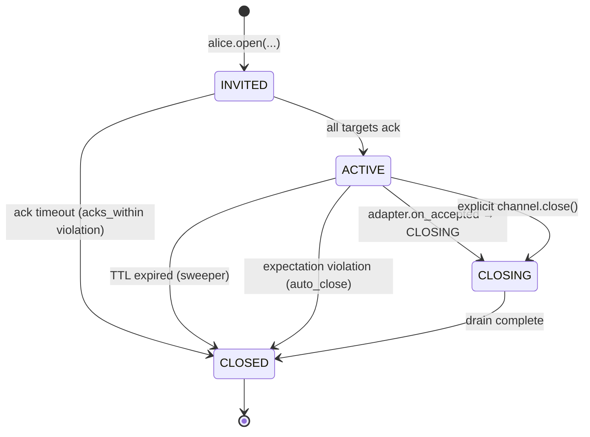
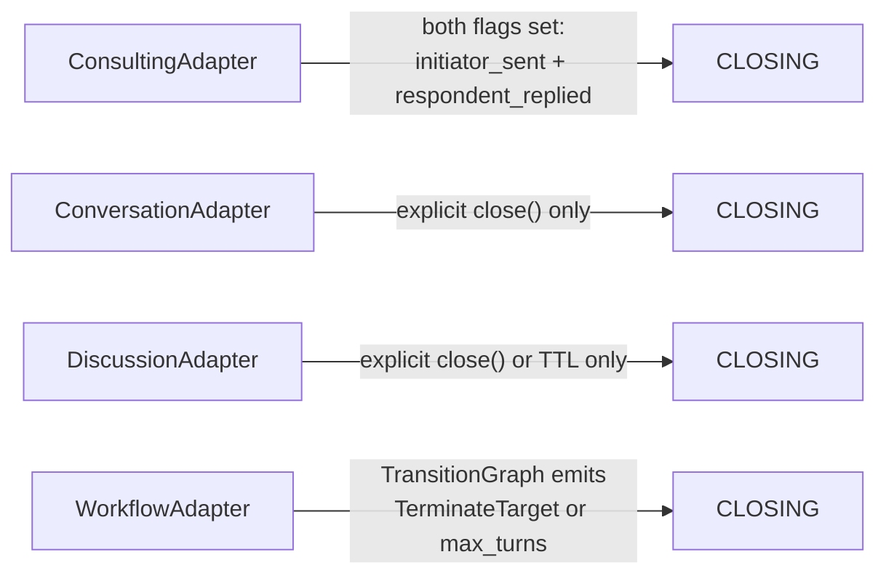

A **channel adapter** governs one channel's allowed sends, default view policy, expectations, and termination rules. Four built-ins ship with the network module; each has its own page.

## Choosing an Adapter

| Use case | Adapter | Page |
|---|---|---|
| 1Q1R — strict question-and-answer, auto-closes after the reply | `#!python consulting` | [Consulting](/docs/beta/network/consulting) |
| 2-party free-form chat with no turn ordering | `#!python conversation` | [Conversation](/docs/beta/network/conversation) |
| N-party round-robin discussion | `#!python discussion` | [Discussion](/docs/beta/network/discussion) |
| Declarative orchestration (group-chat-with-handoff style) | `#!python workflow` | [Workflow](/docs/beta/network/workflow) |

If you're migrating a classic `GroupChat` orchestration, see [Migrating from Group Chat](/docs/beta/network/migration_from_group_chat) — the workflow adapter is the modern equivalent.

## The Adapter Protocol

All four adapters implement the same `#!python ChannelAdapter` Protocol:

```python
class ChannelAdapter(Protocol):
    manifest: ChannelManifest

    def initial_state(self, metadata: ChannelMetadata) -> AdapterState: ...
    def fold(self, envelope: Envelope, state: AdapterState) -> AdapterState: ...
    def validate_create(self, metadata: ChannelMetadata) -> None: ...
    def validate_send(
        self, metadata: ChannelMetadata, envelope: Envelope, state: AdapterState
    ) -> None: ...
    def on_accepted(
        self, metadata: ChannelMetadata, envelope: Envelope, state: AdapterState
    ) -> AdapterResult: ...
```

Each method runs at a specific moment in a channel's lifecycle:

| Method | When | Purpose |
|---|---|---|
| `manifest` | Adapter registration | Static description: type, version, participant counts, knobs schema, default view, default expectations |
| `initial_state` | Channel creation | Build the per-channel bookkeeping (e.g. `expected_next_speaker`, turn count) |
| `validate_create` | Channel creation | Reject the create if the manifest's invariants are violated |
| `fold` | Each accepted envelope | Update the per-channel state (turn-taking, flags, last speaker) |
| `validate_send` | Each prospective send | Reject sends that would violate the protocol (out-of-turn, post-terminal) |
| `on_accepted` | Each accepted envelope | Decide whether to auto-close (`#!python AdapterResult(next_state=CLOSING, ...)`) |

You don't normally implement this protocol yourself — the four built-ins cover most cases, and the workflow adapter is parameterised via `#!python TransitionGraph` for custom orchestrations. The `#!python ChannelAdapter` Protocol is exposed for completeness and for advanced use cases.

## Channel Lifecycle



The state lives on `#!python ChannelMetadata.state` — read it back via `#!python await hub.get_channel(channel_id)`.

The four adapters differ entirely in what triggers the `ACTIVE → CLOSING` arrow:



## ChannelMetadata

```python linenums="1"
from autogen.beta.network import (
    Participant,
    ParticipantRole,
    ParticipantSchema,
    ChannelManifest,
    ChannelMetadata,
    ChannelState,
)
```

The hub-managed record for one channel:

| Field | Notes |
|---|---|
| `channel_id` | UUID hex. |
| `manifest` | Static `ChannelManifest` taken from the adapter. |
| `creator_id` | Who called `agent_client.open(...)`. |
| `participants` | List of `#!python Participant(agent_id, role, order)`. The `order` field is set at create time and used by round-robin adapters. |
| `state` | `ChannelState` enum: `INVITED` / `ACTIVE` / `CLOSING` / `CLOSED` / `EXPIRED`. |
| `created_at` | ISO-Z. |
| `pending_acks` | Agents we're still waiting on. |
| `close_reason` | Free-form string set when the channel terminates. |
| `knobs` | Adapter-specific tuning (`{"ordering": "round_robin"}` for discussion, `{"graph": <dict>}` for workflow). |

## Default Expectations

Each adapter declares its own defaults:

| Adapter | Default expectations |
|---|---|
| `consulting` | `acks_within(30s, auto_close)`, `reply_within(600s, auto_close)` |
| `conversation` | `max_silence(3600s, audit)` |
| `discussion` | `turn_within(120s, warn)`, `turn_within(600s, hide)` |
| `workflow` | `turn_within(120s, warn)`, `turn_within(600s, auto_close)` |

These are enforced by the hub's expectation sweeper. See [Expectations & Audit](/docs/beta/network/expectations_and_audit) for the evaluator and handler model.

## Default View Policies

| Adapter | Default view |
|---|---|
| `consulting` | `#!python FullTranscript()` |
| `conversation` | `#!python WindowedSummary(recent_n=10)` |
| `discussion` | `#!python WindowedSummary(recent_n=N*2)` |
| `workflow` | `#!python WindowedSummary(recent_n=N*2)` |

`N` = participant count. The default view governs what each participant sees of the WAL when the default handler projects history into their LLM turn — see [Views & Skills](/docs/beta/network/views_and_skills).

## What's Next

Pick an adapter from the table at the top of this page and read its dedicated page. Each one includes a worked example you can copy.
