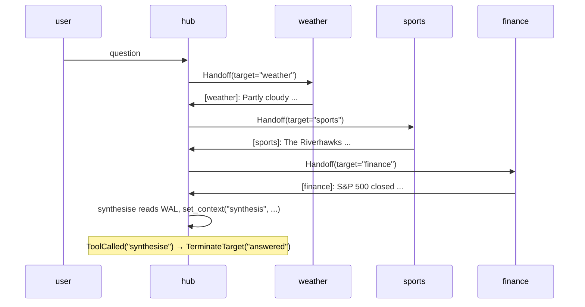

The Star pattern places one hub agent at the centre with several
specialist spokes. The hub fans out questions to the relevant spoke,
collects each reply, and synthesises a final answer. Spokes never
talk to each other; everything routes through the hub.

**Classic (non-beta) primitives:** `#!python DefaultPattern` with
`#!python OnContextCondition` routing, spoke handoffs returning to centre,
`#!python ContextVariables` tracking results.

### Key Characteristics

* **Single hub.** The hub picks which spoke to query, waits for the
  reply, then either delegates to another spoke or terminates with a
  synthesis.
* **Dynamic `#!python Handoff`.** A single parameterised
  `#!python ask_spoke(spoke, query)` tool returns
  `#!python Handoff(target=spoke)`, so the framework routes the next turn
  directly to the chosen spoke. No per-spoke graph rules are needed
  for the delegation edge — `#!python Handoff.target` is authoritative.
* **WAL-gated synthesis.** The `#!python synthesise` tool reads the WAL
  via `#!python HubInject` for each spoke's reply marker (e.g.
  `#!python "[weather]:"`) and refuses with a brief `pending: ...` status
  string until all required spokes have replied. The graph's
  `#!python ToolCalled("synthesise")` rule terminates the workflow once
  the gate opens; the display code reads the stored synthesis from
  `#!python context_vars["synthesis"]` after close.

### Routing Mechanics

* **Spokes return to hub.** `#!python FromSpeaker(<spoke>) → AgentTarget(hub)`
  rotates control back after each spoke replies.
* **Sender prefixing.** Spoke replies in this demo are prefixed with
  the spoke name in square brackets — e.g. `[weather]: Partly cloudy ...`.
  The default `#!python WindowedSummary` projection drops sender identity
  (each envelope becomes a plain user-role message), so an explicit
  prefix lets the hub LLM attribute each reply correctly when
  synthesising.

!!! note "Parallel-call defence"
    Without mitigation, real Sonnet would emit `#!python ask_spoke`
    for all three spokes plus `#!python synthesise` in a single round,
    flooding the trace with parallel tool calls before the first
    spoke even replies. The fix is at the model layer: set
    Anthropic's `#!python tool_choice` knob via
    `#!python AnthropicConfig.extra_body`:

    ```python
    AnthropicConfig(
        model="claude-sonnet-4-6",
        extra_body={"tool_choice": {"type": "auto", "disable_parallel_tool_use": True}},
    )
    ```

    Sonnet now emits exactly one tool call per response. Each round
    becomes a clean `ask_spoke → spoke reply → ask_spoke` sequence,
    and `#!python synthesise` lands only when the hub genuinely
    sees all three replies.

    OpenAI exposes the analogous `#!python parallel_tool_calls=False`
    as a typed field on `#!python OpenAIConfig`; Gemini's behaviour
    is naturally serial. The technique — disable parallel tool calls
    when a hub's protocol requires one tool per turn — is portable;
    only the config knob is provider-specific.

## Agent Flow



## Migration Notes

| Classic | Beta |
|---|---|
| Coordinator routes by inspecting `#!python ContextVariables` | Hub routes via a parameterised `#!python ask_spoke` tool returning `#!python Handoff(target=spoke)` |
| Spoke replies carry `#!python ReplyResult.target=AgentTarget(coordinator)` | `#!python FromSpeaker(<spoke>) → AgentTarget(hub)` rule rotates control back |
| Synthesis triggered by checking aggregated context | Synthesis triggered by an explicit `#!python synthesise` tool call; the tool reads the WAL via `#!python HubInject`, gates on required markers, and stores the result via `#!python set_context` |

## Code

!!! tip
    The hub uses real Sonnet (the routing decision is the LLM-driven
    part of the demo). The spokes use `#!python TestConfig` with
    pre-canned deterministic replies so the synthesis turn can quote
    them cleanly without LLM-quality noise.

```python linenums="1"
"""Cookbook 03 — Star pattern.

A hub agent fans out to specialist spokes via a parameterised
``ask_spoke(spoke, query)`` tool returning ``Handoff(target=spoke)``.
A WAL-gated ``synthesise`` tool composes the final answer once all
required spokes have replied.
"""

import asyncio

from dotenv import load_dotenv

from autogen.beta import Agent
from autogen.beta.config import AnthropicConfig
from autogen.beta.knowledge import MemoryKnowledgeStore
from autogen.beta.network import (
    EV_PACKET,
    EV_SESSION_CLOSED,
    EV_TEXT,
    WORKFLOW_TYPE,
    AgentTarget,
    FromSpeaker,
    Handoff,
    Hub,
    HubClient,
    HubInject,
    LocalLink,
    Passport,
    Resume,
    SessionInject,
    TerminateTarget,
    ToolCalled,
    Transition,
    TransitionGraph,
)
from autogen.beta.network.workflow_helpers import set_context
from autogen.beta.testing import TestConfig

load_dotenv()


_REQUIRED_SPOKES = ("weather", "sports", "finance")


async def ask_spoke(spoke: str, query: str) -> Handoff:
    """Route a query to one of the spokes. Returns a typed
    Handoff(target=spoke) so the framework routes the next turn
    directly to the named spoke."""
    print(f"  [tool] ask_spoke({spoke}): {query}")
    if spoke not in _REQUIRED_SPOKES:
        return Handoff(target="hub", reason=f"unknown spoke {spoke!r}")
    return Handoff(target=spoke, reason=query)


async def synthesise(headline: str, session: SessionInject, hub: HubInject) -> str:
    """Read each spoke's reply from the WAL, build a synthesis, store
    it in context_vars['synthesis']. Refuses with a brief `pending: ...`
    status until all three spokes have replied — this is what makes
    the demo robust to parallel tool calls."""
    if session is None or hub is None:
        return "no session or hub"
    print(f"  [tool] synthesise(headline={headline!r})")

    # Spoke replies are EV_PACKET envelopes whose body starts with
    # the spoke's name marker (e.g. "[weather]: ...").
    wal = await hub.read_wal(session.session_id)
    by_spoke: dict[str, str] = {}
    for env in wal:
        if env.event_type == EV_PACKET:
            text = env.event_data.get("body", "")
        elif env.event_type == EV_TEXT:
            text = env.event_data.get("text", "")
        else:
            continue
        if not (isinstance(text, str) and text.startswith("[") and "]:" in text):
            continue
        marker = text.split("]:", 1)[0].lstrip("[").strip()
        if marker in _REQUIRED_SPOKES:
            by_spoke[marker] = text

    missing = [s for s in _REQUIRED_SPOKES if s not in by_spoke]
    if missing:
        # Terse, neutral status. Avoid wording that prompts the LLM
        # to apologise or explain — that adds noise to the trace.
        return f"pending: {', '.join(missing)}"

    # Build the synthesis in canonical order so the output is stable
    # regardless of which order the spokes were polled.
    bullets: list[str] = [f"**{headline.strip() or 'Roundup'}**", ""]
    for spoke in _REQUIRED_SPOKES:
        bullets.append(f"- {by_spoke[spoke]}")
    synthesis = "\n".join(bullets)

    await set_context(session, "synthesis", synthesis)
    return "synthesis posted"


async def main() -> None:
    # Hub config: disable parallel tool calls so Sonnet emits exactly
    # one ask_spoke (or synthesise) per turn. Spokes use TestConfig so
    # they don't need this.
    hub_config = AnthropicConfig(
        model="claude-sonnet-4-6",
        extra_body={"tool_choice": {"type": "auto", "disable_parallel_tool_use": True}},
    )

    hub_obj = await Hub.open(MemoryKnowledgeStore(), ttl_sweep_interval=0)
    link = LocalLink(hub_obj)

    user_hc = HubClient(link, hub=hub_obj)
    hub_hc = HubClient(link, hub=hub_obj)
    weather_hc = HubClient(link, hub=hub_obj)
    sports_hc = HubClient(link, hub=hub_obj)
    finance_hc = HubClient(link, hub=hub_obj)

    user_agent = Agent("user", config=TestConfig())

    hub_agent = Agent(
        "hub",
        prompt=(
            "You are the hub of a Q&A star. Tools:\n"
            "\n"
            "* `ask_spoke(spoke, query)` — query ONE spoke by name "
            "(`weather`, `sports`, `finance`). Returns a Handoff. The "
            "spoke's reply appears in your CONTEXT on a later turn, "
            "prefixed `[weather]:` / `[sports]:` / `[finance]:`. The "
            "tool's return value is just a routing token; ignore it "
            "and wait for the prefixed reply on a future turn.\n"
            "* `synthesise(headline)` — call ONCE when all three "
            "prefixed spoke replies are visible in your context. "
            "Builds the final synthesis from the WAL and ends the "
            "workflow.\n"
            "\n"
            "Protocol:\n"
            "1. Call exactly ONE tool per turn. Do not write any "
            "prose body alongside your tool call — output the tool "
            "call only.\n"
            "2. Each turn, scan your context for spoke prefixes. "
            "Call `ask_spoke` for a spoke that has NOT yet replied.\n"
            "3. Once all three prefixed replies are visible, call "
            "`synthesise` with a short headline like 'Daily Roundup'.\n"
            "\n"
            "If `synthesise` is called early it returns a brief "
            "`pending: ...` status — that is not an error, just "
            "continue to the next turn and try the missing spoke."
        ),
        config=hub_config,
    )
    hub_agent.tool(ask_spoke)
    hub_agent.tool(synthesise)

    weather_agent = Agent(
        "weather",
        config=TestConfig(
            "[weather]: Partly cloudy, 68°F, light southwesterly breeze; no precipitation expected."
        ),
    )
    sports_agent = Agent(
        "sports",
        config=TestConfig(
            "[sports]: The Riverhawks won 2-1 last night, with the winning goal scored in the 87th minute."
        ),
    )
    finance_agent = Agent(
        "finance",
        config=TestConfig(
            "[finance]: S&P 500 closed up 0.4% on cooling inflation data ahead of next week's Fed meeting."
        ),
    )

    user = await user_hc.register(user_agent, Passport(name="user"), Resume())
    central = await hub_hc.register(hub_agent, Passport(name="hub"), Resume())
    weather = await weather_hc.register(weather_agent, Passport(name="weather"), Resume())
    sports = await sports_hc.register(sports_agent, Passport(name="sports"), Resume())
    finance = await finance_hc.register(finance_agent, Passport(name="finance"), Resume())

    graph = TransitionGraph(
        initial_speaker=user.agent_id,
        transitions=[
            # Synthesis terminates first.
            Transition(when=ToolCalled("synthesise"), then=TerminateTarget("answered")),
            # Spokes always return to hub.
            Transition(when=FromSpeaker(weather.agent_id), then=AgentTarget(central.agent_id)),
            Transition(when=FromSpeaker(sports.agent_id),  then=AgentTarget(central.agent_id)),
            Transition(when=FromSpeaker(finance.agent_id), then=AgentTarget(central.agent_id)),
            # Routing FROM hub to a spoke is via Handoff returns from
            # ask_spoke — the framework reads target from the Handoff
            # and stamps it onto the packet, so no graph rules are
            # needed for the per-spoke edges.
            #
            # User's question → hub.
            Transition(when=FromSpeaker(user.agent_id), then=AgentTarget(central.agent_id)),
        ],
        default_target=TerminateTarget("fall_through"),
        max_turns=20,
    )

    session = await user.open(
        type=WORKFLOW_TYPE,
        target=[central.agent_id, weather.agent_id, sports.agent_id, finance.agent_id],
        knobs={"graph": graph.to_dict()},
    )
    print(f"session: {session.session_id}\n")

    name_by_id = {
        user.agent_id: "user",
        central.agent_id: "hub",
        weather.agent_id: "weather",
        sports.agent_id: "sports",
        finance.agent_id: "finance",
    }

    await session.send(
        "What's the weather like and how did the local football team do? "
        "Also a quick word on the markets."
    )

    # Wait for the workflow to terminate (any of the five close routes
    # documented in /docs/beta/network/termination — this demo uses
    # ToolCalled("synthesise") → TerminateTarget("answered")).
    close_env = await user_hc.wait_for_session_event(
        session_id=session.session_id,
        predicate=lambda e: e.event_type == EV_SESSION_CLOSED,
        timeout=240.0,
    )

    # Print the transcript from the WAL after close.
    for env in await hub_obj.read_wal(session.session_id):
        speaker = name_by_id.get(env.sender_id, env.sender_id[:8])
        if env.event_type == EV_TEXT:
            print(f"{speaker:>14}: {env.event_data['text']}")
        elif env.event_type == EV_PACKET:
            routing = env.event_data.get("routing", {}) or {}
            if routing.get("kind") == "handoff":
                line = f"[Handed off via {routing.get('tool', '')}] {routing.get('reason', '')}"
                print(f"{speaker:>14}: {line.rstrip()}")
            body = env.event_data.get("body", "")
            if body:
                print(f"{speaker:>14}: {body}")

    print(f"\nclosed: reason={close_env.event_data.get('reason')!r}")

    print("\n--- final synthesis ---")
    state = hub_obj._adapter_states[session.session_id]
    print(state.context_vars.get("synthesis", "(no synthesis)"))

    await user_hc.close()
    await hub_hc.close()
    await weather_hc.close()
    await sports_hc.close()
    await finance_hc.close()
    await hub_obj.close()


if __name__ == "__main__":
    asyncio.run(main())
```

## Output

```console
session: 4f2e...

           user: What's the weather like and how did the local football team do? Also a quick word on the markets.
  [tool] ask_spoke(weather): What is the current weather like?
            hub: [Handed off via ask_spoke] What is the current weather like?
        weather: [weather]: Partly cloudy, 68°F, light southwesterly breeze; no precipitation expected.
  [tool] ask_spoke(sports): How did the local football team do?
            hub: [Handed off via ask_spoke] How did the local football team do?
         sports: [sports]: The Riverhawks won 2-1 last night, with the winning goal scored in the 87th minute.
  [tool] ask_spoke(finance): Quick market summary
            hub: [Handed off via ask_spoke] Quick market summary
        finance: [finance]: S&P 500 closed up 0.4% on cooling inflation data ahead of next week's Fed meeting.
  [tool] synthesise(headline='Daily Roundup')
            hub: [Handed off via synthesise]

closed: reason='answered'

--- final synthesis ---
**Daily Roundup**

- [weather]: Partly cloudy, 68°F, light southwesterly breeze; no precipitation expected.
- [sports]: The Riverhawks won 2-1 last night, with the winning goal scored in the 87th minute.
- [finance]: S&P 500 closed up 0.4% on cooling inflation data ahead of next week's Fed meeting.
```
