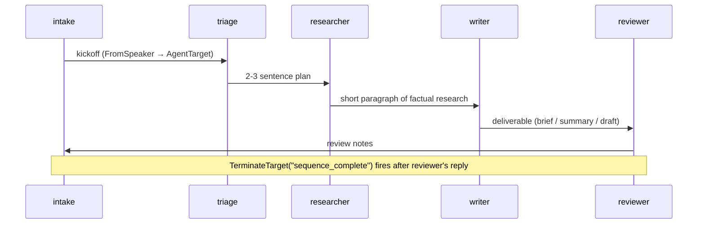

The Triage with Tasks pattern breaks a complex request into typed
tasks (research → writing → review). Each task type routes to a
specialist; tasks process sequentially, respecting prerequisite
ordering. A triage agent up front produces the plan that downstream
specialists work from.

**Classic (non-beta) primitives:** `#!python DefaultPattern`, `#!python OnContextCondition`
checking `current_task_type`, `#!python ReplyResult` advancing the task
index.

### Key Characteristics

* **Triage produces a plan.** The triage agent's only job is to
  write a 2-3 sentence plan naming the three tasks and what each
  will produce for THIS specific request. Downstream specialists
  read the plan as their brief.
* **Sequence then synthesises.** This demo uses
  `#!python TransitionGraph.sequence` — a fixed pipeline of triage →
  researcher → writer → reviewer. Each specialist sees the full
  prior conversation via the windowed view.
* **`#!python knobs["context_vars"]` seeds state at channel creation.**
  Any tool / middleware can read it via `#!python ChannelStateInject`;
  transitions can route on it via `#!python ContextEquals`. The fixed
  sequence here doesn't need to read it for routing — it's there to
  demonstrate that channel-scoped state survives the entire run.

### Routing Mechanics

There is no routing tool in this demo — every step is a plain
`#!python FromSpeaker(a) → AgentTarget(b)` rule wired by
`#!python TransitionGraph.sequence([...])`. The plan is a single triage
output that the windowed view propagates to every subsequent
specialist.

!!! note "Sequence variant vs. dynamic queue"
    The runnable demo uses the simpler `#!python TransitionGraph.sequence`
    variant: triage produces a real LLM-generated plan, then the
    sequence executes researcher → writer → reviewer
    deterministically.

    The dynamic version (triage advances via an `#!python advance_task`
    tool that pops the next task type from a queue, with
    `#!python ContextEquals(current_task_type, ...)` per branch) has a
    sharp edge today: parallel-tool-calling LLMs can fire
    `#!python advance_task` multiple times in one triage turn, each call
    mutating the queue before the previous handoff has locked the
    speaker. The first dispatch wins; the others corrupt state. The
    clean fix is either `#!python disable_parallel_tool_use` at the
    model layer (not yet exposed via `#!python AnthropicConfig`) or
    compare-and-swap on the queue. In the meantime, a sequence
    graph trades the dynamic queue for determinism.

## Agent Flow



## Migrating from Classic to Beta?

| Classic | Beta |
|---|---|
| `#!python ReplyResult(context_variables={"current_task_type": ..., "pending_tasks": [...]})` | `#!python set_context(channel, key, value)` per field (dynamic variant) |
| `#!python OnContextCondition` per task type | `#!python ContextEquals("current_task_type", <type>)` per branch (dynamic variant) |
| Initial `#!python ContextVariables(data=...)` passed to the pattern | `#!python knobs["context_vars"]` on `#!python channel.open(...)` |

### Dynamic queue variant (production pattern)

The dynamic variant has the triage agent owning a list of pending
tasks in context. Its tool either pops the next task type into
`#!python current_task_type` or flips `#!python all_done=True` when the list
is empty — both via `#!python set_context`:

```python linenums="1"
async def advance_task(channel: ChannelInject, state: ChannelStateInject) -> str:
    pending = list(state.context_vars.get("pending_tasks", []))
    if not pending:
        await set_context(channel, "all_done", True)
        return "all tasks complete"
    next_type = pending.pop(0)
    await set_context(channel, "current_task_type", next_type)
    await set_context(channel, "pending_tasks", pending)
    return f"now working on: {next_type}"
```

The matching graph routes per task type and terminates when the queue
is empty:

```python linenums="1" hl_lines="4-10"
graph = TransitionGraph(
    initial_speaker=triage.agent_id,
    transitions=[
        Transition(when=ContextEquals("all_done", True), then=TerminateTarget("complete")),
        Transition(when=ContextEquals("current_task_type", "research"), then=AgentTarget(researcher.agent_id)),
        Transition(when=ContextEquals("current_task_type", "writing"),  then=AgentTarget(writer.agent_id)),
        Transition(when=ContextEquals("current_task_type", "review"),   then=AgentTarget(reviewer.agent_id)),
        Transition(when=FromSpeaker(researcher.agent_id), then=AgentTarget(triage.agent_id)),
        Transition(when=FromSpeaker(writer.agent_id),     then=AgentTarget(triage.agent_id)),
        Transition(when=FromSpeaker(reviewer.agent_id),   then=AgentTarget(triage.agent_id)),
    ],
    default_target=TerminateTarget("max_turns"),
    max_turns=30,
)
```

The sequence variant below is the runnable demo.

## Code

!!! tip
    Real Sonnet on every agent — triage produces an actual plan,
    each specialist does real domain work.

```python linenums="1"
"""Cookbook 08 — Triage with Tasks pattern.

A triage agent receives the user's request and produces a typed
task plan (research → writing → review). The graph then executes
the plan as a fixed sequence, each specialist seeing the prior
conversation. The plan is also stamped into ``context_vars`` at
channel creation so it's readable across the run.
"""

import asyncio

from dotenv import load_dotenv

from autogen.beta import Agent
from autogen.beta.config import AnthropicConfig
from autogen.beta.knowledge import MemoryKnowledgeStore
from autogen.beta.network import (
    EV_PACKET,
    EV_CHANNEL_CLOSED,
    EV_TEXT,
    WORKFLOW_TYPE,
    Hub,
    HubClient,
    LocalLink,
    Passport,
    Resume,
    TransitionGraph,
)
from autogen.beta.testing import TestConfig

load_dotenv()

async def main() -> None:
    config = AnthropicConfig(model="claude-sonnet-4-6")

    hub_obj = await Hub.open(MemoryKnowledgeStore(), ttl_sweep_interval=0)
    link = LocalLink(hub_obj)

    intake_hc = HubClient(link, hub=hub_obj)
    triage_hc = HubClient(link, hub=hub_obj)
    researcher_hc = HubClient(link, hub=hub_obj)
    writer_hc = HubClient(link, hub=hub_obj)
    reviewer_hc = HubClient(link, hub=hub_obj)

    intake_agent = Agent("intake", config=TestConfig())

    triage_agent = Agent(
        "triage",
        prompt=(
            "You are the triage agent. The user has just submitted a "
            "request. Your job is ONE thing: write a 2-3 sentence "
            "plan that names the three tasks (research, writing, "
            "review) and what each will produce for THIS specific "
            "request. Be concrete — the specialists will read your "
            "plan as their brief. No preamble, no headers."
        ),
        config=config,
    )

    researcher_agent = Agent(
        "researcher",
        prompt=(
            "You are the researcher. Triage's plan is the most "
            "recent message in your context. Reply with ONE short "
            "paragraph (3-4 sentences) of factual research relevant "
            "to the request. No preamble."
        ),
        config=config,
    )
    writer_agent = Agent(
        "writer",
        prompt=(
            "You are the writer. The conversation contains the "
            "user's request, triage's plan, and the researcher's "
            "findings. Produce the actual deliverable that the user "
            "requested (a brief, a summary, a draft — whatever fits) "
            "drawing on the research. No preamble."
        ),
        config=config,
    )
    reviewer_agent = Agent(
        "reviewer",
        prompt=(
            "You are the reviewer. The conversation contains the "
            "writer's draft. Reply with ONE short paragraph (2-3 "
            "sentences) of constructive review notes — what works, "
            "what could be tightened. No preamble."
        ),
        config=config,
    )

    intake = await intake_hc.register(intake_agent, Passport(name="intake"), Resume())
    triage = await triage_hc.register(triage_agent, Passport(name="triage"), Resume())
    researcher = await researcher_hc.register(researcher_agent, Passport(name="researcher"), Resume())
    writer = await writer_hc.register(writer_agent, Passport(name="writer"), Resume())
    reviewer = await reviewer_hc.register(reviewer_agent, Passport(name="reviewer"), Resume())

    graph = TransitionGraph.sequence([
        intake.agent_id,
        triage.agent_id,
        researcher.agent_id,
        writer.agent_id,
        reviewer.agent_id,
    ])

    # context_vars seeds the task plan into channel state at creation.
    # Any tool / middleware can read it via ChannelStateInject;
    # transitions can route on it via ContextEquals. The fixed
    # sequence here doesn't need to read it for routing — it's there
    # to demonstrate that channel-scoped state survives the run.
    channel = await intake.open(
        type=WORKFLOW_TYPE,
        target=[triage.agent_id, researcher.agent_id, writer.agent_id, reviewer.agent_id],
        knobs={
            "graph": graph.to_dict(),
            "context_vars": {
                "pending_tasks": ["research", "writing", "review"],
                "completed_tasks": [],
                "request_kind": "brief",
            },
        },
    )
    print(f"channel: {channel.channel_id}\n")

    name_by_id = {
        intake.agent_id: "intake",
        triage.agent_id: "triage",
        researcher.agent_id: "researcher",
        writer.agent_id: "writer",
        reviewer.agent_id: "reviewer",
    }

    initial_state = hub_obj._adapter_states[channel.channel_id]
    print(f"initial context_vars: {initial_state.context_vars!r}\n")

    await channel.send("Write a 3-sentence brief on distributed consensus.")

    # Wait for the workflow to terminate (any of the five close routes
    # documented in /docs/beta/network/termination — this demo uses
    # TerminateTarget("sequence_complete") after the reviewer's reply).
    close_env = await intake.wait_for_channel_event(
        channel_id=channel.channel_id,
        predicate=lambda e: e.event_type == EV_CHANNEL_CLOSED,
        timeout=240.0,
    )

    # Print the transcript from the WAL after close.
    for env in await hub_obj.read_wal(channel.channel_id):
        speaker = name_by_id.get(env.sender_id, env.sender_id[:8])
        if env.event_type == EV_TEXT:
            print(f"{speaker:>14}: {env.event_data['text']}")
        elif env.event_type == EV_PACKET:
            routing = env.event_data.get("routing", {}) or {}
            if routing.get("kind") == "handoff":
                line = f"[Handed off via {routing.get('tool', '')}] {routing.get('reason', '')}"
                print(f"{speaker:>14}: {line.rstrip()}")
            body = env.event_data.get("body", "")
            if body:
                print(f"{speaker:>14}: {body}")

    print(f"\nclosed: reason={close_env.event_data.get('reason')!r}")
    final_state = hub_obj._adapter_states[channel.channel_id]
    print(f"final context_vars: {final_state.context_vars!r}")

    await intake_hc.close()
    await triage_hc.close()
    await researcher_hc.close()
    await writer_hc.close()
    await reviewer_hc.close()
    await hub_obj.close()

if __name__ == "__main__":
    asyncio.run(main())
```

## Output

```console
channel: 6b1a...
initial context_vars: {'pending_tasks': ['research', 'writing', 'review'], 'completed_tasks': [], 'request_kind': 'brief'}

         intake: Write a 3-sentence brief on distributed consensus.
         triage: Research will gather the canonical protocols (Paxos, Raft) and the FLP impossibility result. Writing will produce a 3-sentence brief defining distributed consensus, naming the protocols, and stating the safety/liveness trade-off. Review will check that the brief is technically accurate and reads naturally.
     researcher: Distributed consensus protocols allow a set of unreliable nodes to agree on a single value despite failures and message loss. Paxos and Raft are the dominant safety-first protocols; Raft is widely deployed (etcd, Consul) for its leader-based simplicity, while Paxos underpins systems like Google Chubby. The FLP impossibility theorem proves that no asynchronous protocol can guarantee both safety and liveness without timing assumptions, so all production protocols rely on partial synchrony or randomness.
         writer: Distributed consensus is the problem of getting a fleet of unreliable nodes to agree on one value despite failures. Paxos and Raft are the canonical protocols — Raft is favoured for its leader-based simplicity and powers etcd and Consul; Paxos predates it and underpins systems like Chubby. The FLP impossibility theorem is the price of asynchrony: no protocol can guarantee both safety and liveness without timing assumptions, so production systems rely on partial synchrony.
       reviewer: The brief is technically accurate and well-paced — naming Paxos / Raft and citing etcd / Consul / Chubby gives it the right level of detail for a 3-sentence summary. The closing FLP sentence is dense; consider splitting "the price of asynchrony" off as a short framing phrase so the impossibility result lands with one clear takeaway. Otherwise it's ship-ready.

closed: reason='sequence_complete'
final context_vars: {'pending_tasks': ['research', 'writing', 'review'], 'completed_tasks': [], 'request_kind': 'brief'}
```
