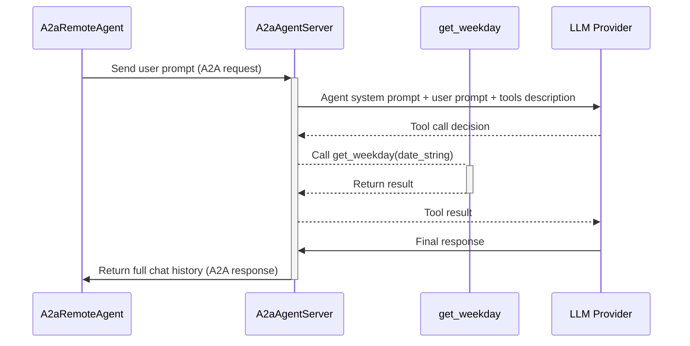
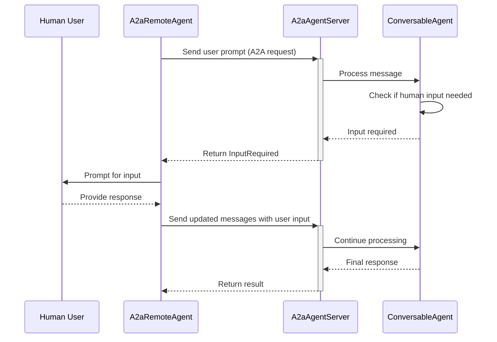

# A2A Server Setup

The A2A server allows you to expose your AG2 agents as web services that can be accessed by remote clients. This guide covers everything you need to know about setting up and configuring A2A servers.

## Simple Server Setup

```python title="server.py" linenums="1" hl_lines="16-19"
from autogen import ConversableAgent, LLMConfig
from autogen.a2a import A2aAgentServer

# Create your regular agent
llm_config = LLMConfig({ "model": "gpt-4o-mini" })

agent = ConversableAgent(
    name="python_coder",
    system_message="You are an expert Python developer...",
    llm_config=llm_config,
    # set human_input_mode "NEVER" to avoid asking for human input on server side
    human_input_mode="NEVER",
)

# Create A2A server
server = A2aAgentServer(
    agent,
    url="http://0.0.0.0:8000"
).build()
```

Now you can start it using any ASGI server, for example:

```bash
uvicorn server:server --host 0.0.0.0 --port 8000
```

!!! tip
    Do not forget to set the `url` parameter to match your server URL. It will be used to build the public agent card.

## Capabilities

### Remote Tools execution details

AG2 has a great feature - [Tools](/docs/user-guide/advanced-concepts/tools){.internal-link}. Our A2A agent executor allows your remote agents to execute any tool by themselves. So, if your client calls an agent with a tool, their tools will be executed and the result processed by the remote agent, with a final result returned to the client.

```python title="remote.py" linenums="1" hl_lines="17-23"
from datetime import datetime
from typing import Annotated

from autogen import ConversableAgent, LLMConfig
from autogen.a2a import A2aAgentServer
from autogen.agentchat import ReplyResult

llm_config = LLMConfig({ "model": "gpt-4o-mini" })

agent = ConversableAgent(
    name="calendar_agent",
    llm_config=llm_config,
    human_input_mode="NEVER",
    silent=True,
)

@agent.register_for_llm(name="get_weekday", description="Get the day of the week for a given date")
@agent.register_for_execution(name="get_weekday")
def get_weekday(
    date_string: Annotated[str, "Format: YYYY-MM-DD"],
) -> str:
    date = datetime.strptime(date_string, "%Y-%m-%d")
    return ReplyResult(message=date.strftime("%A"))

app = A2aAgentServer(agent, url="http://0.0.0.0:8000").build()
```

Here’s how the sequence looks as a diagram:



### Human in the Loop (HITL) Support

A2A servers support Human in the Loop interactions, allowing agents to request human input during task execution. When an agent's `human_input_mode` is set to a mode that requires human input (e.g., `"ALWAYS"`, `"TERMINATE"`, or `"NEVER"` with termination messages), the server will automatically detect when input is needed and return a response with the `InputRequired` signal.

```python title="server.py" linenums="1" hl_lines="23-24"
from autogen import ConversableAgent, LLMConfig
from autogen.a2a import A2aAgentServer

llm_config = LLMConfig({ "model": "gpt-4o-mini" })

agent = ConversableAgent(
    name="approval_agent",
    system_message="You are an approval agent that requires human confirmation for important decisions.",
    llm_config=llm_config,
    # Enable human input mode to allow the agent to request input
    human_input_mode="TERMINATE",
)

server = A2aAgentServer(agent).build()
```

The client will automatically handle the input request, prompt the user, and send the response back to continue the conversation.

Here's how the HITL flow looks:



!!! note
    The server doesn't block waiting for human input. Instead, it returns immediately with an `input_required` response, and the client handles the interaction loop.

#### AskUserTarget in Tool Responses

Tools running on remote agents can also request human input by using `AskUserTarget` in their response.

When a tool returns a `ReplyResult` with `target=AskUserTarget()`, the A2A server will automatically signal the client that human input is needed, and the client will prompt the user before continuing execution.

```python title="server.py" linenums="1"
from datetime import datetime
from typing import Annotated
from autogen import ConversableAgent, LLMConfig
from autogen.a2a import A2aAgentServer
from autogen.agentchat.group import AskUserTarget, ReplyResult

llm_config = LLMConfig({ "model": "gpt-4o-mini" })

agent = ConversableAgent(
    name="date_agent",
    llm_config=llm_config,
)

@agent.register_for_llm()
def get_weekday(date_string: Annotated[str, "Format: YYYY-MM-DD"]) -> str:
    weekday = datetime.strptime(date_string, "%Y-%m-%d").strftime("%A")
    # Return result with AskUserTarget to prompt user for next step
    return ReplyResult(message=weekday, target=AskUserTarget())

server = A2aAgentServer(agent).build()
```

### Support for other features

Additionally, remote agents support AG2's Group Chat features without needing any additional configuration:

- [Context Variables](/docs/user-guide/advanced-concepts/orchestration/group-chat/context-variables/){.internal-link}
- [Guardrails](/docs/user-guide/advanced-concepts/orchestration/group-chat/guardrails/){.internal-link}

Just use these features with your remote `ConversableAgent` agent, wrap it in `A2aAgentServer`, and let the magic happen!


### Multiple agents on one server

The A2A protocol assumes a single agent per server. However, because `A2aAgentServer` is a full-featured ASGI application, you can combine it with other ASGI apps in any way you need. So, you can add your server to regular FastAPI applications or other ASGI applications. Furthermore, you can combine multiple agents onto one server, separated by paths.

An example of multiple agents on one server:

```python title="remote.py" linenums="1" hl_lines="9 13 17"
from autogen.a2a import A2aAgentServer
from starlette.applications import Starlette
from starlette.routing import Mount

app = Starlette(
    routes=[
        Mount(
            "/triage",
            A2aAgentServer(triage_agent, url="http://0.0.0.0:8000/triage/").build(),
        ),
        Mount(
            "/tech",
            A2aAgentServer(tech_agent, url="http://0.0.0.0:8000/tech/").build(),
        ),
        Mount(
            "/general",
            A2aAgentServer(general_agent, url="http://0.0.0.0:8000/general/").build(),
        ),
    ]
)
```

!!! tip

    Be careful with the `A2aAgentServer(..., url="...")` parameter. It will be used to build the agent card, so you need to add your path with `/` at the end of the server URL.


In this case, the clients for these agents would be:

```python title="client.py" linenums="1" hl_lines="4 9 14"
from autogen.a2a import A2aRemoteAgent

triage_agent = A2aRemoteAgent(
    "http://localhost:8000/triage/",
    name="triage_agent",
)

tech_agent = A2aRemoteAgent(
    "http://localhost:8000/tech/",
    name="tech_agent",
)

general_agent = A2aRemoteAgent(
    "http://localhost:8000/general/",
    name="general_agent",
)
```

## Advanced A2A Configuration

AG2 doesn't limit A2A to a default implementation. You can specify any and all parts of the server that you need. To enable this, we provide a way to use the native [A2A python sdk](https://github.com/a2aproject/a2a-python){.external-link target="_blank"} to fully customize your server.

### Agent Card

The Agent Card describes your agent's capabilities and is [automatically discovered by clients](https://a2a-protocol.org/latest/topics/agent-discovery/){.external-link target="_blank"}.

To configure an Agent Card, you can use the `agent_card` and `extended_agent_card` parameters.

* `agent_card` - basic agent card, describes basic capabilities of your agent and is available to all clients
* `extended_agent_card` - extended agent card, for authenticated access with additional capabilities

```python title="server.py" linenums="1" hl_lines="7 11"
from autogen.a2a import A2aAgentServer, CardSettings
from a2a.types import AgentSkill

server = A2aAgentServer(
    agent,
    url="http://0.0.0.0:8000",
    agent_card=CardSettings(
        name="Public Python Coder",
        description="Basic Python coding assistance",
    ),
    extended_agent_card=CardSettings(
        name="Premium Python Coder",
        description="Advanced Python coding with premium features",
        skills=[
            AgentSkill(
                name="advanced_optimization",
                id="opt",
                description="Advanced code optimization techniques",
                tags=["python", "coding", "optimization"],
            )
        ]
    )
).build()
```

!!! note
    By default `A2aAgentServer` uses the agent's name and description to build their agent card.

    You can override it by passing in the `agent_card` and `extended_agent_card` parameters.

### Custom Request Handler

For advanced use cases, you can customize the request handling, allowing you to use your own task store, queue manager, or configure push notifications, etc. By default, `A2aAgentServer` uses the simple `InMemoryTaskStore` to store tasks.

```python title="server.py" linenums="1" hl_lines="7-10"
from a2a.server.request_handlers import DefaultRequestHandler
from a2a.server.tasks import InMemoryTaskStore
from autogen.a2a import A2aAgentServer

server = A2aAgentServer(agent)

request_handler = DefaultRequestHandler(
    agent_executor=server.executor,  # use AG2 executor
    task_store=InMemoryTaskStore(),
)

app = server.build(request_handler=request_handler)
```

### Custom Server Application

You can also use your own server application. For example, `A2AFastAPIApplication` is a FastAPI application that can be used to serve your agent.

```python title="server.py" linenums="1" hl_lines="7-13"
from a2a.server.apps import A2AFastAPIApplication
from autogen import ConversableAgent
from autogen.a2a import A2aAgentServer

server = A2aAgentServer(agent)

app = A2AFastAPIApplication(
    agent_card=server.card,
    extended_agent_card=server.extended_agent_card,
    # use default request handler or
    # your own request handler from the previous example
    http_handler=server.build_request_handler(),
).build()
```

Please refer to the [A2A python sdk](https://github.com/a2aproject/a2a-python){.external-link target="_blank"} documentation for more details on how to use it.
