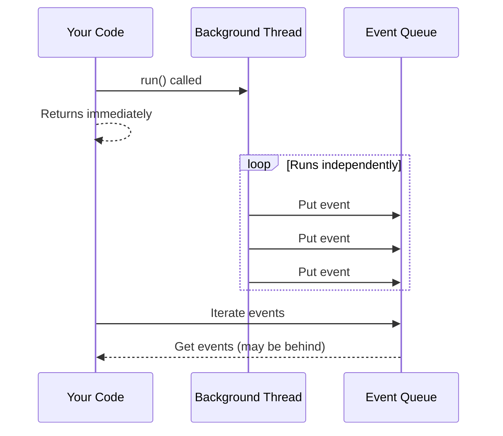
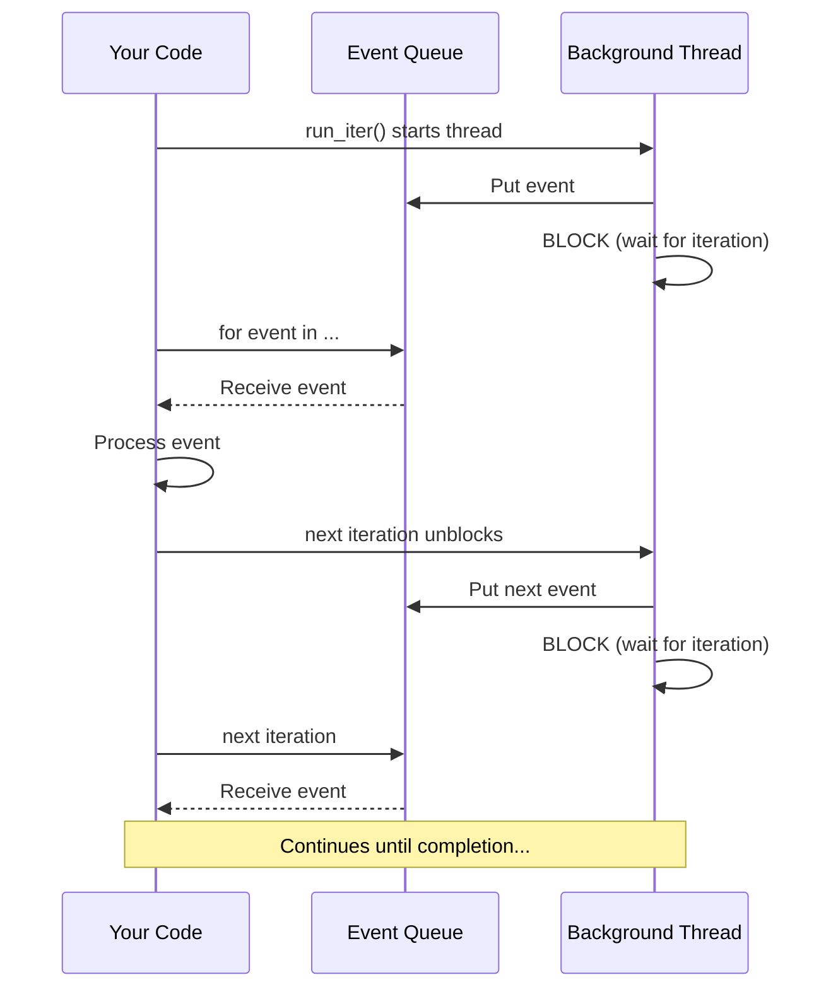

The `run_iter()` and `run_group_chat_iter()` methods give you fine-grained control over agent execution by yielding events one at a time. This is essential for debugging, implementing human-in-the-loop workflows, and building interactive applications.

## Why Iterate Over Runs?

When you call `run()` or `run_group_chat()`, the agent conversation executes in a **background thread** that runs independently:



This design is great for streaming UIs, but makes it difficult to:

- **Debug step-by-step** - Execution races ahead while you inspect events
- **Implement human-in-the-loop** - Hard to pause for approval before actions
- **Build interactive tools** - Can't gate execution on user decisions

**Run iteration** solves this by synchronizing execution - the background thread blocks after each event until you advance to the next iteration.

## Getting Started

Use `run_iter()` instead of `run()` to iterate over events:

```python
import os
from autogen import ConversableAgent, LLMConfig

llm_config = LLMConfig(api_type="openai", model="gpt-4o-mini", api_key=os.environ["OPENAI_API_KEY"])

assistant = ConversableAgent(
    "Assistant",
    system_message="You are a helpful assistant. Say DONE when finished.",
    is_termination_msg=lambda x: "DONE" in x.get("content", ""),
    llm_config=llm_config,
)

# Iterate over events as they occur
for event in assistant.run_iter(message="Hello!", max_turns=2):
    print(f"Event: {event.type}")

print("Run completed!")
```

### Key Points

1. **Use `run_iter()`** instead of `run()` for event-by-event control
2. **Iterate with `for event in ...`** to process events one at a time
3. **Iteration ends naturally** when the run completes
4. **Cleanup is automatic** - the generator handles cleanup on break or exception

## Filtering Events with `yield_on`

By default, `run_iter()` yields every event. Use `yield_on` to filter which events are yielded:

```python
from autogen.events.agent_events import TextEvent, ToolCallEvent, TerminationEvent

for event in assistant.run_iter(
    message="Calculate 2 + 2",
    max_turns=3,
    yield_on=[TextEvent, ToolCallEvent, TerminationEvent],  # Only yield these
):
    if isinstance(event, TextEvent):
        print(f"Text from {event.content.sender}: {event.content.content}")
    elif isinstance(event, ToolCallEvent):
        print(f"Tool call: {event.content.tool_calls}")
```

### Common Event Types

| Event Type | Description |
|------------|-------------|
| `TextEvent` | Agent sends or receives a text message |
| `ToolCallEvent` | Agent wants to call a tool |
| `ToolResponseEvent` | Tool returns a result |
| `ExecutedFunctionEvent` | Function execution completed |
| `TerminationEvent` | Conversation terminates |
| `GroupChatRunChatEvent` | Agent selected to speak in group chat |

### Special Events (Always Yielded)

These events bypass the `yield_on` filter because they require immediate handling:

| Event Type | Behavior |
|------------|----------|
| `InputRequestEvent` | Always yielded - user must respond |
| `ErrorEvent` | Raises as exception |
| `RunCompletionEvent` | Signals completion (iteration ends) |

### Handling Input Requests

When an agent requests human input, you must respond:

```python
from autogen.events.agent_events import InputRequestEvent

for event in assistant.run_iter(message="Ask me a question"):
    if isinstance(event, InputRequestEvent):
        user_input = input(event.content.prompt)
        event.content.respond(user_input)
        continue

    # Handle other events...
```

## Iterating Group Chats

Use `run_group_chat_iter()` for multi-agent conversations:

```python
from autogen.agentchat.group.multi_agent_chat import run_group_chat_iter
from autogen.agentchat.group.patterns import AutoPattern
from autogen.events.agent_events import GroupChatRunChatEvent, TextEvent

# Create agents
coder = ConversableAgent("Coder", system_message="Write code.", llm_config=llm_config)
reviewer = ConversableAgent("Reviewer", system_message="Review code.", llm_config=llm_config)

pattern = AutoPattern(
    initial_agent=coder,
    agents=[coder, reviewer],
    group_manager_args={"llm_config": llm_config},
)

# Iterate over group chat events
for event in run_group_chat_iter(
    pattern=pattern,
    messages="Write a hello world function",
    max_rounds=4,
    yield_on=[GroupChatRunChatEvent, TextEvent],
):
    if isinstance(event, GroupChatRunChatEvent):
        print(f"\n=== {event.content.speaker}'s turn ===")
    elif isinstance(event, TextEvent):
        print(f"{event.content.content[:100]}...")
    elif isinstance(event, InputRequestEvent):
        user_input = input(event.content.prompt)
        event.content.respond(user_input)
```

## Practical Use Cases

### Aborting Execution

Break out of the iteration to stop execution immediately:

```python
from autogen.events.agent_events import ToolCallEvent

BLOCKED_ACTIONS = ["delete_file", "send_email"]

aborted = False
for event in assistant.run_iter(message="Delete the config file"):
    if isinstance(event, ToolCallEvent):
        for tool_call in event.content.tool_calls:
            if tool_call.function.name in BLOCKED_ACTIONS:
                print(f"BLOCKED: {tool_call.function.name}")
                aborted = True
                break
        if aborted:
            break  # Exit the loop - execution stops

if aborted:
    print("Execution was aborted before the action could run.")
```

### Human Approval for Tools

Prompt for approval before tool execution:

```python
for event in assistant.run_iter(message="Send an email"):
    if isinstance(event, ToolCallEvent):
        for tool_call in event.content.tool_calls:
            print(f"Agent wants to call: {tool_call.function.name}")
            print(f"Arguments: {tool_call.function.arguments}")
            approval = input("Approve? (y/n): ")
            if approval.lower() != 'y':
                print("Rejected - aborting")
                break
```

## How It Works

The iterator synchronizes the producer (background thread) and consumer (your code):



### Automatic Cleanup

Python's generator cleanup ensures the background thread exits cleanly, even if an exception occurs or you break out of the loop:

```python
# Safe - cleanup happens automatically on break
for event in assistant.run_iter(message="Hello"):
    if should_stop(event):
        break  # Generator cleanup terminates the background thread

# Safe - cleanup happens automatically on exception
for event in assistant.run_iter(message="Hello"):
    process(event)  # If this raises, cleanup still happens
```

The generator's `finally` block terminates the controller, allowing the background thread to exit.

## Custom Events

You can create custom events to yield on your domain-specific conditions.

### Requirements

1. Inherit from `BaseEvent`
2. Use the `@wrap_event` decorator
3. Class name must end with `Event`

```python
from typing import Any, Callable
from autogen.events.base_event import BaseEvent, wrap_event, resolve_print_callable

@wrap_event
class ValidationCheckpointEvent(BaseEvent):
    """Custom event for validation checkpoints."""
    checkpoint_name: str
    records_processed: int
    passed: bool

    def print(self, f: Callable[..., Any] | None = None) -> None:
        f = resolve_print_callable(f)
        status = "PASSED" if self.passed else "FAILED"
        f(f"[Checkpoint] {self.checkpoint_name}: {status}", flush=True)
```

### Emitting Custom Events

Emit events from within tools using `IOStream`:

```python
from autogen.io.base import IOStream
from autogen.tools import tool

@tool(description="Process data through validation stages")
def process_data(source: str, count: int) -> str:
    # Stage 1
    IOStream.get_default().send(
        ValidationCheckpointEvent(
            checkpoint_name="extraction",
            records_processed=count,
            passed=True,
        )
    )

    # Stage 2
    IOStream.get_default().send(
        ValidationCheckpointEvent(
            checkpoint_name="validation",
            records_processed=count,
            passed=count > 0,
        )
    )

    return f"Processed {count} records"
```

### Yielding Custom Events

Add your custom event to `yield_on`:

```python
for event in assistant.run_iter(
    message="Process the data",
    yield_on=[ValidationCheckpointEvent, TextEvent],
):
    if isinstance(event, ValidationCheckpointEvent):
        print(f"Checkpoint: {event.content.checkpoint_name}")
        if not event.content.passed:
            print("Validation failed - aborting")
            break
```

## API Reference

### `run_iter()` Parameters

| Parameter | Type | Default | Description |
|-----------|------|---------|-------------|
| `yield_on` | `Sequence[type[BaseEvent]]` | `None` | Event types to yield (None = all events) |

All other parameters are the same as `run()`.

### `run_group_chat_iter()` Parameters

| Parameter | Type | Default | Description |
|-----------|------|---------|-------------|
| `yield_on` | `Sequence[type[BaseEvent]]` | `None` | Event types to yield (None = all events) |

All other parameters are the same as `run_group_chat()`.

### Async Support

Async versions are fully supported:

```python
async for event in assistant.a_run_iter(message="Hello"):
    # Process event
    pass
```

For group chats:

```python
from autogen.agentchat.group.multi_agent_chat import a_run_group_chat_iter

async for event in a_run_group_chat_iter(pattern=pattern, messages="Hello"):
    # Process event
    pass
```

## Summary

Run iteration provides precise control over agent execution:

- **`run_iter()` / `a_run_iter()`** - Iterate over single-agent runs
- **`run_group_chat_iter()` / `a_run_group_chat_iter()`** - Iterate over group chats
- **`yield_on=[...]`** - Filter which events to yield
- **`for event in ...`** - Simple Python iteration
- **Custom events** - Create domain-specific checkpoints

Use run iteration for:

- Debugging agent conversations
- Human-in-the-loop approval workflows
- Aborting execution based on conditions
- Monitoring and logging all events
- Building interactive agent applications
