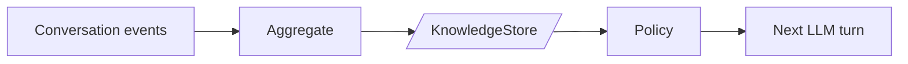

**Aggregation** extracts structured knowledge from raw events and writes it to the [KnowledgeStore](/docs/user-guide/advanced/knowledge_store). It is the knowledge-organizing counterpart to [Compaction](/docs/user-guide/advanced/compaction).

> Compaction removes. Aggregation creates. They are separate concerns.

Aggregation is how an agent builds up persistent state between conversations — the material that `WorkingMemoryPolicy` and `EpisodicMemoryPolicy` read back in on subsequent runs.

## When to use it

| You want the agent to | Use |
|---|---|
| Carry stable facts across conversations (user prefs, role, timezone) | `WorkingMemoryAggregate` + [`WorkingMemoryPolicy`](/docs/user-guide/advanced/assembly#workingmemorypolicy) |
| Remember summaries of what happened in past sessions | `ConversationSummaryAggregate` + [`EpisodicMemoryPolicy`](/docs/user-guide/advanced/assembly#episodicmemorypolicy) |
| Index artifacts for later retrieval | Write a custom strategy |

Each built-in is one half of a producer/consumer pair: the aggregate writes a file, the assembly policy reads it back on the next turn.

## AggregateStrategy protocol

Every strategy implements the same shape:

```python linenums="1"
from typing import Protocol
from ag2 import Context
from ag2.events import BaseEvent
from ag2.knowledge import KnowledgeStore

class AggregateStrategy(Protocol):
    async def aggregate(
        self,
        events: list[BaseEvent],
        context: Context,
        store: KnowledgeStore,
    ) -> None:
        ...
```

Aggregation returns nothing — its output lives in the knowledge store. Unlike `CompactStrategy`, the store is required (not optional).

## AggregateTrigger

A dataclass describing when aggregation should fire.

```python linenums="1"
from ag2.aggregate import AggregateTrigger

trigger = AggregateTrigger(
    every_n_turns=10,      # aggregate every 10 LLM turns
    every_n_events=100,    # aggregate every 100 new events
    on_end=True,           # aggregate when the conversation ends
)
```

Each condition is independent. Setting a counter to `0` disables it. `AggregateTrigger()` with no arguments fires nothing — every condition is opt-in. `on_end` defaults to `False` because each strategy costs one LLM call per fire, and a typical setup pairs `ConversationSummaryAggregate` with `WorkingMemoryAggregate` (so `on_end=True` doubles the per-conversation cost).

Like `CompactTrigger`, this is a plain data object — it records when you want aggregation to fire, but does not fire it. Strategies are invoked explicitly via `#!python await strategy.aggregate(...)`.

## Built-in strategies

Both built-ins are importable from `#!python ag2.aggregate` and both take a `#!python ModelConfig` for a summarization LLM call. Use a smaller / cheaper model than the agent's main model.

### ConversationSummaryAggregate

Writes a timestamped summary of the conversation to `/memory/conversations/`. The companion to [`EpisodicMemoryPolicy`](/docs/user-guide/advanced/assembly#episodicmemorypolicy), which reads from that directory.

```python linenums="1" hl_lines="6 9"
from ag2.aggregate import ConversationSummaryAggregate
from ag2.config import OpenAIConfig
from ag2.knowledge import MemoryKnowledgeStore

store = MemoryKnowledgeStore()
strategy = ConversationSummaryAggregate(config=OpenAIConfig(model="gpt-5-mini"))

# After the conversation:
await strategy.aggregate(events, ctx, store)

# Produces a file like:
# /memory/conversations/20260420T091530_<stream_id>.md
```

Filenames are `{ISO timestamp}_{stream id}.md`, so lexicographic sort matches chronological sort — which is why `EpisodicMemoryPolicy(max_episodes=N)` can simply take the trailing N entries.

Token usage is recorded on the strategy instance as `#!python strategy.last_usage`.

### WorkingMemoryAggregate

Updates `/memory/working.md` — the agent's single persistent state document. Reads the existing file, merges in context from recent events, writes the updated version back. The companion to [`WorkingMemoryPolicy`](/docs/user-guide/advanced/assembly#workingmemorypolicy).

```python linenums="1" hl_lines="6 9"
from ag2.aggregate import WorkingMemoryAggregate
from ag2.config import OpenAIConfig
from ag2.knowledge import MemoryKnowledgeStore

store = MemoryKnowledgeStore()
strategy = WorkingMemoryAggregate(config=OpenAIConfig(model="gpt-5-mini"))

# Refresh working memory at the end of a session:
await strategy.aggregate(events, ctx, store)
# /memory/working.md now reflects the latest context.
```

Unlike `ConversationSummaryAggregate`, this one is destructive toward its own prior output — each call overwrites `/memory/working.md` with the merged version. That is the point: working memory is a rolling single-file state, not an append log.

The default prompt is journal-style: *preserve facts that are still relevant, drop outdated content*. For other memory shapes — procedural memory (what tactics worked), reflection (what to do differently next time), or task-state memory — pass a `prompt=` template with `{existing}` and `{events}` placeholders:

```python linenums="1" hl_lines="3-8"
strategy = WorkingMemoryAggregate(
    config=OpenAIConfig(model="gpt-5-mini"),
    prompt=(
        "You maintain a research agent's working memory. Track tactics, "
        "not topical facts: which phrasings worked, which sources were "
        "reliable, which dead ends to avoid.\n\n"
        "## Current Notes\n{existing}\n\n## Latest Round\n{events}"
    ),
)
```

If a `prompt=` override is not enough — different storage path, multi-call extraction, schema-validated output — write a custom strategy (see [below](#writing-a-custom-strategy)). The protocol is small and the framework's wiring stays the same.

## Pairing with assembly policies

The intended pattern: aggregate at the end of a conversation (or on a cadence), then read back in on the next turn via the matching assembly policy.



| Aggregate | File | Policy |
|---|---|---|
| `ConversationSummaryAggregate` | `/memory/conversations/{ts}_{id}.md` | [`EpisodicMemoryPolicy`](/docs/user-guide/advanced/assembly#episodicmemorypolicy) |
| `WorkingMemoryAggregate` | `/memory/working.md` | [`WorkingMemoryPolicy`](/docs/user-guide/advanced/assembly#workingmemorypolicy) |

The path constants (`WORKING_MEMORY_PATH`, `CONVERSATIONS_PREFIX`) are defined in `#!python ag2.knowledge`. Both sides of each pair use those constants so the producer/consumer contract is held together by types, not magic strings.

## Wiring onto an Agent

Pass the strategy + trigger through [`KnowledgeConfig`](/docs/user-guide/agent_harness#knowledge-knowledgeconfig). The Agent wires a `_AggregationMiddleware` that fires `aggregate()` automatically according to the trigger.

```python linenums="1" hl_lines="11-15"
from ag2 import Agent, KnowledgeConfig
from ag2.aggregate import AggregateTrigger, ConversationSummaryAggregate
from ag2.config import OpenAIConfig
from ag2.knowledge import MemoryKnowledgeStore

store = MemoryKnowledgeStore()
summarizer_config = OpenAIConfig(model="gpt-5-mini")  # cheap model for summaries
agent = Agent(
    "assistant",
    config=OpenAIConfig(model="gpt-5"),
    knowledge=KnowledgeConfig(
        store=store,
        aggregate=ConversationSummaryAggregate(config=summarizer_config),
        aggregate_trigger=AggregateTrigger(every_n_turns=10, on_end=True),
    ),
)
```

Every aggregation attempt emits a triple on the agent's stream:

| Event | When | Use it to |
|---|---|---|
| `AggregationStarted` | Just before `aggregate()` runs | Mark the start of work in dashboards |
| `AggregationCompleted` | `aggregate()` returned | Read `strategy` / `usage` / `event_count` |
| `AggregationFailed` | `aggregate()` raised | Inspect `error_type` + `error`; the agent turn itself is not interrupted |

The failure path is the important one: the strategy exception is also logged via the module logger, but the stream event is the durable signal. Subscribe to `AggregationFailed` if you want failed aggregations to surface in your application's UI or alerting — relying on `AggregationCompleted` alone makes silent failures undebuggable.

Compaction emits the symmetric `CompactionStarted` / `CompactionCompleted` / `CompactionFailed` triple.

## Driving a strategy directly

If you're not using `Agent` (custom harness, tests, one-off scripts), call `#!python await strategy.aggregate(...)` yourself:

```python linenums="1"
from ag2.aggregate import AggregateTrigger, ConversationSummaryAggregate
from ag2.config import OpenAIConfig

trigger = AggregateTrigger(every_n_turns=10, on_end=True)
strategy = ConversationSummaryAggregate(config=OpenAIConfig(model="gpt-5-mini"))

_turn_count = 0

async def after_turn(events, ctx, store, *, is_end: bool) -> None:
    global _turn_count
    _turn_count += 1
    should = (
        (trigger.every_n_turns and _turn_count % trigger.every_n_turns == 0)
        or (is_end and trigger.on_end)
    )
    if should:
        await strategy.aggregate(events, ctx, store)
```

## Writing a custom strategy

Any object with an `async aggregate(events, ctx, store)` method satisfies the protocol. Use it to extract domain-specific knowledge:

- **Extract facts.** Scan events for entity mentions, write `/memory/facts/{entity}.md`.
- **Build an index.** On each aggregation, append a row to `/memory/index.jsonl` for later RAG lookup.
- **Classify and tag.** Read events, ask the LLM for a category, store under `/memory/tags/{tag}/{timestamp}.md`.

```python linenums="1"
from ag2.events import BaseEvent, ModelResponse
from ag2.knowledge import KnowledgeStore

class ResponseLengthAggregate:
    """Track the length of each model response for later analysis."""

    async def aggregate(
        self,
        events: list[BaseEvent],
        context,
        store: KnowledgeStore,
    ) -> None:
        lengths = [
            len(e.message.content)
            for e in events
            if isinstance(e, ModelResponse) and e.message
        ]
        if not lengths:
            return
        stream_id = context.stream.id
        path = f"/memory/metrics/{stream_id}.txt"
        await store.write(path, "\n".join(str(n) for n in lengths))
```

!!! tip
    Aggregation strategies and assembly policies often come in pairs: the strategy writes a path, the policy reads that same path. If you add a new aggregate, consider also adding the reader policy — otherwise the data sits on disk with no way back into the prompt.
