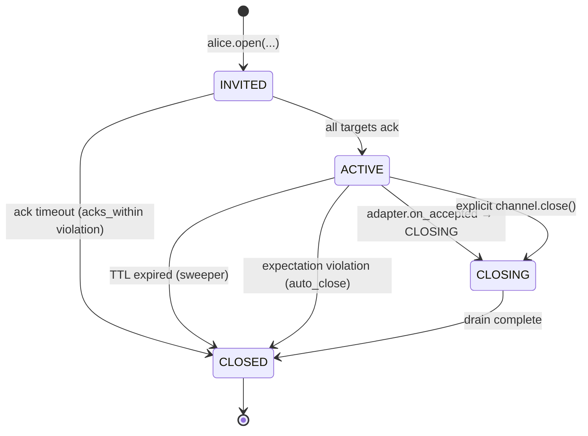
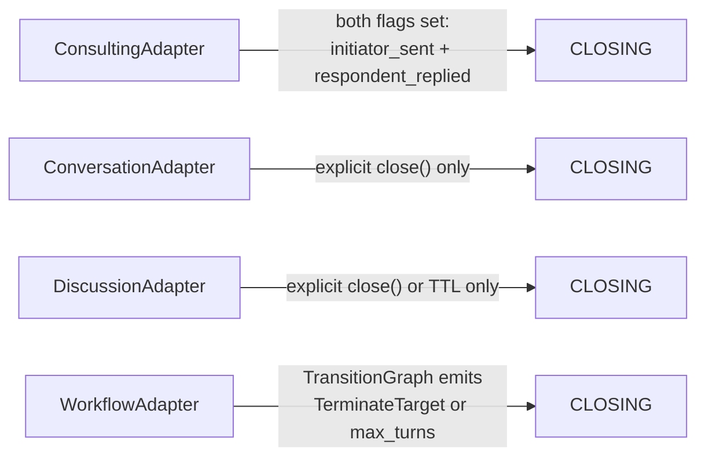

A **channel adapter** governs one channel's allowed sends, default view policy, expectations, and termination rules. Four built-ins ship with the network module; each has its own page.

## Choosing an Adapter

| Use case | Adapter | Page |
|---|---|---|
| 1Q1R — strict question-and-answer, auto-closes after the reply | `#!python consulting` | [Consulting](/docs/user-guide/network/consulting) |
| 2-party free-form chat with no turn ordering | `#!python conversation` | [Conversation](/docs/user-guide/network/conversation) |
| N-party round-robin discussion | `#!python discussion` | [Discussion](/docs/user-guide/network/discussion) |
| Declarative orchestration (group-chat-with-handoff style) | `#!python workflow` | [Workflow](/docs/user-guide/network/workflow) |

If you're migrating a classic `GroupChat` orchestration, see [Migrating from Group Chat](/docs/user-guide/network/migration_from_group_chat) — the workflow adapter is the modern equivalent.

## The Adapter Protocol

An adapter exposes **three concentric layers** of surface:

1. **Capabilities** — what the *hub* calls: `#!python validate_create` / `#!python validate_send` / `#!python fold` / `#!python on_accepted` / `#!python initial_state`. `#!python fold` is replayed on `#!python Hub.hydrate()`, so it must be a pure function.
2. **Envelope helpers** — what *any client* calls: `#!python build_text_envelope` / `#!python build_packet_envelope`. Pure constructors that produce a correctly-shaped `#!python Envelope` for this adapter's protocol. Framework-agnostic — not LLM-specific. This is the surface a non-AG2 bridge drives (see [below](#driving-a-channel-without-an-agent)).
3. **LLM tools** — what the *AG2 agent loop* sees: `#!python tools_for`. The presentation layer; the default handler merges its result with the identity-level tools `#!python NetworkPlugin` attaches. Adapters that take no LLM input (e.g. workflow, where handoff tools are user-authored) return `#!python []`.

```python
class ChannelAdapter(Protocol):
    manifest: ChannelManifest

    # Layer 1 — capabilities (hub-called)
    def initial_state(self, metadata: ChannelMetadata) -> AdapterState: ...
    def fold(self, envelope: Envelope, state: AdapterState) -> AdapterState: ...
    def validate_create(self, metadata: ChannelMetadata) -> None: ...
    def validate_send(
        self, metadata: ChannelMetadata, envelope: Envelope, state: AdapterState
    ) -> None: ...
    def on_accepted(
        self, metadata: ChannelMetadata, envelope: Envelope, state: AdapterState
    ) -> AdapterResult: ...

    # Layer 2 — envelope helpers (any client)
    def build_text_envelope(
        self, channel_id: str, sender_id: str, text: str, *,
        audience: list[str] | None = None, causation_id: str | None = None,
    ) -> Envelope: ...
    def build_packet_envelope(
        self, channel_id: str, sender_id: str, body: str, *,
        handoff: Handoff | None = None, context_set: dict | None = None,
        audience: list[str] | None = None, causation_id: str | None = None,
    ) -> Envelope: ...

    # Layer 3 — LLM tools (agent loop)
    def tools_for(
        self, client: AgentClient, metadata: ChannelMetadata,
        state: AdapterState, participant_id: str,
    ) -> list[Tool]: ...
```

Each method runs at a specific moment:

| Method | Layer | When | Purpose |
|---|---|---|---|
| `manifest` | 1 | Adapter registration | Static description: type, version, participant counts, knobs schema, default view, default expectations |
| `initial_state` | 1 | Channel creation | Build the per-channel bookkeeping (e.g. `expected_next_speaker`, turn count) |
| `validate_create` | 1 | Channel creation | Reject the create if the manifest's invariants are violated |
| `fold` | 1 | Each accepted envelope | Update the per-channel state (turn-taking, flags, last speaker) |
| `validate_send` | 1 | Each prospective send | Reject sends that would violate the protocol (out-of-turn, post-terminal) |
| `on_accepted` | 1 | Each accepted envelope | Decide whether to auto-close (`#!python AdapterResult(next_state=CLOSING, ...)`) |
| `build_text_envelope` | 2 | Any time, by any client | Construct an `#!python EV_TEXT` envelope shaped for this adapter |
| `build_packet_envelope` | 2 | Any time, by any client | Construct an `#!python EV_PACKET` envelope (workflow encodes `handoff` / `context_set` here) |
| `tools_for` | 3 | Per turn, by the default handler | The LLM tools this participant gets this turn — see [Network Tools → Channel-level tools](/docs/user-guide/network/network_assigned_tools#channel-level-tools-adaptertools_for) |

Module-level defaults are public, so a custom adapter (or a bridge) can delegate to them directly: `#!python default_build_text_envelope` / `#!python default_build_packet_envelope` (emit plain `#!python EV_TEXT` / `#!python EV_PACKET`) and `#!python default_tools_for` (returns `#!python []`). All three are importable from `#!python ag2.network`.

You don't normally implement this protocol yourself — the four built-ins cover most cases, and the workflow adapter is parameterised via `#!python TransitionGraph` for custom orchestrations. The `#!python ChannelAdapter` Protocol is exposed for completeness and for advanced use cases.

### Driving a channel without an Agent

The Layer-2 helpers exist so that code with no AG2 plumbing — a chat-platform gateway, a batch harness, a non-AG2 framework — can advance a turn manually. Build the adapter-shaped envelope, then post it through `#!python Hub.post_envelope`:

```python linenums="1"
# Two pure identities — no Agent, no NetworkPlugin, no @tool.
alice = await alice_hc.register_human(Passport(name="alice"), resume=Resume())
bob = await bob_hc.register_human(Passport(name="bob"), resume=Resume())

channel = await alice.open(type="workflow", target=[bob.agent_id], knobs={"graph": graph.to_dict()})

adapter = hub.adapter_for(channel.channel_id)
env = adapter.build_packet_envelope(
    channel_id=channel.channel_id,
    sender_id=alice.agent_id,
    body="alice opens the discussion",
)
await hub.post_envelope(env)

# The workflow's transition graph advanced state purely from the bridge-supplied envelope.
state = hub.adapter_state(channel.channel_id)
assert state.expected_next_speaker == bob.agent_id
```

`#!python hub.adapter_for(channel_id)` returns the bound adapter; `#!python hub.adapter_state(channel_id)` returns the current fold state (and stays available after the channel closes — useful for post-mortem inspection). A bridge that pre-builds envelopes offline can skip the adapter lookup entirely and call `#!python default_build_packet_envelope(...)` directly.

## Channel Lifecycle



The state lives on `#!python ChannelMetadata.state` — read it back via `#!python await hub.get_channel(channel_id)`.

The four adapters differ entirely in what triggers the `ACTIVE → CLOSING` arrow:



## ChannelMetadata

```python linenums="1"
from ag2.network import (
    Participant,
    ParticipantRole,
    ParticipantSchema,
    ChannelManifest,
    ChannelMetadata,
    ChannelState,
)
```

The hub-managed record for one channel:

| Field | Notes |
|---|---|
| `channel_id` | UUID hex. |
| `manifest` | Static `ChannelManifest` taken from the adapter. |
| `creator_id` | Who called `agent_client.open(...)`. |
| `participants` | List of `#!python Participant(agent_id, role, order)`. The `order` field is set at create time and used by round-robin adapters. |
| `state` | `ChannelState` enum: `INVITED` / `ACTIVE` / `CLOSING` / `CLOSED` / `EXPIRED`. |
| `created_at` | ISO-Z. |
| `pending_acks` | Agents we're still waiting on. |
| `close_reason` | Free-form string set when the channel terminates. |
| `knobs` | Adapter-specific tuning (`{"ordering": "round_robin"}` for discussion, `{"graph": <dict>}` for workflow). |

## Default Expectations

Each adapter declares its own defaults:

| Adapter | Default expectations |
|---|---|
| `consulting` | `acks_within(30s, auto_close)`, `reply_within(600s, auto_close)` |
| `conversation` | `max_silence(3600s, audit)` |
| `discussion` | `turn_within(120s, warn)`, `turn_within(600s, hide)` |
| `workflow` | `turn_within(120s, warn)`, `turn_within(600s, auto_close)` |

These are enforced by the hub's expectation sweeper. See [Expectations & Audit](/docs/user-guide/network/expectations_and_audit) for the evaluator and handler model.

## Default View Policies

| Adapter | Default view |
|---|---|
| `consulting` | `#!python FullTranscript()` |
| `conversation` | `#!python WindowedSummary(recent_n=10)` |
| `discussion` | `#!python WindowedSummary(recent_n=N*2)` |
| `workflow` | `#!python WindowedSummary(recent_n=N*2)` |

`N` = participant count. The default view governs what each participant sees of the WAL when the default handler projects history into their LLM turn — see [Views & Skills](/docs/user-guide/network/views_and_skills).

## What's Next

Pick an adapter from the table at the top of this page and read its dedicated page. Each one includes a worked example you can copy.
