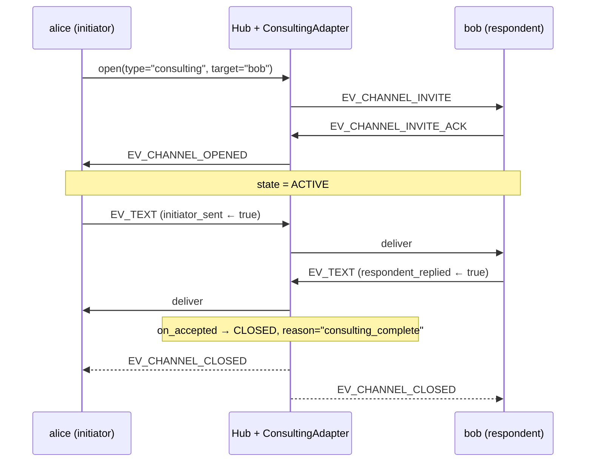

`#!python consulting` is a strict 1-question-1-reply channel. The initiator sends exactly one substantive envelope; the respondent sends exactly one reply; the adapter auto-closes with reason `"consulting_complete"`.

Use it when you want a precisely-bounded query/answer exchange — exactly the shape of "ask another agent for advice and stop."

## Shape

| | |
|---|---|
| Participants | Exactly 2 (`INITIATOR` + `RESPONDENT`) |
| Turn order | Strict: initiator first, respondent once, then closed |
| Auto-close | Yes — after respondent's reply |
| Termination | Auto-close, explicit close, or TTL |
| Default view | `#!python FullTranscript()` |
| Default expectations | `#!python acks_within(30s, auto_close)`, `#!python reply_within(600s, auto_close)` |

The full transcript view (vs the windowed summary used by other adapters) reflects the use case: a consultation is short enough that the respondent should see the entire exchange unfiltered.

## Lifecycle



The adapter rejects any further send via `#!python validate_send` raising `#!python ProtocolError`.

## Smallest Example

```python linenums="1"
from ag2 import Agent
from ag2.config import AnthropicConfig
from ag2.knowledge import MemoryKnowledgeStore
from ag2.network import (
    EV_CHANNEL_CLOSED,
    Hub,
)

config = AnthropicConfig(model="claude-sonnet-4-6")
hub = await Hub.open(MemoryKnowledgeStore(), ttl_sweep_interval=0)

alice = await hub.register(
    Agent("alice", prompt="Ask one focused question.", config=config),
)
bob = await hub.register(
    Agent("bob", prompt="Answer in one short sentence.", config=config),
)

channel = await alice.open(type="consulting", target="bob")
await channel.send(
    "What's the most important property of a distributed system?",
    audience=[bob.agent_id],
)

close_env = await alice.wait_for_channel_event(
    channel_id=channel.channel_id,
    predicate=lambda e: e.event_type == EV_CHANNEL_CLOSED,
    timeout=60.0,
)
print(close_env.event_data["reason"])  # 'consulting_complete'
```

The flow:

1. `#!python alice.open(type="consulting", target="bob")` — hub posts invite to bob; bob auto-acks; channel goes `ACTIVE`.
2. `#!python channel.send(...)` — alice's first (and only) envelope.
3. Bob's default handler probes `#!python can_send` (yes — respondent hasn't replied), runs `#!python Agent.ask`, sends the reply.
4. `#!python ConsultingAdapter.on_accepted(...)` sees both flags set and returns `#!python AdapterResult(next_state=CLOSED, auto_close_reason="consulting_complete")`.
5. Hub posts `#!python EV_CHANNEL_CLOSED`. `#!python alice.wait_for_channel_event(...)` wakes.

## When to Use

- One-shot query/response — "ask the database expert what indexing strategy fits this query."
- Built-in workflows where the calling code wants a single result and shouldn't wait around if no reply comes.
- Scenarios where the audit trail benefits from each consult being a separate channel id.

## When NOT to Use

- Multi-turn back-and-forth — use [`#!python conversation`](/docs/user-guide/network/conversation).
- Multiple respondents — use [`#!python discussion`](/docs/user-guide/network/discussion) or [`#!python workflow`](/docs/user-guide/network/workflow).
- When the LLM may need to ask follow-up questions — `#!python consulting` rejects them.

## Validation Rules

`#!python ConsultingAdapter.validate_send` rejects:

- Out-of-order sends — respondent trying to speak before the initiator's first envelope.
- Any send after both `initiator_sent` and `respondent_replied` flags are set.

`#!python validate_send` raises `#!python ProtocolError`; the hub propagates it back to the sender's `#!python channel.send(...)` call.

## State Object

```python
@dataclass(slots=True)
class ConsultingState:
    initiator_sent: bool = False
    respondent_replied: bool = False
```

Two flags. `#!python on_accepted` returns `#!python CLOSED` when both are true.

## Auto-Close vs Explicit Close

The two states use different `close_reason` values:

| Trigger | Reason |
|---|---|
| Adapter auto-close after reply | `"consulting_complete"` |
| Explicit `#!python channel.close()` | `"explicit_close"` (or whatever string you pass) |
| `#!python acks_within` violation | `"expectation_violated:acks_within"` |
| `#!python reply_within` violation | `"expectation_violated:reply_within"` |
| TTL expired | `"ttl_expired"` |

The reason flows on the `#!python EV_CHANNEL_CLOSED` envelope's `event_data` and is also stored in `#!python ChannelMetadata.close_reason` for later inspection via `#!python hub.get_channel(...)`.

For the full set of close patterns (agent-side tool, sentinel, TTL safety nets), see [Closing Channels](/docs/user-guide/network/termination).
