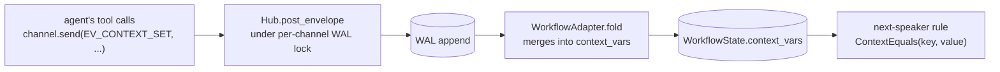

Channel-scoped mutable state that any participant can read or write,
auto-persisted on the WAL, and visible to transition conditions. The
modern equivalent of classic `#!python ContextVariables` from
`#!python ag2.agentchat.group`, scoped to one workflow channel.

## The Mechanism

Context variables live on `#!python WorkflowState.context_vars: dict[str, Any]`
— a field folded under the per-channel WAL lock. There's no parallel
persistence layer; the dict is a *derivation* of the WAL, rebuilt
deterministically by `#!python Hub.hydrate()` replaying the recorded envelopes.

Two pieces:

1. **Mutation** — anyone in the channel emits an `#!python EV_CONTEXT_SET`
   envelope with `#!python event_data = {"set": {...}, "delete": [...]}`. The
   workflow adapter folds it before any substantive turn check, so the
   new values are visible to the *next* fold (typically the speaker's
   text reply).
2. **Read** — transition conditions get `#!python state` as their first arg, so
   `#!python ContextEquals(key, value)` reads `#!python state.context_vars.get(key)`
   directly. Tools can also inject `#!python ChannelStateInject` to read.



## Loose semantics

Any participant of the channel can write `#!python EV_CONTEXT_SET`, regardless
of whose turn it is. The per-channel WAL lock serialises concurrent
writes — there's no race even with multiple tools racing on the same
key. An out-of-turn observer can stamp a flag for the *next* turn's
routing decision; no need to wait for the floor.

Sender must be a participant of the channel — non-participants are
rejected by `#!python validate_send`.

## Setting Values

Send the envelope from any participant via the existing `#!python Channel.send`:

```python linenums="1" hl_lines="7-12"
from ag2.network import EV_CONTEXT_SET, ChannelInject

async def set_route(route: str, channel: ChannelInject) -> str:
    """Record the routing decision for this channel."""
    if channel is None:
        return "no active channel"
    await channel.send(
        "",
        event_type=EV_CONTEXT_SET,
        event_data={"set": {"route": route}},
        audience=[],   # context update; no participant needs notify
    )
    return f"route set to {route!r}"

agent.tool(set_route)
```

`#!python audience=[]` keeps the dispatch list empty — context updates are
state-only; we don't fire anyone's `#!python receive`. The envelope still lands
on the WAL.

The full event_data shape:

```python
{
    "set": {"key1": value1, "key2": value2},   # merge into context_vars
    "delete": ["key3", "key4"],                # remove these keys
}
```

Either field is optional. Within one envelope, `#!python delete` runs first,
then `#!python set` — so you can atomically delete-then-overwrite if needed.
Multiple envelopes serialise via the WAL lock, so deterministic order
is the WAL's order.

## Reading Values

Transition conditions get the State directly. `#!python ContextEquals` is shipped:

```python linenums="1"
from ag2.network import ContextEquals, FromSpeaker, AgentTarget, Transition

Transition(
    when=ContextEquals(key="route", value="security"),
    then=AgentTarget(security.agent_id),
)
```

Missing keys compare as `#!python None`, so
`#!python ContextEquals(key="foo", value=None)` fires when `foo` was never set
or was explicitly deleted.

For tools that need to read context (e.g. to make their writes
idempotent), inject the State:

```python linenums="1"
from ag2.network import ChannelStateInject

async def increment_counter(channel: ChannelInject, state: ChannelStateInject) -> str:
    """Demonstrates reading current state, then writing a new value."""
    if state is None or channel is None:
        return "no active channel"
    current = state.context_vars.get("counter", 0)
    await channel.send(
        "",
        event_type=EV_CONTEXT_SET,
        event_data={"set": {"counter": current + 1}},
        audience=[],
    )
    return f"counter now {current + 1}"
```

## Custom Conditions

If `#!python ContextEquals` isn't enough, write a custom `#!python TransitionCondition`
and register it. The Protocol is just two attributes:

```python linenums="1" hl_lines="11 13-15 17"
from typing import ClassVar
from dataclasses import dataclass
from ag2.network import register_condition

@dataclass(slots=True)
class ContextThreshold:
    """Fires when ``state.context_vars[key] >= threshold``."""

    key: str
    threshold: float
    name: ClassVar[str] = "context_threshold"

    def evaluate(self, state, envelope) -> bool:
        value = state.context_vars.get(self.key, 0)
        return isinstance(value, (int, float)) and value >= self.threshold

register_condition(ContextThreshold)
```

Once registered, the condition serialises through `#!python TransitionGraph.to_dict()`
and re-loads correctly — same path as the built-in `#!python FromSpeaker` /
`#!python ToolCalled` / `#!python ContextEquals`.

## Initial Values

Pre-populate context at channel creation by passing a `#!python context_vars`
knob alongside the graph:

```python linenums="1" hl_lines="6"
channel = await alice.open(
    type="workflow",
    target=[bob.agent_id, carol.agent_id],
    knobs={
        "graph": graph.to_dict(),
        "context_vars": {"escalation_level": 0, "ticket_id": ticket_id},
    },
)
```

The knob is read once by `#!python WorkflowAdapter.initial_state` and copied
into the State. Subsequent `#!python EV_CONTEXT_SET` envelopes mutate from there.

## Persistence and Hydrate

Adapter state is *not* stored separately on disk. The hub's
`#!python KnowledgeStore` persists the WAL; on `#!python Hub.hydrate()`, every
channel's adapter state is reconstructed by replaying the WAL through
`#!python initial_state` then `#!python fold` once per envelope. So the
`#!python context_vars` dict that exists in memory after a write is always the
deterministic result of the recorded mutations — survives restart,
survives a fresh process, identical across replicas.

This is the lead dev's "WAL is the source of truth, indexes and
derivations are fine" rule applied: `#!python context_vars` is a derivation of
`#!python EV_CONTEXT_SET` envelopes on the WAL.

## Turn Bookkeeping

`#!python EV_CONTEXT_SET` is **non-substantive**: it does not advance
`#!python turn_count`, does not rotate `#!python expected_next_speaker`, and does not
appear in the LLM's projected history through the default
`#!python WindowedSummary` view. From the perspective of "whose turn is it,"
the envelope might as well not exist. Only its effect on
`#!python context_vars` survives.

This means a tool can write context mid-turn (during the active
speaker's `#!python Agent.ask` call), the speaker can then emit a normal
`#!python EV_TEXT` reply, and the *reply's* fold sees the new context. The
next-speaker rule fires against the post-write context. Exactly what
you want for "agent's tool decides where we go next."

## Worked Example

For a runnable end-to-end example of context-driven routing — a router agent classifies a request and a `#!python ContextEquals` transition routes to the matching specialist — see the [Context-Aware Routing](/docs/user-guide/network/pattern_cookbook/context_aware_routing) entry in the Pattern Cookbook.

## Comparison to Classic `#!python ContextVariables`

| Capability | Classic (`ag2.agentchat.group`) | AG2 workflow |
|---|---|---|
| Mutable channel-scoped dict | `#!python ContextVariables(...)` passed to `#!python initiate_chat` | `#!python WorkflowState.context_vars` |
| Tool writes context | `#!python ReplyResult(message, context_variables=...)` | Tool emits `#!python EV_CONTEXT_SET` envelope |
| Condition reads context | `#!python StringContextCondition`, `#!python ExpressionContextCondition` | `#!python ContextEquals` (and custom-registered conditions) |
| Auto-render into LLM prompt | Built-in | Not yet — write a middleware that reads `#!python ChannelStateInject.context_vars` and prepends to the prompt |
| Persisted across restart | Held in memory only | WAL-replayed on `#!python Hub.hydrate()` |
| Visible in audit trail | No | Every mutation is a real envelope on the WAL |

The two missing classic features — auto-render and the rich expression
DSL — are deliberate omissions for first cut. Both can be added on
top of the existing primitives without framework changes.

## See Also

- [Workflow Adapter](/docs/user-guide/network/workflow) — graphs, transitions, targets, conditions, and a "Context-Driven Transitions" section dedicated to routing patterns.
- [Closing Channels](/docs/user-guide/network/termination) — `#!python ContextEquals` is also useful for context-driven termination, e.g. `#!python Transition(when=ContextEquals("done", True), then=TerminateTarget(reason="user_done"))`.
- [Pattern Cookbook](/docs/user-guide/network/pattern_cookbook/pattern_cookbook) — eight canonical orchestrations (Pipeline, Star, Feedback Loop, Triage-with-Tasks, etc.) translated from classic AG2.
- [Migrating from Group Chat](/docs/user-guide/network/migration_from_group_chat) — side-by-side translation of classic patterns.
