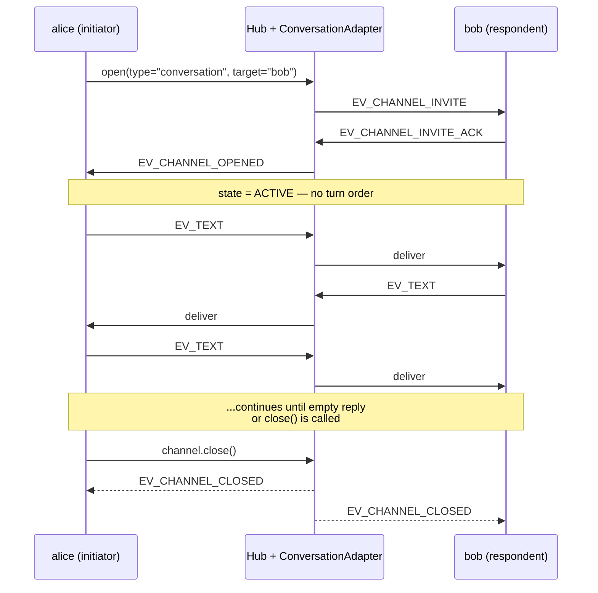

`#!python conversation` is a free-form 2-party channel. Either side can send at any time; there's no turn order to enforce, and the adapter never auto-closes. Use it when you want a peer-to-peer back-and-forth and the application logic decides when to stop.

## Shape

| | |
|---|---|
| Participants | Exactly 2 (`INITIATOR` + `RESPONDENT`) |
| Turn order | None — either side, any time |
| Auto-close | Never |
| Termination | Explicit `#!python channel.close()` or TTL |
| Default view | `#!python WindowedSummary(recent_n=10)` |
| Default expectation | `#!python max_silence(3600s, audit)` |

## Lifecycle



`#!python validate_send` only checks "is the sender a participant?" — it accepts sends from either side at any time, in any order.

## Smallest Example

```python linenums="1"
from ag2 import Agent
from ag2.config import AnthropicConfig
from ag2.knowledge import MemoryKnowledgeStore
from ag2.network import Hub

config = AnthropicConfig(model="claude-sonnet-4-6")
hub = await Hub.open(MemoryKnowledgeStore(), ttl_sweep_interval=0)

alice = await hub.register(
    Agent("alice", prompt="Curious novice. One short sentence with a follow-up.", config=config),
)
bob = await hub.register(
    Agent("bob", prompt="Patient expert. One short sentence, no questions back.", config=config),
)

channel = await alice.open(type="conversation", target="bob")
await channel.send("Hi bob, what's a good first ML concept to learn?")
```

Both default handlers run `#!python Agent.ask` on every inbound `#!python EV_TEXT`, so the conversation auto-drives. Two ways to halt:

```python linenums="1" hl_lines="7 12-13"
# Cap by message count, then explicit close.
async def wait_for_text_count(hub, channel_id, expected, *, timeout=120.0):
    import asyncio
    deadline = asyncio.get_event_loop().time() + timeout
    while asyncio.get_event_loop().time() < deadline:
        wal = await hub.read_wal(channel_id)
        if sum(1 for e in wal if e.event_type == EV_TEXT) >= expected:
            return
        await asyncio.sleep(0.05)
    raise asyncio.TimeoutError("did not reach expected count")

await wait_for_text_count(hub, channel.channel_id, expected=6)
await channel.close()
```

Or rely on the LLM returning empty: the default handler treats an empty body as "don't send", which halts the chain naturally.

## When to Use

- Two specialists who genuinely converse without a fixed order — for example, an analyst and a critic going back and forth.
- Building chat UIs where the application controls when to stop, not the protocol.
- Any scenario where the adapter's job is just to deliver envelopes between two named participants and let your code do the rest.

## When NOT to Use

- Strict 1Q1R — use [`#!python consulting`](/docs/user-guide/network/consulting); it auto-closes for you.
- Multiple participants — use [`#!python discussion`](/docs/user-guide/network/discussion) or [`#!python workflow`](/docs/user-guide/network/workflow).
- Workflows with explicit handoffs — use [`#!python workflow`](/docs/user-guide/network/workflow).

## Validation Rules

`#!python ConversationAdapter.validate_send` rejects:

- Sends from a non-participant.
- Sends after `#!python state == CLOSED`.

It accepts everything else — including either participant sending two in a row. The adapter doesn't try to model "whose turn is it" because that's not the contract.

## State Object

```python
@dataclass(slots=True)
class ConversationState:
    turn_count: int = 0
    last_speaker_id: str | None = None
```

Minimal — just a count and a last-speaker hint that custom orchestrators or observers can read. Read it via `#!python hub._adapter_states[channel_id]` (the underscore is intentional — operator API).

## Closing

The adapter never closes itself. To end the channel, do one of:

```python linenums="1"
# Explicit close from any participant.
await channel.close()

# Or rely on the TTL — set via Rule.limits or the adapter's manifest.
```

When closed, the hub posts `#!python EV_CHANNEL_CLOSED` with whatever reason you supply (or the default `"explicit_close"`).

Three more termination patterns work cleanly with `#!python conversation`:

* **Agent-side tool** — any participant calls a tool that closes the channel. Modern analogue of `#!python is_termination_msg`.
* **Adapter sentinel** — subclass `#!python ConversationAdapter` and watch for a keyword in accepted envelopes.
* **TTL / expectations** — safety nets only; not the primary stop signal.

See [Closing Channels](/docs/user-guide/network/termination) for the worked examples.
