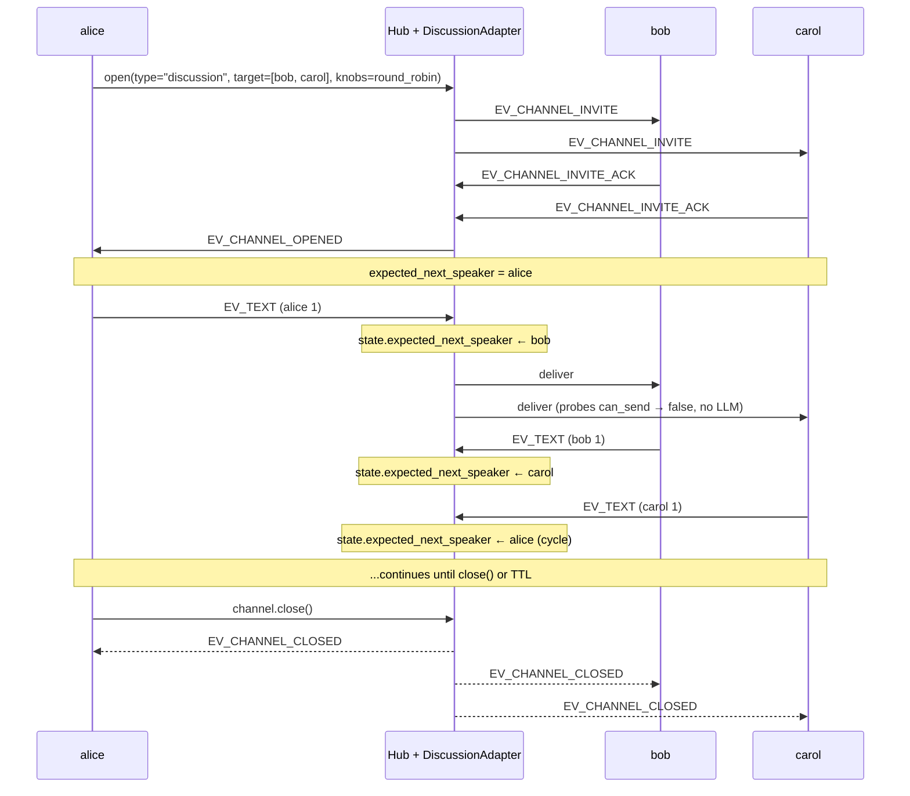

`#!python discussion` is an N-party round-robin channel. Participants speak in a fixed order, cycling indefinitely until you close it. The adapter enforces "wait your turn" via `#!python validate_send`; the hub's `#!python can_send` probe lets the default handler skip wasted LLM calls when it isn't this agent's turn.

## Shape

| | |
|---|---|
| Participants | 2+ |
| Turn order | Round-robin (creator first, then participants in order) |
| Auto-close | No |
| Termination | Explicit `#!python channel.close()` or TTL |
| Default view | `#!python WindowedSummary(recent_n=N*2)` (where `N` = participant count) |
| Default expectations | `#!python turn_within(120s, warn)`, `#!python turn_within(600s, hide)` |
| Knob | `#!python {"ordering": "round_robin"}` (only ordering shipped today) |

## Lifecycle



The `#!python can_send` probe lets each default handler skip its LLM call when it's not that participant's turn — see "How Turn Skipping Works" below.

## Smallest Example

```python linenums="1"
from ag2 import Agent
from ag2.config import AnthropicConfig
from ag2.knowledge import MemoryKnowledgeStore
from ag2.network import (
    EV_TEXT,
    ORDERING_ROUND_ROBIN,
    Hub,
)

config = AnthropicConfig(model="claude-sonnet-4-6")
hub = await Hub.open(MemoryKnowledgeStore(), ttl_sweep_interval=0)

alice = await hub.register(
    Agent("alice", prompt="The optimist. One short sentence.", config=config),
)
bob = await hub.register(
    Agent("bob", prompt="The realist. One short sentence.", config=config),
)
carol = await hub.register(
    Agent("carol", prompt="The skeptic. One short sentence.", config=config),
)

channel = await alice.open(
    type="discussion",
    target=[bob.agent_id, carol.agent_id],
    knobs={"ordering": ORDERING_ROUND_ROBIN},
)

await channel.send("Topic: should every developer learn Rust?")
# After the kickoff, each agent's default handler responds when can_send
# returns true for them — bob, then carol, then alice again, and so on.
```

To halt, cap on text count and call `#!python channel.close()`:

```python linenums="1"
await wait_for_text_count(hub, channel.channel_id, expected=6)
await channel.close()
```

## How Turn Skipping Works

When alice sends "alice 1", the hub fans out an `#!python EV_TEXT` to bob and carol. Both default handlers fire in parallel:

- **bob's handler** — calls `#!python hc.can_send(channel_id, bob.agent_id)`. The adapter says "yes, bob is `expected_next_speaker`." Handler runs `#!python Agent.ask`, sends bob's reply.
- **carol's handler** — calls `#!python hc.can_send(channel_id, carol.agent_id)`. The adapter says "no, expected_next_speaker is bob, not carol." Handler returns without engaging the LLM.

When bob's reply lands, the same fan-out happens. Now `expected_next_speaker = carol`, so carol's handler engages and bob's skips. No wasted LLM calls.

## When to Use

- Brainstorms with a fixed cast — three agents debating a topic in turn.
- Panel discussions where each agent has a static viewpoint.
- Round-robin reviewers — three reviewers each commenting once per cycle on a draft.

## When NOT to Use

- Conditional handoffs ("if alice mentions security, hand to the security expert") — use [`#!python workflow`](/docs/user-guide/network/workflow).
- Two participants only with no order — use [`#!python conversation`](/docs/user-guide/network/conversation).
- A pipeline where each step happens once — use [`#!python workflow`](/docs/user-guide/network/workflow) with `#!python TransitionGraph.sequence(...)`.

## Validation Rules

`#!python DiscussionAdapter.validate_send` rejects:

- `#!python EV_TEXT` from anyone other than `#!python state.expected_next_speaker`.
- Sends from non-participants.
- Sends to a closed channel.

Protocol envelopes (`#!python EV_CHANNEL_*`, `#!python ag2.task.*`) bypass the turn check.

## State Object

```python
@dataclass(slots=True)
class DiscussionState:
    participant_order: list[str]
    expected_next_speaker: str
    turn_count: int = 0
```

Read via `#!python hub._adapter_states[channel_id]`. The order is fixed at create time by sorting participants on `#!python Participant.order`; round-robin advances by `(current_index + 1) % len(participant_order)`.

## Customising the Ordering

Today only `#!python ORDERING_ROUND_ROBIN` ships. The knob is `#!python knobs={"ordering": "round_robin"}`; passing anything else raises at create time. Future orderings (dynamic, weighted) will plug in here without breaking the round-robin contract.

## Closing

`#!python discussion` never auto-closes. The example below caps at 6 turns and calls `#!python channel.close()`, but four other patterns work for `#!python discussion` too:

* **App-side cap** — count turns and call `#!python channel.close()` (canonical, simplest).
* **Agent-side tool** — any participant calls a tool that closes the channel. See [Closing Channels → Agent-side tool](/docs/user-guide/network/termination#pattern-2--agent-side-tool).
* **Custom adapter** — subclass `#!python DiscussionAdapter` to fold `#!python turn_count` and emit `#!python CLOSING` at a cap (or switch to `#!python workflow` with `#!python TransitionGraph.round_robin(max_turns=N)`).
* **TTL / expectations** — safety nets only.

See [Closing Channels](/docs/user-guide/network/termination) for the full picture.
