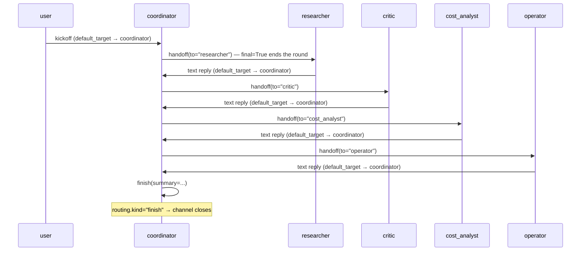

A coordinator agent at the centre with several specialists. The coordinator's LLM decides which specialist to consult next via a single generic `#!python handoff(to)` tool, and ends the conversation via a `#!python finish(summary)` tool. No per-specialist routing rules, no graph rewiring when a specialist is added or removed.

This is the closest AG2 equivalent to classic AG2's `#!python AutoPattern` group chat with LLM-driven manager handoffs.

**Classic primitives:** `#!python AutoPattern` with `#!python GroupChat`, `#!python GroupChatManager`, LLM-selected `next_agent`, and per-specialist handoff registration.

### Key Characteristics

* **One generic handoff tool.** The coordinator's LLM picks the next specialist by *passing the name as a parameter* (`#!python handoff(to="researcher")`). Adding a fifth specialist doesn't add a new tool — just a new participant on the channel.
* **One finish tool.** The coordinator ends the discussion by returning `#!python Finish(summary=...)`. The framework closes the channel cleanly via the typed-return routing path.
* **Both routing tools are terminal.** `#!python handoff` and `#!python finish` each return a `#!python ToolResult(..., final=True)` — calling either *ends the coordinator's round immediately*, so each turn produces exactly one routing decision. (Without this the round runs a multi-step tool loop and emits several routing intents; see the admonition below.)
* **Empty transitions list.** The graph has no per-specialist rules. Dynamic `#!python Handoff` resolution routes coordinator → specialist; `#!python default_target=AgentTarget(coordinator)` routes every other turn (the user's kickoff, each specialist's reply) back to the coordinator.

The whole topology fits in four lines of `#!python TransitionGraph`:

```python linenums="1"
graph = TransitionGraph(
    initial_speaker=user.agent_id,                     # the user kicks off
    transitions=[],                                    # no per-specialist rules
    default_target=AgentTarget(coordinator.agent_id),  # every non-handoff turn → coordinator
    max_turns=14,
)
```

### Tools the coordinator carries

Both tools are user-authored on the coordinator agent. Each returns a `#!python ToolResult(..., final=True)` wrapping the typed routing object:

```python linenums="1"
from typing import Literal
from ag2 import ToolResult
from ag2.network import Finish, Handoff

async def handoff(to: Literal["researcher", "critic", "cost_analyst", "operator"], reason: str = "") -> ToolResult:
    """Hand off the conversation to a participant by name."""
    return ToolResult(Handoff(target=to, reason=reason), final=True)

async def finish(summary: str = "") -> ToolResult:
    """End the conversation cleanly with a brief summary."""
    return ToolResult(Finish(summary=summary), final=True)

# ... then register them on the coordinator agent:
coordinator_agent.tool(handoff)
coordinator_agent.tool(finish)
```

!!! warning "Why the routing tools must be terminal (`final=True`)"
    An `#!python Agent.ask` round runs a **multi-step tool loop**: the LLM calls a tool, sees the result, and may call another — repeating until it stops. A coordinator with plain `#!python handoff` / `#!python finish` tools will call `#!python handoff` *and* `#!python finish` within a single round.

    The workflow resolves a round's routing **first-emit-wins** — it acts on the first routing tool and silently drops the rest. So a round that calls `#!python handoff` then `#!python finish` routes the handoff and *loses the finish* — the channel never closes and the coordinator loops.

    Returning `#!python ToolResult(..., final=True)` makes each routing tool **terminal**: the first call ends the round, so every coordinator turn carries exactly one routing intent. Pair it with disabling parallel tool calls on the coordinator's config (`#!python disable_parallel_tool_use` — see the [Star pattern](/docs/user-guide/network/pattern_cookbook/star)'s "Parallel-call defence" note) so the model also commits to one tool per response.

!!! tip "Constraining `to` to known names"
    Typing `#!python to` as a `#!python Literal[...]` over the participant names lets the LLM's tool schema constrain its picks at the model layer — the LLM can't invent a name. If you'd rather keep targets fully dynamic (e.g. the participant set isn't known at decoration time), use `#!python to: str` and list the valid names in the docstring; the framework's `#!python hub.name_for` resolves unknown names to themselves, so a hallucinated target surfaces as a `#!python validate_send` mismatch on the next envelope.

### How the coordinator knows the roster

For the coordinator to pick the *right* specialist it needs to know what each one is good at. That knowledge comes from two author-supplied sources:

* **The `#!python handoff` tool's `#!python Literal[...]`** — constrains *which* names are valid, surfaced to the LLM as a tool-schema enum. It says nothing about what each specialist does.
* **The system prompt's roster block** — describes *what each specialist is for*. The code below builds it from each specialist's `#!python Resume.summary`:

```python linenums="1"
researcher_resume = Resume(
    summary="Evidence-based analyst — cites studies, benchmarks, and data.",
    claimed_capabilities=["research", "literature-review"],
)
critic_resume = Resume(
    summary="Skeptical risk analyst — surfaces failure modes and overlooked costs.",
    claimed_capabilities=["risk-analysis", "review"],
)
cost_resume = Resume(
    summary="Cost analyst — models total cost of ownership and budget impact.",
    claimed_capabilities=["cost-modelling", "budgeting"],
)
operator_resume = Resume(
    summary="Operations engineer — speaks to day-2 ops, on-call load, and maintenance.",
    claimed_capabilities=["operations", "reliability"],
)

roster = {
    "researcher": researcher_resume,
    "critic": critic_resume,
    "cost_analyst": cost_resume,
    "operator": operator_resume,
}
roster_block = "\n".join(f"- `{name}`: {r.summary}" for name, r in roster.items())
# coordinator prompt embeds f"{roster_block}"; the same Resume objects
# are passed to register() so the prompt and the hub registry agree.
```

Each `#!python Resume` is built once and used twice — folded into the coordinator's prompt, and passed to `#!python register(...)` so the hub registry carries the same description. Because the prompt is fixed when the coordinator `#!python Agent` is constructed, the resumes must exist first.

!!! note "Static snapshot vs. dynamic discovery"
    Baking the roster into the prompt captures it at construction time — fine for a fixed-roster channel. If specialists join or leave mid-run, the prompt goes stale. For a churning roster, register the coordinator with `#!python attach_plugin=True` (the default) and let it call the `#!python peers` tool to read peers' `#!python Resume` / `#!python skill_md` from the hub at runtime. You can also fetch a resume directly with `#!python await hub.get_resume(agent_id)`.

### Agent Flow



## Migrating from Classic to AG2?

| Classic | AG2 |
|---|---|
| `#!python AutoPattern` builds the group chat from `agents=[...]` + an LLM-driven `group_manager` | `#!python TransitionGraph(initial_speaker=user, transitions=[], default_target=AgentTarget(coordinator))` plus the coordinator's two tools |
| `#!python GroupChatManager` runs the manager's LLM each turn and parses `next_agent` from its output | Coordinator is a regular `#!python Agent` whose LLM calls `#!python handoff(to=...)`; the framework reads the typed `#!python Handoff` return and routes |
| One pseudo-tool per agent in classic, generated by `#!python AutoPattern` | One generic `#!python handoff(to)` tool the user writes once |
| Termination via `#!python is_termination_msg` predicate or `#!python max_round` | Termination via the coordinator's `#!python finish(summary)` tool returning `#!python Finish`, or `#!python max_turns` on the graph |

## Code

!!! tip
    Every LLM-driven agent uses `#!python AnthropicConfig(model="claude-sonnet-4-6")` — set `#!python ANTHROPIC_API_KEY` in your environment (the script calls `#!python load_dotenv()`), or swap in `#!python OpenAIConfig` / `#!python GeminiConfig` to run on another provider. The `#!python user` agent uses `#!python TestConfig()` because it only opens the channel and sends the kickoff — it never takes an LLM turn. All agents register with `#!python attach_plugin=False`: none of them need the `#!python NetworkPlugin` tools (`#!python say` / `#!python delegate` / `#!python peers` / …), and leaving those off keeps the coordinator's tool surface to just `#!python handoff` and `#!python finish`.

```python linenums="1"
"""Cookbook — Coordinator (manager + specialists) pattern.

One coordinator at the centre directs several specialists via a single
generic ``handoff(to)`` tool. Specialists reply; the channel default
routes every non-handoff turn back to the coordinator. The coordinator
ends the channel with a ``finish(summary)`` tool.

Both routing tools return ``ToolResult(..., final=True)`` so each
coordinator round produces exactly one routing decision.
"""

import asyncio
from typing import Literal

from dotenv import load_dotenv

from ag2 import Agent, ToolResult
from ag2.config import AnthropicConfig
from ag2.knowledge import MemoryKnowledgeStore
from ag2.network import (
    EV_CHANNEL_CLOSED,
    EV_PACKET,
    EV_TEXT,
    WORKFLOW_TYPE,
    AgentTarget,
    Finish,
    Handoff,
    Hub,
    Resume,
    TransitionGraph,
)
from ag2.testing import TestConfig

load_dotenv()

async def handoff(to: Literal["researcher", "critic", "cost_analyst", "operator"], reason: str = "") -> ToolResult:
    """Hand off the conversation to a specialist by name."""
    return ToolResult(Handoff(target=to, reason=reason), final=True)

async def finish(summary: str = "") -> ToolResult:
    """End the conversation with a summary recommendation."""
    return ToolResult(Finish(summary=summary), final=True)

async def main() -> None:
    config = AnthropicConfig(
        model="claude-sonnet-4-6",
        extra_body={"tool_choice": {"type": "auto", "disable_parallel_tool_use": True}},
    )

    hub_obj = await Hub.open(MemoryKnowledgeStore(), ttl_sweep_interval=0)

    # Each Resume is built once and used twice: folded into the
    # coordinator's system message and passed to register().
    researcher_resume = Resume(
        summary="Evidence-based analyst — cites studies, benchmarks, and data.",
        claimed_capabilities=["research", "literature-review"],
    )
    critic_resume = Resume(
        summary="Skeptical risk analyst — surfaces failure modes and overlooked costs.",
        claimed_capabilities=["risk-analysis", "review"],
    )
    cost_resume = Resume(
        summary="Cost analyst — models total cost of ownership and budget impact.",
        claimed_capabilities=["cost-modelling", "budgeting"],
    )
    operator_resume = Resume(
        summary="Operations engineer — speaks to day-2 ops, on-call load, and maintenance.",
        claimed_capabilities=["operations", "reliability"],
    )

    roster = {
        "researcher": researcher_resume,
        "critic": critic_resume,
        "cost_analyst": cost_resume,
        "operator": operator_resume,
    }
    roster_block = "\n".join(f"- `{name}`: {r.summary}" for name, r in roster.items())

    user_agent = Agent("user", config=TestConfig())

    coord_agent = Agent(
        "coordinator",
        prompt=(
            "You coordinate a discussion between these specialists:\n"
            f"{roster_block}\n"
            "\n"
            "Each turn, do exactly ONE of:\n"
            "- Call `handoff(to=<name>, reason=...)` to consult a "
            "specialist who has not yet weighed in.\n"
            "- Call `finish(summary=...)` once ALL specialists have "
            "contributed, summarising a recommendation."
        ),
        config=config,
    )
    coord_agent.tool(handoff)
    coord_agent.tool(finish)

    researcher_agent = Agent(
        "researcher",
        prompt=(
            "You are a researcher. When consulted, give a concise, "
            "evidence-based input — cite relevant studies, benchmarks, "
            "or data. 2-3 sentences. You have no tools; just reply."
        ),
        config=config,
    )
    critic_agent = Agent(
        "critic",
        prompt=(
            "You are a critic. When consulted, give a skeptical, "
            "risk-focused take — what could go wrong, what's being "
            "overlooked. 2-3 sentences. You have no tools; just reply."
        ),
        config=config,
    )
    cost_agent = Agent(
        "cost_analyst",
        prompt=(
            "You are a cost analyst. When consulted, give a concise "
            "take on total cost of ownership and budget impact — "
            "name the cost drivers. 2-3 sentences. You have no tools; "
            "just reply."
        ),
        config=config,
    )
    operator_agent = Agent(
        "operator",
        prompt=(
            "You are an operations engineer. When consulted, speak to "
            "day-2 operations — on-call load, maintenance, and "
            "reliability. 2-3 sentences. You have no tools; just reply."
        ),
        config=config,
    )

    user = await hub_obj.register(user_agent, attach_plugin=False)
    coordinator = await hub_obj.register(
        coord_agent, attach_plugin=False
    )
    researcher = await hub_obj.register(
        researcher_agent, resume=researcher_resume, attach_plugin=False
    )
    critic = await hub_obj.register(critic_agent, resume=critic_resume, attach_plugin=False)
    cost_analyst = await hub_obj.register(
        cost_agent, resume=cost_resume, attach_plugin=False
    )
    operator = await hub_obj.register(
        operator_agent, resume=operator_resume, attach_plugin=False
    )

    graph = TransitionGraph(
        initial_speaker=user.agent_id,
        transitions=[],
        default_target=AgentTarget(coordinator.agent_id),
        max_turns=14,
    )

    channel = await user.open(
        type=WORKFLOW_TYPE,
        target=[
            coordinator.agent_id,
            researcher.agent_id,
            critic.agent_id,
            cost_analyst.agent_id,
            operator.agent_id,
        ],
        knobs={"graph": graph.to_dict()},
    )
    print(f"channel: {channel.channel_id}\n")

    name_by_id = {
        user.agent_id: "user",
        coordinator.agent_id: "coordinator",
        researcher.agent_id: "researcher",
        critic.agent_id: "critic",
        cost_analyst.agent_id: "cost_analyst",
        operator.agent_id: "operator",
    }

    await channel.send("Should we adopt Kubernetes for an 8-person startup?")

    close_env = await user.wait_for_channel_event(
        channel_id=channel.channel_id,
        predicate=lambda e: e.event_type == EV_CHANNEL_CLOSED,
        timeout=180.0,
    )

    for env in await hub_obj.read_wal(channel.channel_id):
        speaker = name_by_id.get(env.sender_id, env.sender_id[:8])
        if env.event_type == EV_TEXT:
            print(f"{speaker:>13}: {env.event_data['text']}")
        elif env.event_type == EV_PACKET:
            routing = env.event_data.get("routing", {}) or {}
            kind = routing.get("kind")
            if kind == "handoff":
                target = name_by_id.get(routing.get("target", ""), "?")
                print(f"{speaker:>13}: [handoff → {target}] {routing.get('reason', '')}")
            elif kind == "finish":
                print(f"{speaker:>13}: [finish] {routing.get('summary', '')}")
            else:
                body = env.event_data.get("body", "")
                if body:
                    print(f"{speaker:>13}: {body}")

    print(f"\nclosed: reason={close_env.event_data.get('reason')!r}")

    await hub_obj.close()

if __name__ == "__main__":
    asyncio.run(main())
```

## Output

A real `#!python claude-sonnet-4-6` run. The coordinator's turn-by-turn
selection is LLM-driven, so wording varies between runs; the specialist
replies and the final summary below are abridged for length.

```console
channel: e1d5855c...

         user: Should we adopt Kubernetes for an 8-person startup?
  coordinator: [handoff → researcher] Need evidence-based analysis on Kubernetes adoption for small startups, including benchmarks and industry data.
   researcher: A CNCF survey (2022) found Kubernetes complexity is the #1 challenge, and
              teams without dedicated infra staff spend disproportionate time on operations.
              Managed alternatives (Railway, Render, ECS) handle startup-scale workloads
              adequately; ROI on Kubernetes typically appears at 50+ engineers or 20+
              services.
  coordinator: [handoff → critic] Researcher has weighed in. Surface failure modes and hidden risks on both sides.
       critic: The "managed platform" advice glosses over vendor lock-in: Railway and
              Render have repriced and had outages that leave small teams stranded. There's
              also a knowledge-concentration risk — if the one engineer who understands
              your cluster leaves, you can't safely modify production. And both sides
              assume you know your scaling trajectory, which most 8-person startups don't.
  coordinator: [handoff → cost_analyst] Need TCO modelling comparing Kubernetes vs. managed alternatives.
 cost_analyst: Kubernetes Year 1 TCO is 3–5x higher than managed platforms: ~$75–100K/year
              in engineering labor (0.5 FTE at startup salaries) plus tooling, vs. $5–20K
              on Render/ECS. The cost is front-loaded and fixed regardless of traction —
              dangerous burn-rate structure pre-PMF.
  coordinator: [handoff → operator] Need day-2 operations perspective before finalising.
     operator: Week to week, Kubernetes means cert rotations, node upgrades, etcd health,
              and CrashLoopBackOffs landing on whoever knows the cluster — often at 2am
              before a product sprint. Managed platforms push that entire maintenance
              surface to the vendor, which at your size is almost always the right trade.
  coordinator: [finish] ## Recommendation: Skip Kubernetes — For Now
              Evidence, cost, risk, and ops all point the same way. Use a managed platform
              (Render, Fly.io, AWS ECS) until you have a dedicated platform hire and
              genuine multi-service complexity. Containerise now with Docker to keep the
              future migration tractable.

closed: reason='finished'
```

## When to reach for this pattern

This pattern works when:

* The coordinator's LLM is the only decision-maker — specialists answer when asked but don't pick the next turn.
* The set of specialists is small enough that the coordinator can reason about which one to consult (typically &lt; 10).
* You want to add or remove specialists by editing the participant list, not by rewriting graph rules.
* Termination is a deliberate LLM call (`#!python finish`), not a side-effect of state or a turn cap.

When it's not a fit:

* If specialists hand off to each other (specialist → specialist without going through the coordinator), you need explicit `#!python FromSpeaker → AgentTarget` rules — the default-to-coordinator target no longer covers it. See [Hierarchical](/docs/user-guide/network/pattern_cookbook/hierarchical) for nested coordination.
* If the LLM needs to decide *whether* to continue rather than *who* to ask, you may want a `#!python ContextEquals` gate. See [Feedback Loop](/docs/user-guide/network/pattern_cookbook/feedback_loop).
* If you need parallel fan-out + synthesis (ask all specialists, then summarise), see [Star](/docs/user-guide/network/pattern_cookbook/star) — same idea, different control flow.

## See Also

- [Workflow Adapter](/docs/user-guide/network/workflow) — the underlying graph machinery, dynamic `#!python Handoff`, and `#!python Finish` typed return.
- [Star](/docs/user-guide/network/pattern_cookbook/star) — fan-out variant with WAL-gated synthesis instead of LLM-driven turn-by-turn selection.
- [Hierarchical](/docs/user-guide/network/pattern_cookbook/hierarchical) — when specialists need their own sub-coordinators.
- [Migrating from Group Chat](/docs/user-guide/network/migration_from_group_chat) — the broader translation table for classic patterns.
