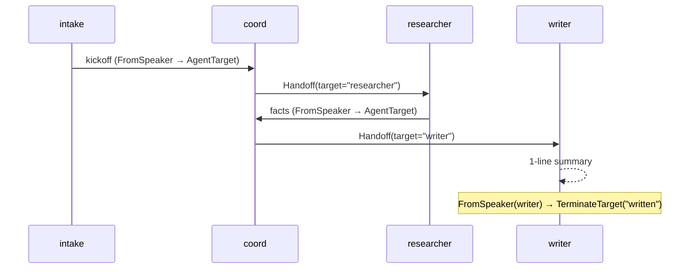

The Hierarchical pattern places a coordinator above a set of
specialists. The coordinator delegates work, the researcher returns
to the coordinator with facts, and the writer is the *terminal* step
that uses those facts to produce the final summary — its reply
closes the workflow.

**Classic primitives:** `#!python NestedChat` for sub-flows,
`#!python GroupManager` for delegation, top-level `#!python DefaultPattern`
for the coordinator graph.

### Key Characteristics

* **Coordinator owns dispatch.** The coord decides whether to call
  the researcher or the writer, never replies as the specialist.
* **Researcher returns to coord.** The researcher's reply routes back
  via `#!python FromSpeaker(researcher) → AgentTarget(coord)` so coord
  can decide the next move.
* **Writer is the terminal speaker.** A `#!python FromSpeaker(writer) →
  TerminateTarget("written")` rule closes the workflow as soon as the
  writer's summary lands. There is no separate "finish" tool.

### Routing Mechanics

* **Typed `#!python Handoff` return.** Each `#!python delegate_<spoke>` tool
  returns `#!python Handoff(target="researcher", reason=...)`. The framework
  reads it from the agent's local `#!python ToolResultEvent` stream after
  the round and stamps it onto the packet's `#!python routing.target`. No
  graph rule is needed for the delegation edge — `#!python Handoff.target`
  is authoritative.
* **No `finish_delegate` tool.** Earlier iterations of this demo had a
  `#!python finish_delegate` tool that flipped a context flag to terminate.
  Real LLMs (Sonnet, GPT, Gemini) routinely emit several tool calls in
  parallel inside one round — a parallel call to `#!python finish_delegate`
  alongside `#!python delegate_researcher` would set the flag *before* the
  researcher had a chance to speak, terminating the workflow prematurely.
  Making the writer the terminal speaker sidesteps this hazard entirely:
  parallel calls to `#!python delegate_researcher` and `#!python delegate_writer`
  are safe because [first-emitted-wins](/docs/user-guide/network/workflow#first-emitted-wins)
  picks researcher (the other tool runs but its `#!python Handoff` doesn't
  drive routing), and the writer step still runs in its own dedicated
  round once researcher returns.

## Agent Flow



## Migrating from Classic to AG2?

| Classic | AG2 |
|---|---|
| `#!python ReplyResult(target=AgentTarget(researcher))` from a delegate tool | `#!python return Handoff(target="researcher", reason=...)` |
| `#!python NestedChat` for a specialist that runs its own sub-flow | Specialist tool opens a separate `#!python consulting` channel |
| Explicit "finish" tool flipping a context flag | Make the terminal specialist's reply itself close via `#!python FromSpeaker(writer) → TerminateTarget` |

### Gaps & Workarounds

* **No `#!python NestedChatTarget`.** A specialist that needs its own
  sub-flow can't open a "child workflow" inline. Workaround: the
  specialist's tool opens a *separate* channel (e.g. a `#!python consulting`
  channel via `#!python AgentClient.open(...)`), runs the sub-conversation
  there, and returns the result to the coordinator channel via its
  reply. Two channels, one per nesting level — clean WAL per nesting,
  but the affordance isn't built in.

## Code

!!! tip
    Coord, researcher, and writer all use real Sonnet — the
    coordinator genuinely decides between researcher and writer, and
    the writer's summary is a real LLM output.

```python linenums="1"
"""Cookbook 02 — Hierarchical / Tree pattern.

A coordinator delegates work to specialists. The researcher returns
to the coordinator with facts; the writer is the *terminal* step
that uses those facts to produce the final summary, and its reply
closes the workflow.
"""

import asyncio

from dotenv import load_dotenv

from ag2 import Agent
from ag2.config import AnthropicConfig
from ag2.knowledge import MemoryKnowledgeStore
from ag2.network import (
    EV_PACKET,
    EV_CHANNEL_CLOSED,
    EV_TEXT,
    WORKFLOW_TYPE,
    AgentTarget,
    FromSpeaker,
    Handoff,
    Hub,
    TerminateTarget,
    Transition,
    TransitionGraph,
)
from ag2.testing import TestConfig

load_dotenv()

async def delegate_researcher(reason: str) -> Handoff:
    """Send the work to the research specialist. The returned
    Handoff carries the target name; the framework resolves it
    and routes the next turn there. No graph rule needed for this
    edge — Handoff.target is authoritative."""
    print(f"  [tool] delegate_researcher({reason!r})")
    return Handoff(target="researcher", reason=reason)

async def delegate_writer(reason: str) -> Handoff:
    """Send the work to the writing specialist. Writer's reply is
    the terminal step — the graph closes the workflow on
    FromSpeaker(writer)."""
    print(f"  [tool] delegate_writer({reason!r})")
    return Handoff(target="writer", reason=reason)

async def main() -> None:
    config = AnthropicConfig(model="claude-sonnet-4-6")

    hub = await Hub.open(MemoryKnowledgeStore(), ttl_sweep_interval=0)

    intake_agent = Agent("intake", config=TestConfig())

    coord_agent = Agent(
        "coord",
        prompt=(
            "You are a router-only coordinator. You produce no prose "
            "yourself; specialists do that work.\n"
            "\n"
            "On each turn your ENTIRE output MUST be one tool call "
            "and nothing else — no preface, no summary, no commentary. "
            "Any text body you emit is treated as a bug.\n"
            "\n"
            "Routing logic:\n"
            "* If the conversation does not yet contain bullet facts "
            "from the researcher, call `delegate_researcher`.\n"
            "* Once the researcher's facts are present, call "
            "`delegate_writer`. The writer produces the final 1-line "
            "summary and that reply ends the workflow.\n"
            "\n"
            "Strict: never call both delegations in the same turn — "
            "wait for the researcher's reply before delegating to the "
            "writer."
        ),
        config=config,
    )
    coord_agent.tool(delegate_researcher)
    coord_agent.tool(delegate_writer)

    researcher_agent = Agent(
        "researcher",
        prompt=(
            "You are the researcher. Reply with ONE short opening "
            "sentence followed by three bullet facts (each one line). "
            "No preamble, no closing."
        ),
        config=config,
    )
    writer_agent = Agent(
        "writer",
        prompt=(
            "You are the writer. The conversation contains the user's "
            "request and the researcher's three bullet facts. Produce "
            "ONE short sentence (≤ 30 words) summarising the topic, "
            "drawing on the researcher's facts. Your reply ends the "
            "workflow — make it the final answer the user receives. "
            "No preamble, no headers."
        ),
        config=config,
    )

    intake = await hub.register(intake_agent)
    coord = await hub.register(coord_agent)
    researcher = await hub.register(researcher_agent)
    writer = await hub.register(writer_agent)

    graph = TransitionGraph(
        initial_speaker=intake.agent_id,
        transitions=[
            # Writer's reply is the terminal step.
            Transition(when=FromSpeaker(writer.agent_id), then=TerminateTarget("written")),
            # Researcher returns to coord so coord can delegate to writer.
            Transition(when=FromSpeaker(researcher.agent_id), then=AgentTarget(coord.agent_id)),
            # intake → coord kickoff. Routing FROM coord to a specialist
            # happens via Handoff returns from delegate_* tools — the
            # framework reads target from the Handoff and stamps it onto
            # the packet, so no ToolCalled rules are needed for that edge.
            Transition(when=FromSpeaker(intake.agent_id), then=AgentTarget(coord.agent_id)),
        ],
        default_target=TerminateTarget("fall_through"),
        max_turns=10,
    )

    channel = await intake.open(
        type=WORKFLOW_TYPE,
        target=[coord.agent_id, researcher.agent_id, writer.agent_id],
        knobs={"graph": graph.to_dict()},
    )
    print(f"channel: {channel.channel_id}\n")

    name_by_id = {
        intake.agent_id: "intake",
        coord.agent_id: "coord",
        researcher.agent_id: "researcher",
        writer.agent_id: "writer",
    }

    await channel.send("Brief on distributed consensus: research, then write a 1-line summary.")

    # Wait for the workflow to terminate (any of the five close routes
    # documented in /docs/user-guide/network/termination — this demo uses
    # FromSpeaker(writer) → TerminateTarget("written")).
    close_env = await intake.wait_for_channel_event(
        channel_id=channel.channel_id,
        predicate=lambda e: e.event_type == EV_CHANNEL_CLOSED,
        timeout=180.0,
    )

    # Print the transcript from the WAL after close.
    for env in await hub.read_wal(channel.channel_id):
        speaker = name_by_id.get(env.sender_id, env.sender_id[:8])
        if env.event_type == EV_TEXT:
            print(f"{speaker:>14}: {env.event_data['text']}")
        elif env.event_type == EV_PACKET:
            routing = env.event_data.get("routing", {}) or {}
            if routing.get("kind") == "handoff":
                line = f"[Handed off via {routing.get('tool', '')}] {routing.get('reason', '')}"
                print(f"{speaker:>14}: {line.rstrip()}")
            body = env.event_data.get("body", "")
            if body:
                print(f"{speaker:>14}: {body}")

    print(f"\nclosed: reason={close_env.event_data.get('reason')!r}")

    await hub.close()

if __name__ == "__main__":
    asyncio.run(main())
```

## Output

```console
channel: 9b7c...

         intake: Brief on distributed consensus: research, then write a 1-line summary.
  [tool] delegate_researcher('Gather bullet facts about distributed consensus...')
          coord: [Handed off via delegate_researcher] Gather bullet facts about distributed consensus...
     researcher: Distributed consensus enables networked nodes to agree on a single value or state despite failures.

- Key algorithms: Paxos, Raft, PBFT
- Core trade-offs: CAP theorem, FLP impossibility
- Real-world uses: ZooKeeper, etcd, blockchain protocols
  [tool] delegate_writer('Write a 1-line summary covering algorithms, trade-offs, and uses.')
          coord: [Handed off via delegate_writer] Write a 1-line summary covering algorithms, trade-offs, and uses.
         writer: Distributed consensus algorithms — Paxos, Raft, PBFT — let networked nodes agree on shared state despite faults, trading consistency against availability in real systems like etcd and blockchains.

closed: reason='written'
```
