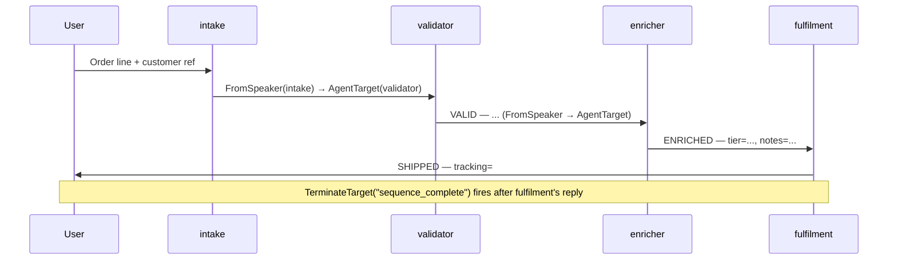

The Pipeline pattern organises agents into a strict linear sequence:
each agent processes the previous agent's output, then hands off to
the next. Information flows in one direction; the run ends after the
last stage replies.

**Classic primitives:** `#!python DefaultPattern` with explicit
`#!python AgentTarget` handoffs, optionally `#!python ReplyResult` to bundle
a context update with each reply.

### Key Characteristics

* **Specialised stages.** Each agent focuses on one transformation —
  validate, enrich, fulfil — and ignores the rest.
* **Unidirectional flow.** Each stage hands off forward only. There
  is no return path for revisions inside the pipeline.
* **Progressive refinement.** The conversation accumulates through
  the WAL: every agent sees the full prior context via the windowed
  view, so no explicit state passing is needed.
* **Well-defined interfaces.** Each agent's prompt shapes its single
  reply line so the next stage can pick it up unambiguously.

### Information Flow

The graph's `#!python TransitionGraph.sequence([...])` shorthand wires
`#!python FromSpeaker(a) → AgentTarget(b)`, `#!python FromSpeaker(b) → AgentTarget(c)`,
and so on, with `#!python TerminateTarget("sequence_complete")` as the
default and `#!python max_turns=len(steps)` matching the pipeline length.
Each step terminates only by reaching the end — a stage that wants to
abort early can return a typed `#!python Handoff(target="terminate")` or
emit any other routing intent the framework recognises.

## Agent Flow



## Migrating from Classic to AG2?

| Classic | AG2 |
|---|---|
| `#!python DefaultPattern` + per-agent handoff registration | `#!python TransitionGraph.sequence([...])` |
| `#!python ReplyResult(message, target=AgentTarget(next))` from a tool | Either bake the handoff into the graph (preferred), return a typed `#!python Handoff(target=...)` from a tool, or wire a `#!python ToolCalled` rule to a plain `#!python @tool` |
| `#!python ContextVariables` carrying intermediate state | `#!python set_context(channel, key, value)` from inside a tool; reads via `#!python ChannelStateInject` |

## Code

!!! tip
    Each agent uses `#!python AnthropicConfig(model="claude-sonnet-4-6")`
    so the validator / enricher / fulfilment stages produce real
    domain output. Set `#!python ANTHROPIC_API_KEY` before running.

```python linenums="1"
"""Cookbook 01 — Pipeline pattern.

Strict linear hand-off: A → B → C → D → terminate.
TransitionGraph.sequence ships the canonical implementation —
each step's FromSpeaker rule routes to the next, and
sequence_complete terminates after the last speaker.
"""

import asyncio

from dotenv import load_dotenv

from ag2 import Agent
from ag2.config import AnthropicConfig
from ag2.knowledge import MemoryKnowledgeStore
from ag2.network import (
    EV_PACKET,
    EV_CHANNEL_CLOSED,
    EV_TEXT,
    WORKFLOW_TYPE,
    Hub,
    TransitionGraph,
)
from ag2.testing import TestConfig

load_dotenv()

async def main() -> None:
    config = AnthropicConfig(model="claude-sonnet-4-6")

    hub = await Hub.open(MemoryKnowledgeStore(), ttl_sweep_interval=0)

    intake_agent = Agent("intake", config=TestConfig())

    validator_agent = Agent(
        "validator",
        prompt=(
            "You are the order validator. The intake message describes "
            "an order. Check that it has a customer reference and at "
            "least one line item. If valid, reply on a single line: "
            "`VALID — <one-line summary of what was validated>`. If "
            "invalid, reply: `INVALID — <reason>`. Either way, ONE "
            "line, no preamble."
        ),
        config=config,
    )

    enricher_agent = Agent(
        "enricher",
        prompt=(
            "You are the order enricher. The validator has just "
            "approved an order. Look up (i.e. invent plausibly) the "
            "customer tier and any shipping notes a fulfilment agent "
            "would need. Reply on a single line: "
            "`ENRICHED — tier=<tier>, notes=<short notes>`. ONE line, "
            "no preamble."
        ),
        config=config,
    )

    fulfilment_agent = Agent(
        "fulfilment",
        prompt=(
            "You are fulfilment. The validator approved the order and "
            "the enricher added the customer tier. Issue a shipping "
            "confirmation. Reply on a single line: "
            "`SHIPPED — tracking=#<plausible-tracking>, ETA=<short "
            "phrase>`. ONE line, no preamble."
        ),
        config=config,
    )

    intake = await hub.register(intake_agent)
    validator = await hub.register(validator_agent)
    enricher = await hub.register(enricher_agent)
    fulfilment = await hub.register(fulfilment_agent)

    graph = TransitionGraph.sequence([
        intake.agent_id,
        validator.agent_id,
        enricher.agent_id,
        fulfilment.agent_id,
    ])

    channel = await intake.open(
        type=WORKFLOW_TYPE,
        target=[validator.agent_id, enricher.agent_id, fulfilment.agent_id],
        knobs={"graph": graph.to_dict()},
    )
    print(f"channel: {channel.channel_id}\n")

    name_by_id = {
        intake.agent_id: "intake",
        validator.agent_id: "validator",
        enricher.agent_id: "enricher",
        fulfilment.agent_id: "fulfilment",
    }

    await channel.send("Order: 2x widget (SKU W-100), customer ACME-7, ship-to: London EC1.")

    # Wait for the workflow to terminate (any of the five close routes
    # documented in /docs/user-guide/network/termination — this demo uses
    # TerminateTarget("sequence_complete") as its happy path).
    close_env = await intake.wait_for_channel_event(
        channel_id=channel.channel_id,
        predicate=lambda e: e.event_type == EV_CHANNEL_CLOSED,
        timeout=180.0,
    )

    # Print the transcript from the WAL after close.
    for env in await hub.read_wal(channel.channel_id):
        speaker = name_by_id.get(env.sender_id, env.sender_id[:8])
        if env.event_type == EV_TEXT:
            print(f"{speaker:>14}: {env.event_data['text']}")
        elif env.event_type == EV_PACKET:
            routing = env.event_data.get("routing", {}) or {}
            if routing.get("kind") == "handoff":
                line = f"[Handed off via {routing.get('tool', '')}] {routing.get('reason', '')}"
                print(f"{speaker:>14}: {line.rstrip()}")
            body = env.event_data.get("body", "")
            if body:
                print(f"{speaker:>14}: {body}")

    print(f"\nclosed: reason={close_env.event_data.get('reason')!r}")

    await hub.close()

if __name__ == "__main__":
    asyncio.run(main())
```

## Output

```console
channel: 3a1f...

         intake: Order: 2x widget (SKU W-100), customer ACME-7, ship-to: London EC1.
      validator: VALID — order has customer ref ACME-7 and one line item (2x SKU W-100).
       enricher: ENRICHED — tier=Gold, notes=expedite for London EC1, signature on delivery.
     fulfilment: SHIPPED — tracking=#GB-2026-09-AC7-W100, ETA=next-day before 12:00 GMT.

closed: reason='sequence_complete'
```
