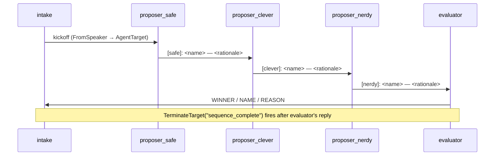

The Redundant pattern sends the same problem to multiple specialists
with different perspectives; an evaluator at the end picks the best
answer or synthesises across them.

**Classic primitives:** `#!python DefaultPattern` with parallel dispatch,
evaluator at the end, `#!python ContextVariables` collecting per-specialist
results.

### Key Characteristics

* **Fan-out via sequence.** `#!python TransitionGraph.sequence` runs each
  proposer in turn. Proposers are prompted to *differentiate* (e.g.
  "suggest something different from prior proposals — clever pun").
* **Evaluator at the end.** The evaluator sees all three proposals
  in its projected history and picks the best one.
* **`#!python sequence_complete` terminates** after the evaluator's reply.

### Routing Mechanics

There is no routing tool in this pattern — every step is a plain
`#!python FromSpeaker(a) → AgentTarget(b)` rule wired by
`#!python TransitionGraph.sequence([...])`. Each proposer's reply is
visible to subsequent proposers via the windowed view, so the prompt
"suggest something DIFFERENT from any prior proposal" works without
any explicit state tracking.

## Agent Flow



## Migrating from Classic to AG2?

| Classic | AG2 |
|---|---|
| Parallel dispatch to N specialists | Sequential `#!python TransitionGraph.sequence([...])` (no parallel today) |
| `#!python ContextVariables` collecting per-specialist results | Each proposer reads prior proposals from the windowed view; evaluator reads all three from its context |
| Evaluator picks via `#!python ReplyResult` and signals completion | Evaluator writes a plain text reply; `#!python sequence_complete` terminates the run automatically |

### Gaps & Workarounds

* **No parallel dispatch.** Classic Redundant could fan out to three
  specialists *simultaneously* and the evaluator would receive all
  three responses. AG2 workflow is strictly sequential. Workaround:
  the sequential version above is functionally equivalent for
  synthesis, just slower (3× LLM latency instead of 1×). For genuine
  parallelism, run the specialists in separate `#!python consulting`
  channels opened by the asker's tool, gather replies via
  `#!python wait_for_channel_event`, then write the results back into
  the main workflow's `#!python context_vars` via `#!python set_context`.
  Heavier but parallel.
* **No `#!python NestedChatTarget`.** Same as Hierarchical — child
  channels are the workaround when you genuinely want isolated
  specialist runs.

## Code

!!! tip
    All four agents use real Sonnet so the proposals and the
    evaluator's pick are genuinely LLM-driven.

```python linenums="1"
"""Cookbook 05 — Redundant pattern.

The same task is given to multiple agents with different perspectives;
an evaluator at the end picks the best response. In classic AG2 the
fan-out can be parallel — three agents work concurrently. AG2
workflow has no parallel dispatch yet, so this demo shows the
sequential equivalent.
"""

import asyncio

from dotenv import load_dotenv

from ag2 import Agent
from ag2.config import AnthropicConfig
from ag2.knowledge import MemoryKnowledgeStore
from ag2.network import (
    EV_PACKET,
    EV_CHANNEL_CLOSED,
    EV_TEXT,
    WORKFLOW_TYPE,
    Hub,
    TransitionGraph,
)
from ag2.testing import TestConfig

load_dotenv()

async def main() -> None:
    config = AnthropicConfig(model="claude-sonnet-4-6")

    hub_obj = await Hub.open(MemoryKnowledgeStore(), ttl_sweep_interval=0)

    intake_agent = Agent("intake", config=TestConfig())

    safe_agent = Agent(
        "proposer_safe",
        prompt=(
            "You are the SAFE proposer. Suggest exactly ONE name for "
            "the product the user describes. Pick something traditional "
            "and professional — no puns, no jargon. Reply in one line: "
            "`[safe]: <name> — <one-sentence rationale>`."
        ),
        config=config,
    )
    clever_agent = Agent(
        "proposer_clever",
        prompt=(
            "You are the CLEVER proposer. You can see prior proposals "
            "in the conversation. Suggest exactly ONE name that is "
            "DIFFERENT from any prior proposal — a clever pun or word "
            "play. Reply in one line: "
            "`[clever]: <name> — <one-sentence rationale>`."
        ),
        config=config,
    )
    nerdy_agent = Agent(
        "proposer_nerdy",
        prompt=(
            "You are the NERDY proposer. You can see prior proposals. "
            "Suggest exactly ONE name DIFFERENT from any prior — a "
            "reference to programming, sci-fi, or maths culture. Reply "
            "in one line: `[nerdy]: <name> — <one-sentence rationale>`."
        ),
        config=config,
    )
    evaluator_agent = Agent(
        "evaluator",
        prompt=(
            "You are the evaluator. The conversation contains three "
            "name proposals tagged `[safe]:`, `[clever]:`, and "
            "`[nerdy]:`. Pick the ONE you think best balances clarity "
            "and memorability for the product. Reply in this format:\n"
            "\n"
            "  WINNER: <one of safe / clever / nerdy>\n"
            "  NAME: <the chosen name>\n"
            "  REASON: <one-sentence reason>"
        ),
        config=config,
    )

    intake = await hub_obj.register(intake_agent)
    safe = await hub_obj.register(safe_agent)
    clever = await hub_obj.register(clever_agent)
    nerdy = await hub_obj.register(nerdy_agent)
    evaluator = await hub_obj.register(evaluator_agent)

    graph = TransitionGraph.sequence([
        intake.agent_id,
        safe.agent_id,
        clever.agent_id,
        nerdy.agent_id,
        evaluator.agent_id,
    ])

    channel = await intake.open(
        type=WORKFLOW_TYPE,
        target=[safe.agent_id, clever.agent_id, nerdy.agent_id, evaluator.agent_id],
        knobs={"graph": graph.to_dict()},
    )
    print(f"channel: {channel.channel_id}\n")

    name_by_id = {
        intake.agent_id: "intake",
        safe.agent_id: "safe",
        clever.agent_id: "clever",
        nerdy.agent_id: "nerdy",
        evaluator.agent_id: "evaluator",
    }

    await channel.send(
        "Suggest a name for our new code-review SaaS. It runs as a "
        "GitHub bot and gives senior-engineer-style feedback on PRs."
    )

    # Wait for the workflow to terminate (any of the five close routes
    # documented in /docs/user-guide/network/termination — this demo uses
    # TerminateTarget("sequence_complete") after the evaluator's reply).
    close_env = await intake.wait_for_channel_event(
        channel_id=channel.channel_id,
        predicate=lambda e: e.event_type == EV_CHANNEL_CLOSED,
        timeout=240.0,
    )

    # Print the transcript from the WAL after close.
    for env in await hub_obj.read_wal(channel.channel_id):
        speaker = name_by_id.get(env.sender_id, env.sender_id[:8])
        if env.event_type == EV_TEXT:
            print(f"{speaker:>14}: {env.event_data['text']}")
        elif env.event_type == EV_PACKET:
            routing = env.event_data.get("routing", {}) or {}
            if routing.get("kind") == "handoff":
                line = f"[Handed off via {routing.get('tool', '')}] {routing.get('reason', '')}"
                print(f"{speaker:>14}: {line.rstrip()}")
            body = env.event_data.get("body", "")
            if body:
                print(f"{speaker:>14}: {body}")

    print(f"\nclosed: reason={close_env.event_data.get('reason')!r}")

    await hub_obj.close()

if __name__ == "__main__":
    asyncio.run(main())
```

## Output

```console
channel: 7e91...

         intake: Suggest a name for our new code-review SaaS. It runs as a GitHub bot and gives senior-engineer-style feedback on PRs.
           safe: [safe]: ReviewPro — a clear, professional name signalling thorough code review with senior-level expertise.
         clever: [clever]: PullSenior — a pun on "pull request" + "senior" that hints at the bot's seniority while staying memorable.
          nerdy: [nerdy]: Linus's Reviewer — a nod to Linus Torvalds's famously direct kernel reviews, signalling the bot delivers no-nonsense senior-engineer feedback.
      evaluator: WINNER: clever
                 NAME: PullSenior
                 REASON: PullSenior is memorable, on-brand for GitHub workflows, and immediately conveys the product's value (senior-level pull-request review) without sacrificing clarity.

closed: reason='sequence_complete'
```
