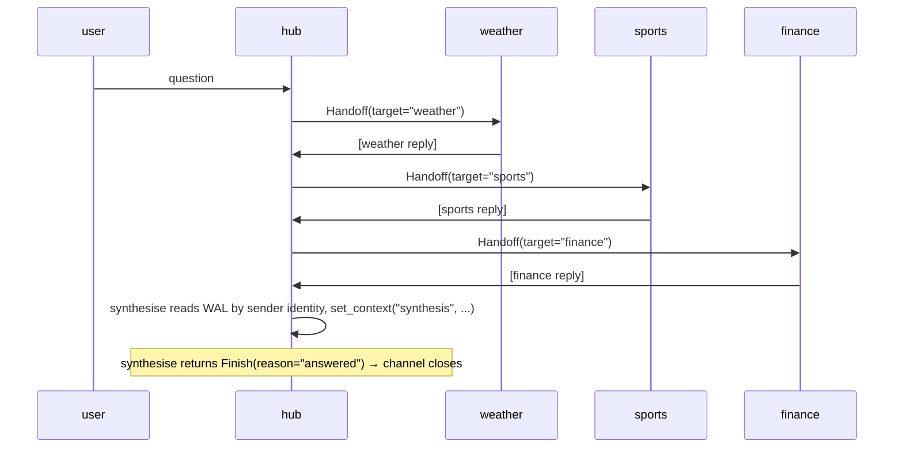

The Star pattern places one hub agent at the centre with several
specialist spokes. The hub fans out questions to the relevant spoke,
collects each reply, and synthesises a final answer. Spokes never
talk to each other; everything routes through the hub.

**Classic primitives:** `#!python DefaultPattern` with
`#!python OnContextCondition` routing, spoke handoffs returning to centre,
`#!python ContextVariables` tracking results.

### Key Characteristics

* **Single hub.** The hub picks which spoke to query, waits for the
  reply, then either delegates to another spoke or terminates with a
  synthesis.
* **Dynamic `#!python Handoff`.** A single parameterised
  `#!python ask_spoke(spoke, query)` tool returns
  `#!python Handoff(target=spoke)`, so the framework routes the next turn
  directly to the chosen spoke. No per-spoke graph rules are needed
  for the delegation edge — `#!python Handoff.target` is authoritative.
* **WAL-gated synthesis.** The `#!python synthesise` tool reads the WAL
  via `#!python HubInject` and checks for each spoke's reply by
  sender identity (`#!python hub.name_for`). It refuses with a
  `#!python "pending: ..."` string until all required spokes have replied,
  then stores the synthesis via `#!python set_context` and returns
  `#!python Finish(reason="answered")` to terminate the workflow.
* **`#!python StayTarget` for hub.** The graph's hub transition uses
  `#!python StayTarget` so that turns where `#!python synthesise` returns
  `#!python "pending"` (and the hub writes a short text note) re-route back
  to the hub rather than stalling on a silent round.

### Routing Mechanics

* **Spokes return to hub.** `#!python FromSpeaker(<spoke>) → AgentTarget(hub)`
  rotates control back after each spoke replies.
* **Termination via `#!python Finish`.** When `#!python synthesise` has all
  three spoke replies, it returns `#!python Finish(reason="answered")`. The
  adapter reads `#!python Finish` from the `#!python ToolResultEvent` and
  sets `#!python routing.kind = "finish"`, which `#!python fold` converts
  directly into a channel close — no `#!python ToolCalled` graph rule needed.
* **Sender-identity detection.** `#!python synthesise` identifies spoke
  replies by calling `#!python hub.name_for(env.sender_id)` on each
  `#!python EV_PACKET` in the WAL. This works regardless of the reply's
  text format — no `#!python "[spoke]:"` prefix convention required.

!!! note "Parallel-call defence"
    Without mitigation, Sonnet may emit `#!python ask_spoke`
    calls for multiple spokes in a single turn (the agent's
    internal multi-round loop). The first `#!python Handoff` in the
    event list always wins routing, so the correct spoke is
    reached. Still, disabling parallel tool calls keeps the trace
    clean and prevents redundant LLM calls:

    ```python
    AnthropicConfig(
        model="claude-sonnet-4-6",
        extra_body={"tool_choice": {"type": "auto", "disable_parallel_tool_use": True}},
    )
    ```

    OpenAI exposes the analogous `#!python parallel_tool_calls=False`
    as a typed field on `#!python OpenAIConfig`; Gemini's behaviour
    is naturally serial.

## Agent Flow



## Migrating from Classic to AG2?

| Classic | AG2 |
|---|---|
| Coordinator routes by inspecting `#!python ContextVariables` | Hub routes via a parameterised `#!python ask_spoke` tool returning `#!python Handoff(target=spoke)` |
| Spoke replies carry `#!python ReplyResult.target=AgentTarget(coordinator)` | `#!python FromSpeaker(<spoke>) → AgentTarget(hub)` rule rotates control back |
| Synthesis triggered by checking aggregated context | Synthesis triggered by an explicit `#!python synthesise` tool call; the tool reads the WAL via `#!python HubInject`, gates on required senders, stores the result via `#!python set_context`, and returns `#!python Finish` to close the workflow |

## Code

!!! tip
    The hub uses real Sonnet (the routing decision is the LLM-driven
    part of the demo). The spokes use `#!python TestConfig` with
    pre-canned deterministic replies so the synthesis turn can quote
    them cleanly without LLM-quality noise.

```python linenums="1"
"""Cookbook 03 — Star pattern.

A hub agent fans out to specialist spokes via a parameterised
``ask_spoke(spoke, query)`` tool returning ``Handoff(target=spoke)``.
A WAL-gated ``synthesise`` tool composes the final answer once all
required spokes have replied, then returns ``Finish(reason="answered")``
to terminate the workflow.
"""

import asyncio

from dotenv import load_dotenv

from ag2 import Agent
from ag2.config import AnthropicConfig
from ag2.knowledge import MemoryKnowledgeStore
from ag2.network import (
    EV_CHANNEL_CLOSED,
    EV_CONTEXT_SET,
    EV_PACKET,
    EV_TEXT,
    WORKFLOW_TYPE,
    AgentTarget,
    ChannelInject,
    Finish,
    FromSpeaker,
    Handoff,
    Hub,
    HubInject,
    StayTarget,
    TerminateTarget,
    Transition,
    TransitionGraph,
)
from ag2.network.workflow_helpers import set_context
from ag2.testing import TestConfig

load_dotenv()

_REQUIRED_SPOKES = ("weather", "sports", "finance")

async def ask_spoke(spoke: str, query: str) -> Handoff:
    """Route a query to one of the spokes. Returns a typed
    Handoff(target=spoke) so the framework routes the next turn
    directly to the named spoke."""
    print(f"  [tool] ask_spoke({spoke}): {query}")
    if spoke not in _REQUIRED_SPOKES:
        return Handoff(target="hub", reason=f"unknown spoke {spoke!r}")
    return Handoff(target=spoke, reason=query)

async def synthesise(headline: str, channel: ChannelInject, hub: HubInject) -> "Finish | str":
    """Scan the WAL for spoke replies by sender identity, build synthesis.

    Uses hub.name_for(sender_id) to identify each spoke — works
    regardless of reply text format, no "[spoke]:" prefix required.
    Returns Finish(reason="answered") once all three spokes have replied,
    terminating the workflow. Returns "pending: ..." until then.
    """
    if channel is None or hub is None:
        return "no channel or hub"
    print(f"  [tool] synthesise(headline={headline!r})")

    wal = await hub.read_wal(channel.channel_id)
    by_spoke: dict[str, str] = {}
    for env in wal:
        if env.event_type != EV_PACKET:
            continue
        body = env.event_data.get("body", "")
        if not body:
            continue
        name = hub.name_for(env.sender_id, default="")
        if name in _REQUIRED_SPOKES:
            by_spoke[name] = body

    missing = [s for s in _REQUIRED_SPOKES if s not in by_spoke]
    if missing:
        return f"pending: {', '.join(missing)}"

    bullets: list[str] = [f"**{headline.strip() or 'Roundup'}**", ""]
    for spoke in _REQUIRED_SPOKES:
        bullets.append(f"- {by_spoke[spoke]}")
    synthesis = "\n".join(bullets)

    await set_context(channel, "synthesis", synthesis)
    return Finish(reason="answered")

async def main() -> None:
    # Hub config: disable parallel tool calls so Sonnet emits exactly
    # one ask_spoke (or synthesise) per LLM response. Spokes use
    # TestConfig so they don't need this.
    hub_config = AnthropicConfig(
        model="claude-sonnet-4-6",
        extra_body={"tool_choice": {"type": "auto", "disable_parallel_tool_use": True}},
    )

    hub_obj = await Hub.open(MemoryKnowledgeStore(), ttl_sweep_interval=0)

    user_agent = Agent("user", config=TestConfig())

    hub_agent = Agent(
        "hub",
        prompt=(
            "You are the hub of a Q&A star. Tools:\n"
            "\n"
            "* `ask_spoke(spoke, query)` — query ONE spoke by name "
            "(`weather`, `sports`, `finance`). Returns a Handoff. The "
            "spoke's reply appears in your conversation on a later turn. "
            "The tool's return value is just a routing token; ignore it "
            "and wait for the spoke's reply on a future turn.\n"
            "* `synthesise(headline)` — call ONCE when all three "
            "spoke replies are visible in your conversation history. "
            "Builds the final synthesis from the WAL and ends the "
            "workflow.\n"
            "\n"
            "Protocol:\n"
            "1. Call exactly ONE tool per turn.\n"
            "2. Each turn, check your conversation history for spoke "
            "replies. Call `ask_spoke` for a spoke that has NOT yet "
            "replied.\n"
            "3. Once all three spoke replies are visible, call "
            "`synthesise` with a short headline like 'Daily Roundup'.\n"
            "\n"
            "If `synthesise` returns `pending: ...` some spokes are "
            "still missing — call `ask_spoke` for the first listed "
            "missing spoke on your next turn."
        ),
        config=hub_config,
    )
    hub_agent.tool(ask_spoke)
    hub_agent.tool(synthesise)

    weather_agent = Agent(
        "weather",
        config=TestConfig(
            "[weather]: Partly cloudy, 68°F, light southwesterly breeze; no precipitation expected."
        ),
    )
    sports_agent = Agent(
        "sports",
        config=TestConfig(
            "[sports]: The Riverhawks won 2-1 last night, with the winning goal scored in the 87th minute."
        ),
    )
    finance_agent = Agent(
        "finance",
        config=TestConfig(
            "[finance]: S&P 500 closed up 0.4% on cooling inflation data ahead of next week's Fed meeting."
        ),
    )

    user = await hub_obj.register(user_agent)
    central = await hub_obj.register(hub_agent)
    weather = await hub_obj.register(weather_agent)
    sports = await hub_obj.register(sports_agent)
    finance = await hub_obj.register(finance_agent)

    graph = TransitionGraph(
        initial_speaker=user.agent_id,
        transitions=[
            # Spokes always return to hub.
            Transition(when=FromSpeaker(weather.agent_id), then=AgentTarget(central.agent_id)),
            Transition(when=FromSpeaker(sports.agent_id),  then=AgentTarget(central.agent_id)),
            Transition(when=FromSpeaker(finance.agent_id), then=AgentTarget(central.agent_id)),
            # Hub stays on text turns (synthesise returns "pending" and
            # hub writes a short note). Prevents silent-round stalls.
            # Handoff turns (ask_spoke) and Finish turns (synthesise done)
            # bypass this rule via routing.target / routing.kind.
            Transition(when=FromSpeaker(central.agent_id), then=StayTarget()),
            # User's question → hub.
            Transition(when=FromSpeaker(user.agent_id), then=AgentTarget(central.agent_id)),
        ],
        default_target=TerminateTarget("fall_through"),
        max_turns=20,
    )

    channel = await user.open(
        type=WORKFLOW_TYPE,
        target=[central.agent_id, weather.agent_id, sports.agent_id, finance.agent_id],
        knobs={"graph": graph.to_dict()},
    )
    print(f"channel: {channel.channel_id}\n")

    name_by_id = {
        user.agent_id: "user",
        central.agent_id: "hub",
        weather.agent_id: "weather",
        sports.agent_id: "sports",
        finance.agent_id: "finance",
    }

    await channel.send(
        "What's the weather like and how did the local football team do? "
        "Also a quick word on the markets."
    )

    close_env = await user.wait_for_channel_event(
        channel_id=channel.channel_id,
        predicate=lambda e: e.event_type == EV_CHANNEL_CLOSED,
        timeout=240.0,
    )

    for env in await hub_obj.read_wal(channel.channel_id):
        speaker = name_by_id.get(env.sender_id, env.sender_id[:8])
        if env.event_type == EV_TEXT:
            print(f"{speaker:>14}: {env.event_data['text']}")
        elif env.event_type == EV_PACKET:
            routing = env.event_data.get("routing", {}) or {}
            if routing.get("kind") == "handoff":
                line = f"[Handed off via {routing.get('tool', '')}] {routing.get('reason', '')}"
                print(f"{speaker:>14}: {line.rstrip()}")
            elif routing.get("kind") == "finish":
                print(f"{speaker:>14}: [Finish] {routing.get('reason', '')}")
            body = env.event_data.get("body", "")
            if body:
                print(f"{speaker:>14}: {body}")

    print(f"\nclosed: reason={close_env.event_data.get('reason')!r}")

    print("\n--- final synthesis ---")
    synthesis = "(no synthesis)"
    for env in await hub_obj.read_wal(channel.channel_id):
        if env.event_type == EV_CONTEXT_SET:
            kv = env.event_data.get("set", {})
            if "synthesis" in kv:
                synthesis = kv["synthesis"]
    print(synthesis)

    await hub_obj.close()

if __name__ == "__main__":
    asyncio.run(main())
```

## Output

```console
channel: 4f2e...

           user: What's the weather like and how did the local football team do? Also a quick word on the markets.
  [tool] ask_spoke(weather): What is the current weather like?
            hub: [Handed off via ask_spoke] What is the current weather like?
        weather: [weather]: Partly cloudy, 68°F, light southwesterly breeze; no precipitation expected.
  [tool] ask_spoke(sports): How did the local football team do?
            hub: [Handed off via ask_spoke] How did the local football team do?
         sports: [sports]: The Riverhawks won 2-1 last night, with the winning goal scored in the 87th minute.
  [tool] ask_spoke(finance): Quick market summary
            hub: [Handed off via ask_spoke] Quick market summary
        finance: [finance]: S&P 500 closed up 0.4% on cooling inflation data ahead of next week's Fed meeting.
  [tool] synthesise(headline='Daily Roundup')
            hub: [Finish] answered

closed: reason='answered'

--- final synthesis ---
**Daily Roundup**

- [weather]: Partly cloudy, 68°F, light southwesterly breeze; no precipitation expected.
- [sports]: The Riverhawks won 2-1 last night, with the winning goal scored in the 87th minute.
- [finance]: S&P 500 closed up 0.4% on cooling inflation data ahead of next week's Fed meeting.
```
