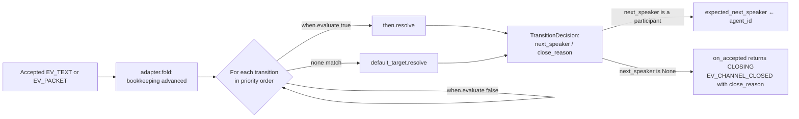
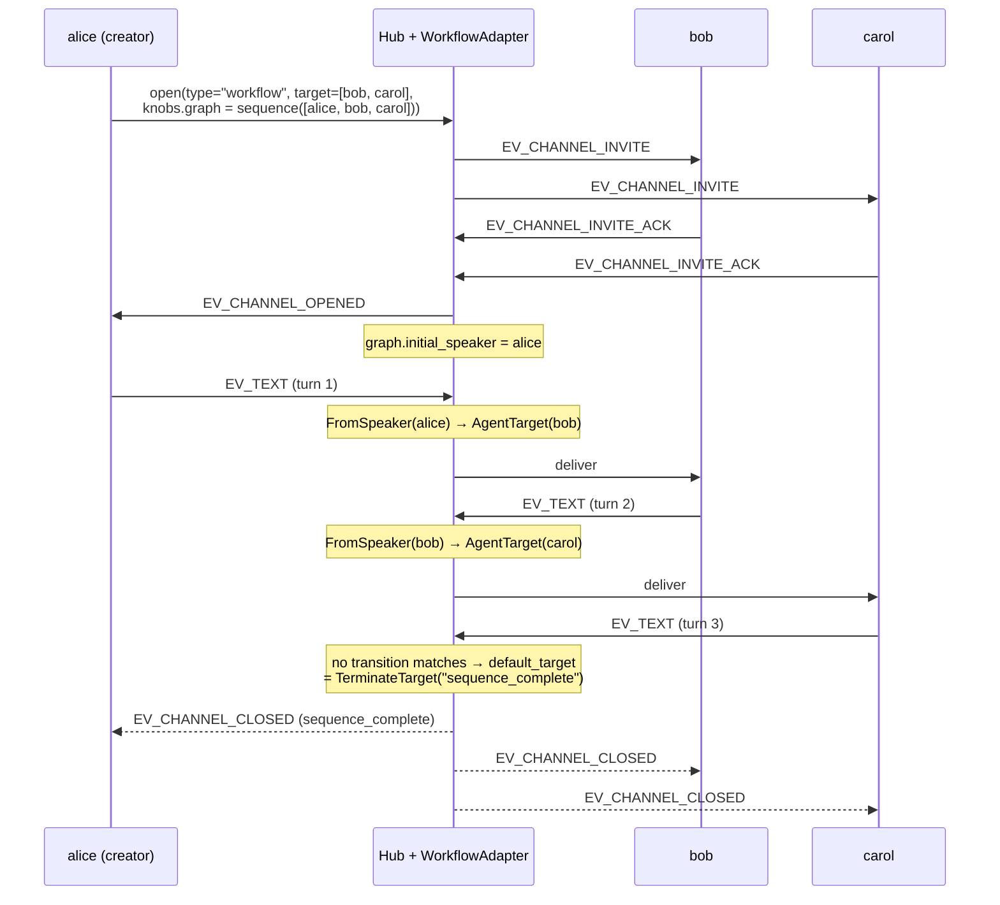

`#!python workflow` is the orchestrated multi-party adapter. A declarative `#!python TransitionGraph` describes who speaks first, what conditions fire, and when the channel terminates. It's the modern replacement for the classic `GroupChat + handoffs` pattern — see [Migrating from Group Chat](/docs/user-guide/network/migration_from_group_chat) for the side-by-side translation.

## Shape

| | |
|---|---|
| Participants | 2+ |
| Turn order | Whatever `#!python TransitionGraph` says |
| Auto-close | Yes — when graph emits a `#!python TerminateTarget` decision or `#!python max_turns` is hit |
| Termination | Auto-close, explicit close, TTL, or expectation violation |
| Default view | `#!python WindowedSummary(recent_n=N*2)` |
| Default expectations | `#!python turn_within(120s, warn)`, `#!python turn_within(600s, auto_close)` |
| Required knob | `#!python {"graph": <TransitionGraph.to_dict()>}` |

## How a TransitionGraph Resolves the Next Speaker



Each accepted substantive envelope walks the transitions list, finds the first matching condition, and resolves a target. `#!python TerminateTarget` (with `#!python next_speaker=None`) ends the channel.

## Lifecycle: Sequence (Pipeline) Example



## Building the Graph

`#!python TransitionGraph` is the orchestrator script:

```python
@dataclass(slots=True)
class TransitionGraph:
    initial_speaker: str                   # agent_id of the first speaker
    transitions: list[Transition]          # ordered list, evaluated by priority
    default_target: TransitionTarget       # what happens if no transition matches
    max_turns: int | None = None           # hard turn cap
```

Each `#!python Transition` pairs a condition with a target:

```python
@dataclass(slots=True)
class Transition:
    when: TransitionCondition   # evaluated against the just-accepted envelope
    then: TransitionTarget      # if when() returns True, this resolves the next speaker
    priority: int = 0           # higher priority runs first; ties break by insertion order
```

## Built-in Targets

| Target | Decision |
|---|---|
| `#!python AgentTarget(agent_id)` | Hand off to a specific named agent. |
| `#!python RoundRobinTarget()` | Advance through the participant order. |
| `#!python StayTarget()` | Same speaker continues (rare; for "let me elaborate" patterns). |
| `#!python RevertToInitiatorTarget()` | Hand back to whoever opened the channel. |
| `#!python TerminateTarget(reason="…")` | End the channel; reason flows on `#!python EV_CHANNEL_CLOSED`. |

## Built-in Conditions

| Condition | Fires when |
|---|---|
| `#!python Always()` | Every accepted envelope. |
| `#!python FromSpeaker(agent_id)` | The just-accepted envelope was sent by this agent. |
| `#!python ToolCalled(tool_name)` | The previous turn called this tool by name (matched via the packet's `routing.tool` field). |
| `#!python ContextEquals(key, value)` | Channel-scoped `#!python context_vars[key]` equals `#!python value`. |

`#!python ContextEquals` is the read side of the [Context Variables](/docs/user-guide/network/context_variables) primitive — most non-trivial routing in classic AG2 went through `#!python OnContextCondition` and friends, and `#!python ContextEquals` is its modern equivalent. The "[Context-Driven Transitions](#context-driven-transitions)" section below covers routing patterns, multi-branch dispatch, and the order-of-rules traps in detail.

Both `#!python TransitionTarget` and `#!python TransitionCondition` are `#!python Protocol`s with a `name: ClassVar[str]` registration key. Custom targets or conditions register via `#!python register_target(MyTarget)` / `#!python register_condition(MyCondition)` so they can round-trip through `#!python TransitionGraph.to_dict()`.

## Convenience Factories

Two are shipped:

```python linenums="1"
# Cycle through participants for max_turns total turns.
graph = TransitionGraph.round_robin(
    participants=[alice.agent_id, bob.agent_id, carol.agent_id],
    max_turns=6,
)

# Pipeline: alice -> bob -> carol -> terminate.
graph = TransitionGraph.sequence([
    alice.agent_id, bob.agent_id, carol.agent_id,
])
```

`#!python round_robin(participants)` uses `#!python Always() -> RoundRobinTarget()`. `#!python sequence(steps)` uses `#!python FromSpeaker(steps[i]) -> AgentTarget(steps[i+1])` for each pair, with `#!python TerminateTarget("sequence_complete")` as the default.

## Custom Graphs

```python linenums="1" hl_lines="5 6 9 10 13"
graph = TransitionGraph(
    initial_speaker=triage.agent_id,
    transitions=[
        Transition(
            when=ToolCalled("escalate_to_security"),
            then=AgentTarget(security.agent_id),
        ),
        Transition(
            when=FromSpeaker(security.agent_id),
            then=RevertToInitiatorTarget(),
        ),
    ],
    default_target=TerminateTarget(reason="triage_complete"),
    max_turns=20,
)
```

`#!python ToolCalled` reads from the packet's `routing.tool` field. The flow is: the agent's `#!python Agent.ask` round runs and one or more routing tools fire; when the round ends, the framework walks the agent's local-stream `#!python ToolCallEvent`s in emission order and records the first one matching a `#!python ToolCalled(name)` rule into the packet's `routing` field; the workflow adapter folds the resulting `#!python EV_PACKET` envelope and `#!python ToolCalled("escalate_to_security")` matches.

For dynamic routing (target depends on runtime state), a tool can return a typed `#!python Handoff(target="<name>", reason="...")` value instead — the framework reads it from the tool's result, resolves the participant name, and stamps `routing.target` on the packet. The matching `#!python ToolCalled` rule is shadowed when a `#!python Handoff` is returned from the same tool: the dynamic target wins.

### Writing a handoff tool

For each `#!python ToolCalled(name) → AgentTarget(agent)` transition, attach an `#!python @tool`-decorated function with that exact name and have it return a typed `#!python Handoff(target=agent.agent_id)`:

```python linenums="1" hl_lines="1 2 4"
@triage.tool
async def transfer_to_eng(reason: str = "") -> Handoff:
    """Transfer the conversation to the engineering specialist."""
    return Handoff(target=eng.agent_id, reason=reason)
```

The workflow adapter consumes the `#!python Handoff` from the agent's local-stream `#!python ToolResultEvent` at round-end and routes the next speaker — no separate `#!python ToolCalled` evaluation is needed because the typed return supersedes the graph match. The matching `#!python ToolCalled` rule in the graph remains useful as documentation and as a fallback if you ever want to re-route the same tool name to a different target.

### Ending a workflow with `Finish`

A tool can also end the channel cleanly by returning a typed `#!python Finish(summary="...", reason="...")`. The framework reads it from the agent's `#!python ToolResultEvent` and closes the channel — same effect as a `#!python TerminateTarget` rule firing, but the decision is made by the tool at runtime rather than by a static graph transition:

```python linenums="1" hl_lines="1 2 4"
@coord.tool
async def finish(summary: str) -> Finish:
    """Wrap up — no further handoffs needed."""
    return Finish(summary=summary)
```

`#!python reason` (default `#!python "finished"`) lands on `#!python ChannelMetadata.close_reason`; `#!python summary` rides on the packet's `#!python routing.summary` field for callers and observability. With `#!python Finish`, you no longer need a `#!python Rule(when=ToolCalled("finish"), then=TerminateTarget())` glue rule — the typed return is enough.

!!! tip "Handoff vs Finish — which to use?"
    Both are typed returns the framework reads from `#!python ToolResultEvent`. They're mutually exclusive intents:

    - `#!python Handoff(target="alice", reason="...")` — redirect: the channel continues; `alice` speaks next.
    - `#!python Finish(summary="...", reason="...")` — terminate: the channel closes; no further turns.

    First emission wins. If a tool emits both in the same round (unusual), the first event in stream order takes precedence.

## Context-Driven Transitions

Most non-trivial group-chat orchestrations in classic AG2 routed on context variables — `#!python OnContextCondition`, `#!python StringContextCondition`, `#!python ExpressionContextCondition`. The AG2 equivalent is a tool that emits `#!python EV_CONTEXT_SET` and a transition whose `#!python when` is `#!python ContextEquals(key, value)`. The mutation primitive lives on the [Context Variables](/docs/user-guide/network/context_variables) page; this section is about *using* context to decide who speaks next.

### Reading context in a transition

`#!python ContextEquals` compares `#!python state.context_vars.get(key)` to `#!python value`. Missing keys compare as `#!python None`, so an unset key never matches a non-None value:

```python linenums="1"
Transition(
    when=ContextEquals(key="route", value="security"),
    then=AgentTarget(security.agent_id),
)
```

The state is read on every fold of a substantive envelope (text or handoff). So as soon as a tool's `#!python EV_CONTEXT_SET` lands on the WAL, the *next* fold sees the new value — typically the speaker's reply text, fired from the same `#!python Agent.ask` call.

### Routing on a flag

The 1-bit case: a tool sets a boolean, the transition routes on it. This is the modern `#!python is_termination_msg` analogue, but generalised to "is some condition met."

```python linenums="1" hl_lines="5 7"
graph = TransitionGraph(
    initial_speaker=intake.agent_id,
    transitions=[
        Transition(when=FromSpeaker(intake.agent_id),     then=AgentTarget(triage.agent_id)),
        Transition(when=ContextEquals("urgent", value=True), then=AgentTarget(oncall.agent_id)),
        Transition(when=FromSpeaker(triage.agent_id),     then=AgentTarget(reviewer.agent_id)),
        Transition(when=FromSpeaker(oncall.agent_id),     then=TerminateTarget("paged")),
        Transition(when=FromSpeaker(reviewer.agent_id),   then=TerminateTarget("reviewed")),
    ],
    default_target=TerminateTarget("fall_through"),
    max_turns=10,
)
```

Triage's tool flips `#!python urgent=True` when the ticket warrants paging. The condition fires on triage's reply fold and reroutes the next turn to `#!python oncall` — whose `#!python FromSpeaker` rule then terminates the channel. Without the flag, triage hands off to the reviewer instead.

### Multi-branch dispatch

Three or more buckets, one `#!python ContextEquals` per branch. Order matters: lower-priority transitions are checked first, and ties resolve in *insertion order*. Put the more specific rules first so they win:

```python linenums="1" hl_lines="4-6"
graph = TransitionGraph(
    initial_speaker=triage.agent_id,
    transitions=[
        Transition(when=ContextEquals("domain", value="security"), then=AgentTarget(sec.agent_id)),
        Transition(when=ContextEquals("domain", value="legal"),    then=AgentTarget(legal.agent_id)),
        Transition(when=ContextEquals("domain", value="billing"),  then=AgentTarget(billing.agent_id)),
        # Default: fall through to the generic catch-all.
        Transition(when=FromSpeaker(triage.agent_id), then=AgentTarget(generic.agent_id)),
    ],
    default_target=TerminateTarget("done"),
)
```

If triage's tool calls `#!python set_context(domain="security")` then the security row matches and the generic `#!python FromSpeaker(triage)` row is never consulted. Note that `#!python ContextEquals(key, value=None)` fires on missing keys — useful for "unset" branches.

### Combining with `FromSpeaker`

Most useful patterns combine the two: "if alice spoke AND the flag is set, do X." AG2's first-cut conditions don't ship a built-in `#!python AllOf` composer, so you encode the conjunction as transition order — list the most specific rules first, with subsequent rules as fallbacks:

```python linenums="1"
transitions=[
    # Specific: alice flagged escalation → security
    Transition(when=ContextEquals("escalate", value=True), then=AgentTarget(security.agent_id)),
    # Less specific: alice's normal reply → reviewer
    Transition(when=FromSpeaker(alice.agent_id), then=AgentTarget(reviewer.agent_id)),
]
```

When alice speaks and `#!python escalate==True`, the first row wins. When alice speaks and the flag is unset, the first row falls through and the second row matches. Same evaluation order as classic `#!python OnCondition` lists.

If you need a true AND of "from this speaker AND in this state," register a custom composer (the `#!python AllOf` recipe in [Context Variables](/docs/user-guide/network/context_variables#custom-conditions) is the typical shape).

### Avoiding the stuck-routing trap

`#!python ContextEquals` is **sticky**. Once `#!python route="security"` is in `#!python context_vars`, every subsequent fold re-evaluates it. If the security agent speaks next and you have `#!python ContextEquals("route", "security") → AgentTarget(security)` near the top of the list, you'll bounce right back to security forever (or until `#!python max_turns`).

Two fixes:

1. **List terminate rules before context-conditions.** `#!python FromSpeaker(security) → TerminateTarget(...)` placed earlier in the list short-circuits the loop after security speaks.

  ```python linenums="1" hl_lines="3 4"
  transitions=[
      # Terminate FIRST so post-handoff speaker exits before re-matching.
      Transition(when=FromSpeaker(security.agent_id), then=TerminateTarget("security_done")),
      Transition(when=ContextEquals("route", value="security"), then=AgentTarget(security.agent_id)),
      Transition(when=FromSpeaker(triage.agent_id), then=AgentTarget(legal.agent_id)),
  ]
  ```

2. **Have the second agent clear the key.** Security's tool emits `#!python EV_CONTEXT_SET` with `#!python {"delete": ["route"]}` when it's done. Subsequent folds see `#!python route` unset and the routing transition stops firing.

The first fix is the more common pattern — terminate transitions are cheap, the speaker-rule check is just an `#!python ==` against the envelope's sender_id.

!!! tip "Order check"
    When a graph-driven channel loops unexpectedly, the first thing to check is the transition list order. The shipped `#!python sequence` and `#!python round_robin` factories handle this for you; custom graphs need explicit attention.

### Beyond `#!python ContextEquals`

`#!python ContextEquals` is the only context-driven condition shipped today. For richer predicates, register your own — the Protocol is `#!python evaluate(state, envelope) -> bool`:

```python linenums="1" hl_lines="5-7 9-11 13-15 17"
from typing import ClassVar
from dataclasses import dataclass
from ag2.network import register_condition

@dataclass(slots=True)
class ContextThreshold:
    """Fires when ``state.context_vars[key] >= threshold``."""

    key: str
    threshold: float
    name: ClassVar[str] = "context_threshold"

    def evaluate(self, state, envelope) -> bool:
        value = state.context_vars.get(self.key, 0)
        return isinstance(value, (int, float)) and value >= self.threshold

register_condition(ContextThreshold)
```

`#!python register_condition` plugs the class into `#!python TransitionGraph.to_dict()` round-tripping, so the graph still serialises cleanly through `#!python Hub.hydrate()`. The `#!python AllOf` / `#!python AnyOf` / `#!python ContextIn` / `#!python ContextThreshold` recipes follow the same pattern. See [Context Variables → Custom Conditions](/docs/user-guide/network/context_variables#custom-conditions) for the full set of recipes.

## Opening a Workflow Channel

```python linenums="1" hl_lines="6-10"
graph = TransitionGraph.round_robin(
    participants=[alice.agent_id, bob.agent_id, carol.agent_id],
    max_turns=6,
)

channel = await alice.open(
    type="workflow",
    target=[bob.agent_id, carol.agent_id],
    knobs={"graph": graph.to_dict()},
)
```

`#!python initial_speaker` must match a participant. The creator (alice) is automatically a participant; targets fill the rest. The graph's dict form is what gets stored on `#!python ChannelMetadata.knobs["graph"]`, so it round-trips through `#!python Hub.hydrate()` deterministically.

After opening, the creator's first send is treated as turn 1 by the adapter. The default handler then drives subsequent turns by probing `#!python can_send`.

## Termination

The graph terminates the channel when:

1. A transition fires whose target is `#!python TerminateTarget(reason="…")`, or
2. `#!python max_turns` is reached and no other transition fires (the `default_target` is consulted), or
3. An agent explicitly calls `#!python channel.close(reason="…")`, or
4. An expectation violation triggers `#!python AutoCloseHandler`, or
5. The channel's TTL expires.

`#!python EV_CHANNEL_CLOSED` carries the close reason on its `event_data`.

For the cross-adapter view (when to use the workflow graph vs. an app-side cap, an agent tool, or a sentinel adapter), see [Closing Channels](/docs/user-guide/network/termination).

## State Object

```python
@dataclass(slots=True)
class WorkflowState:
    participant_order: list[str]
    expected_next_speaker: str | None
    last_speaker_id: str | None = None
    last_envelope_id: str | None = None
    turn_count: int = 0
    pending_close_reason: str = ""
    creator_id: str = ""
    graph_data: dict = field(default_factory=dict)
```

`#!python expected_next_speaker = None` signals "channel should terminate." The adapter's `#!python on_accepted` reads this and returns `#!python AdapterResult(next_state=CLOSING, ...)`.

`#!python graph_data` is the serialised graph — the adapter rebuilds `#!python TransitionGraph` on every fold so it doesn't keep mutable graph state in memory between turns.

## Custom Targets / Conditions

Implement the Protocol, decorate with a unique `name`, register on the default registry:

```python linenums="1"
from ag2.network import (
    Envelope,
    TransitionTarget,
    TransitionDecision,
    register_target,
)

@dataclass(slots=True)
class HighestRankedReviewer(TransitionTarget):
    name: ClassVar[str] = "highest_ranked_reviewer"
    role_priority: list[str] = field(default_factory=list)

    def resolve(self, state, envelope: Envelope) -> TransitionDecision:
        # ...look up the next reviewer based on your domain logic...
        return TransitionDecision(next_speaker=chosen_id)

register_target(HighestRankedReviewer)
```

Then use it in a graph just like a built-in:

```python linenums="1"
Transition(when=Always(), then=HighestRankedReviewer(role_priority=["security", "legal"]))
```

Custom targets and conditions persist via `#!python TransitionGraph.to_dict()` — the `name` field is the key, and the dataclass fields become the args dict that `#!python loads(...)` passes back to the constructor.

## Packet execution model

Each `#!python Agent.ask` round on a workflow channel commits to the WAL atomically as a single `#!python EV_PACKET` envelope. The packet carries the agent's routing decision (`routing.tool` matched against `#!python ToolCalled` rules, or a pre-resolved `routing.target` from a typed `#!python Handoff` return), the round's body text, and a reserved `context_updates` slot. State mutations from tool calls (via `#!python set_context(channel, ...)`) land as separate `#!python EV_CONTEXT_SET` envelopes during tool execution — they're folded before the packet, so a `#!python ContextEquals` rule on the same fold sees the just-set value.

### External side-effects and packet retry

The packet model commits a round's effects atomically: if the agent crashes mid-packet, the channel reverts to its pre-packet state and the original input is re-dispatched. **Tool calls within that packet will execute again on retry.**

If your tool calls an external system (HTTP API, database, payment gateway, queue), **it must be idempotent under retry** — calling it twice with the same arguments must produce the same outcome as calling it once.

Recommended patterns:

- Use the external service's idempotency-key feature where available (Stripe, S3, well-designed REST APIs). Derive a stable key from `#!python (channel_id, round_counter, tool_name)` so retries within a packet reuse the same key.
- For database writes, use upsert (`INSERT ... ON CONFLICT`) rather than blind insert.
- For tools that genuinely cannot be made idempotent (rare), gate them behind a HITL confirmation step or run them in a single-tool round so the packet-rollback boundary is tighter.

### HITL packet-boundary semantics

Non-speaker substantive sends (e.g. a supervisor injecting a correction via `#!python channel.send(EV_TEXT, ...)`) are accepted at packet boundaries, not arbitrary instants. While an agent's packet is in flight (including any slow tool execution), `#!python validate_send` keeps that agent as the expected speaker until the packet commits. A supervisor's mid-packet inject waits for the active packet to commit (≈ slow-tool latency) before being accepted.

!!! tip "Loose-semantics writes are unaffected"
    `#!python EV_CONTEXT_SET` envelopes (emitted by `#!python set_context` / `#!python delete_context` from any participant) are non-substantive and land immediately, regardless of who's speaking — observer writes during another agent's packet are visible to the next packet's `#!python ContextEquals` evaluation.

## Working Examples

For the canonical multi-agent patterns translated from classic AG2 (Pipeline, Star, Feedback Loop, Triage-with-Tasks, etc.), see the [Pattern Cookbook](/docs/user-guide/network/pattern_cookbook/pattern_cookbook).
